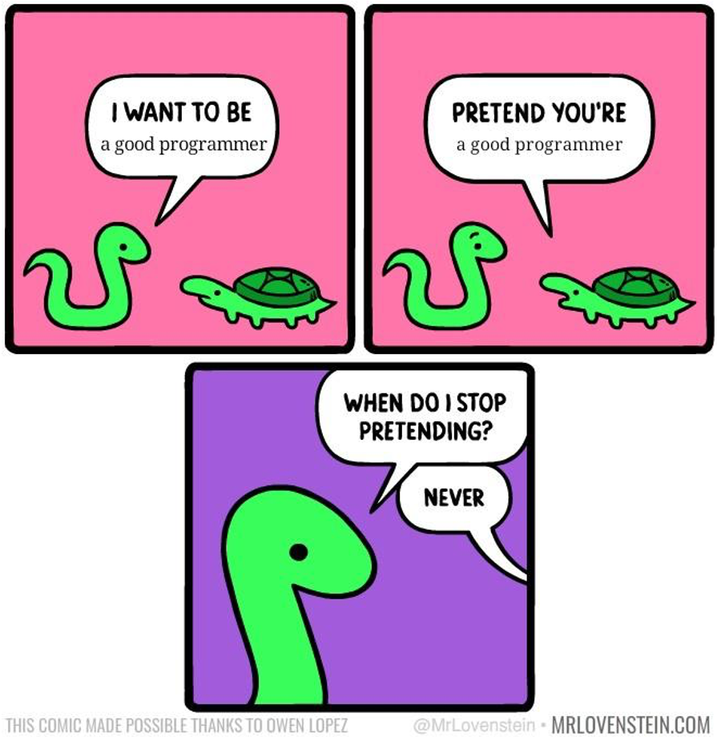

```{r setup, include=FALSE}
options(htmltools.dir.version = FALSE)
knitr::opts_chunk$set(warning = F,
                      message = F,
                      fit.retina = 3,
                      fig.align = "center")

hook_source <- knitr::knit_hooks$get('source')
knitr::knit_hooks$set(source = function(x, options) {
  x <- stringr::str_replace(x, "^[[:blank:]]?([^*].+?)[[:blank:]]*#<<[[:blank:]]*$", "*\\1")
  hook_source(x, options)
})
```

```{r xaringan-themer, include=FALSE, warning=FALSE}
library(xaringanthemer)
style_mono_accent(base_color = "#4834d4")
```

```{r starwarsData, include=FALSE, warning=FALSE}
library(tidyverse)
library(knitr)
library(kableExtra)

empire <- starwars

empire <- empire[c(1:5, 10, 13, 14, 19, 21), c(1:3, 8:10)]
empire$species <- factor(empire$species)

```

# Plan for today

- What is an **object**?

--

- **Assignment**

--

- More than 1 thing with **vectors**

--

- Object **classes**

---

# What do we *want*?

We *want* our data to look something like this...

```{r swDataEx, echo=FALSE}
kable(empire, format = "html")
```

---

# What do we *want*?

What R sees...

```{r swDataEx2, echo=FALSE}
empire
```

---
name: objects

# How do we get there? 

### Objects

- A basic concept in (statistical) programming is called an **object**

- An **object** allows you to store a value or a thing:

---

# An object can be...

```{r swObjects, echo=FALSE}

empire$mass[4] <- cell_spec(empire$mass[4], "html", background = c("#FFFF00"))

kable(empire, format = "html", escape = F)

```

---
# An object can be...

```{r swObjects2, echo=FALSE}

empire$mass[4] <- "136"

kable(empire, format = "html", escape = F) %>%
  column_spec(3, background = c("#FFFF00"))

```

---

# An object can be...

```{r swObjects3, echo=FALSE}

kable(empire, format = "html", escape = F) %>%
  row_spec(row = 4, background = c("#FFFF00"))

```

---

# An object can be...

```{r swObjects4, echo=FALSE}

kable(empire, format = "html", escape = F) %>%
  row_spec(row = c(1:10), background = c("#FFFF00"))

```

---

# Important:

- Objects have *names*
- We are going to refer to objects by their *names*
- Since they have names, we can **store** objects and use them later

---
name: assignment

# Storing data in objects

If you want to use an object later on (you do!), you have to name it.

This is called **assignment** or **assigning** a name to an object

In takes the form of:

```{r assign, eval=FALSE}

nameOfMyObject <- objectToStore

```

---
class: inverse, middle, center
name: practice1

# Go do Practice #1

When you have finished, come back here.

---

# What's the point of storing objects?

Remembering things sucks! Let R hold on to all the stuff you don't want to remember or write down right away. 

Let's do an example with a series of math equations:
$$y = 17*8$$
$$z = \frac{y}{3}$$
How do we solve this?:

1. Solve for $y$, which is $136$. Either remember $136$ or write the number down.
2. Plug it in in the second equation, so that you have $136$ divided by $3$. 

---

#Let's do this with R code!

Let's do an example with a series of math equations:
$$y = 17*8$$
$$z = \frac{y}{3}$$

With code:
```{r eq1}
y <- 17*8 # first, solve for y 
z <- y/3 # now, solve for z 
```

--

We didn't even need to know that `17*8` is `136`. We stored the value of `136` as an object with the name `y`.

--

Then, we could tell R to simply use the name `y` anytime we wanted to refer to the number `136` 

---
# Who cares?

Remembering a single number seems a little ridiculous. But remember, an object in R can really be anything. Some objects you definitely might want to store for later:

- A data set like `empire`
- A correlation coefficient
- The output of a linear regression model
- $p$-values and other statistics
- The mean of a variable, so you can subtract the mean from every individual's score
- and lots, lots more!
---

class: center

## If you do not assign a name to an object, R will not remember it!

Example:
```{r, include=FALSE}
rm(y,z)
```

```{r, error=TRUE}
17*8

y/3
```

--
<br>
<br>

#### The error message `object 'y' not found` is very common!
R cannot perform the operation because you never told it to remember `17*8`
---

class: inverse, middle, center
name: practice2

# Go do Practice #2

When you have finished, come back here.

---
name: vector

# One type of object: **Vectors**

A group of objects is called a **vector**

**Vectors** are *ONE-DIMENSIONAL*. You can think of this as either a row...

```{r vec1, echo=FALSE}

kable(empire, format = "html", escape = F) %>%
  row_spec(row = 4, background = c("#FFFF00"))

```

---

# One type of object: **Vectors**

A group of objects is called a **vector**

**Vectors** are *ONE-DIMENSIONAL*. You can think of this as either a row...
... or a column

```{r vec2, echo=FALSE}
kable(empire, format = "html", escape = F) %>%
  column_spec(3, background = c("#FFFF00"))

```

---
# Making Vectors
In your R code, you will type `c()` in order to create a vector

The `c` stands for *"combine"* or *"concatenate"*

Some examples:
```{r vec3}
subjectID <- c("Subject 1", "Subject 2", "Subject 3", "Subject 4", "Subject 5")
passedStats <- c(TRUE, FALSE, FALSE, TRUE, TRUE)
favoriteNumbers <- c(7, 3, 6, 10, 100)
countries <- c(0, 3, 10, 1, 8)

```

```{r vec3b, echo = F}
subjectID 
passedStats 
favoriteNumbers 
countries 

```
---

# Vectors
Because these items are grouped together, you can do something to them all at once!

Let's say these 5 people all went on a trip together, and they visited 2 countries. We can add `2` to the entire vector, rather than each individual number:

```{r vec4}
countries + 2
```

---

class: inverse, middle, center
name: practice3

# Go do Practice #3

When you have finished, come back here.

---

name: classes
# Basic data classes

Objects can be of a different `class`. You can think of it more as *what type of information is stored in the object?*. Some of the options are:

- **Numeric:** Decimals (3.141593)

--

- **Integer:** Natural numbers (0,1,2, etc.)

--

- **Character:** Text or string characters:

    - Always inside quotation marks
    - **Factors** (or categories)
--

- **Logical:** True or False:

    - No quotations
    - 2 possible values: `TRUE` or `FALSE`
--

- **Missing Value:** `NA`

---

# Basic data classes
To check what data class your object is, you can type **`class()`**.

```{r classEx}
class(subjectID)
class(passedStats)
class(countries)
class(empire$species)
```

---

# Pro Tip \#1: Special Values
RStudio will change the color of the words you type so that as you code, you can quickly see what you're dealing with.

---

# Pro Tip \#1: Special Values

**Character objects** are red (or green), and use quotation marks:
```{r}
subjectID <- c("Subject 1", "Subject 2", "Subject 3", "Subject 4", "Subject 5")
```
--

**Numeric objects** are green (or blue) and do *NOT* use quotation marks:
```{r}
favoriteNumbers <- c(7, 3, 6, 10, 100)
```
--

**Exception #1: `NA`**, without quotation marks, is recognized as "missing" by R. 
```{r}
animals <- c("cow", "dog", NA, "chicken")
```
--

**Exception #2: `TRUE` and `FALSE`** does *not* require quotation marks. Must be either ALL CAPS or just the first letter capitalized (`T` or `F`).
```{r, eval = FALSE}
variable <- c(T, FALSE, F, TRUE) # this line is correct #<<
variable <- c(t, false, f, true) # this line is incorrect
```

---

# Back to data classes

When you combine objects, the new object will have the class of the **least specific** object. For example:

```{r cex}
numbers <- c(5, 6, 7, "eight", 9)
class(numbers)
```

All numbers could theoretially be wrapped in quotes and considered text. But there is no way for the computer to understand that the character string "eight" actually refers to 8. So the `character` class is less specific than the `numeric` class. 

---

# Pro Tip \#2: Naming objects
- An object name can *never __start__* with a number, like `3myObject <- 7`

- You can include underscores `_` and periods `.` in object names, like `my_object <- "hi"` or `correlation.2 <- .57` 

- RStudio allows for tab-complete. Start typing in an object name, and it should appear! Once you see it, either hit tab or enter on your keyboard, and it will fill in the object name for you
    - This means you should name your objects with clear, meaningful names!
    - It does not matter how long the name is

- Use capitalization to your benefit, like camel case `r emo::ji("camel")` `myObject` or `patientsVsControls`

- Names should be human & computer readable

---

# Recap
1. **Objects** are things, with names -- use the names!

2. Single values, or a group of values like **vectors**

3. The stuff within objects can belong to different data types or **data classes**

4. A lot of the error messages you'll get will relate to these!

5. Next up will be accessing our objects!

<center>



</center>