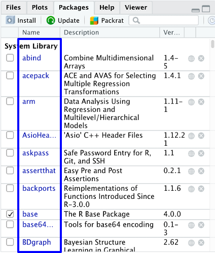
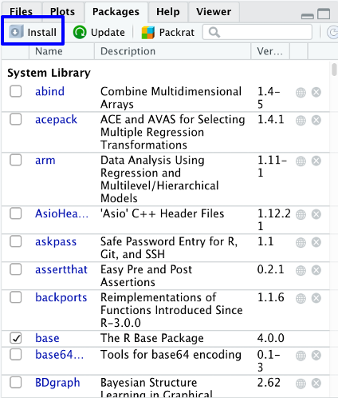
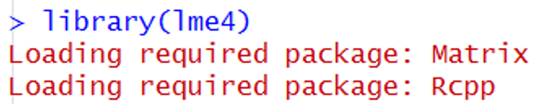

```{r setup, include=FALSE}
options(htmltools.dir.version = FALSE)
knitr::opts_chunk$set(warning = F,
                      message = F,
                      fit.retina = 3,
                      fig.align = "center")

hook_source <- knitr::knit_hooks$get('source')
knitr::knit_hooks$set(source = function(x, options) {
  x <- stringr::str_replace(x, "^[[:blank:]]?([^*].+?)[[:blank:]]*#<<[[:blank:]]*$", "*\\1")
  hook_source(x, options)
})
```

```{r xaringan-themer, include=FALSE, warning=FALSE}
library(xaringanthemer)
style_mono_accent(base_color = "#4834d4",
                  outfile = "xaringan-themer-blue.css")
```

```{r starwarsData, include=FALSE, warning=FALSE}
library(tidyverse)
library(knitr)
library(kableExtra)

empire <- starwars

empire <- empire[c(1:5, 10, 13, 14, 19, 21), c(1:3, 8:10)]
empire$species <- factor(empire$species)

```
name: checkin
class: inverse, middle, center

## Are you struggling?


---
# Plan for today

- Brief recap
- **Packages**

---
# Recap of using variables
- Most of the time, we want to do more than add, subtract, multiply etc.

--

- We want to act on our variables. We do this with operators & **functions**
  - *Each function* has a unique name
  - *Each function* requires some input, and the function can be modified using arguments
  - *Each function* will produce an output

--

- Remember:
  - objects are *nouns*
  - functions & operators are *verbs*
  - arguments are *adverbs*
---

# Recap of using variables
Where do you find functions?
  - Some exist in `R` by default
    - `t.test()`
    - `cor()`
    - `scale()`

Lots of people all over the world write their own functions. And they (rightly!) think it's useful to share these functions.
---
name: packages

# Packages
What is a **package**?
  - A collection of functions and datasets
  - Open source
  
Packages are the reason R is so powerful!
  - While you can definitely write your own functions, most of what you need to do someone else has already done for you! 
---
class: middle, center

---
class: middle, center

---
class: middle, center

---
class: middle, center

---
class: middle, center

---
class: middle, center

---
class: middle, center

---
class: middle, center

---

# How do I get packages?
Packages can be downloaded from the *CRAN* (*C*omprehensive *R* *A*rchive *N*etwork)

You will do this from inside `R`

.center.medium.box-inv-6[Need to be connected to the internet!]
---

# 2 ways to install packages

1. Install button in the Packages tab

2. R Code
<br>
<br>
<br>
<br>
.center.large[*Either way, you need to know the name of the package*]
---
class: middle, center

# Install Button

---
class: middle, center

# Install Button

---
class: middle, center

# Install Button

---

# R code to install packages
<br>
<br>
<br>
<br>
<br>
<br>
<br>
.center.middle.medium[`install.packages("psych")`]
---

# Packages

INSTALLING
  - Downloading the package and saving it to your computer
  - Like installing Microsoft Word on your computer
  - Do this **ONCE**
  
--

LOADING
  - Like opening Microsoft Word to write a paper
  - Once a package is loaded, you can use all of it's functions and datasets are ready to use
  - You need to do this **EVERY TIME** you open a new `R` session
---

# 2 ways to load packages
1. Checkbox in the packages tab (not recommended)

2. R code
<br>
<br>
<br>
<br>
.center.large[*Either way, you need to know the name of the package*]
---
# R code to load packages
<br>
<br>
<br>
<br>
<br>
<br>
<br>
.center.middle.medium[`library(psych)`]
---

# Dependencies


Uses functions from other packages

Installed automatically

Loaded automatically
---

# Help! (again)

Ways to find documentation:

.medium[`?psych`] -- opens documentation specific to that pacakge or function

.medium[`??psych`] -- searches for this in all documentation (that you have installed and loaded)

To find a package that does what you need: .large[Google]
---

class: inverse, middle, center
name: practice1

# Go do Practice #1
When you are finished, go on to the next video