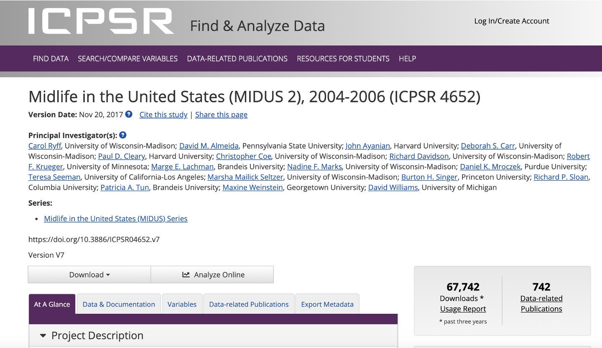

```{r setup, include=FALSE}
options(htmltools.dir.version = FALSE)
knitr::opts_chunk$set(warning = F,
                      message = F,
                      fit.retina = 3,
                      fig.align = "center")

hook_source <- knitr::knit_hooks$get('source')
knitr::knit_hooks$set(source = function(x, options) {
  x <- stringr::str_replace(x, "^[[:blank:]]?([^*].+?)[[:blank:]]*#<<[[:blank:]]*$", "*\\1")
  hook_source(x, options)
})
```

```{r xaringan-themer, include=FALSE, warning=FALSE}
library(xaringanthemer)
style_mono_accent(base_color = "#eb4d4b",
                  outfile = "xaringan-themer-red.css")
```

```{r starwarsData, include=FALSE, warning=FALSE}
library(tidyverse)
library(knitr)
library(kableExtra)

empire <- starwars

empire <- empire[c(1:5, 10, 13, 14, 19, 21), c(1:3, 8, 10, 11)]
empire$species <- factor(empire$species)

```

name: recap

# You've already learned *a lot*!
- Objects
- Classes
- Indexing 1-d vectors and 2-d data.frames
- Logical operators & functions
- How to look at the help documentation
- Installing/loading packages
- Making new script files
- Importing your data etc. 
---

# This time
- Lots of practice sets; letting it all come together
  
- Some random tidbits to make your life easier
---

name: midus

# MIDUS

For this portion, we will use the `midus.csv` dataset (you can find it ______).
  - Please download this file and save it somewhere you can easily find it. 

You should do the exercises in this tutorial *locally* (on your own computer).
---

# MIDUS

---
# About the MIDUS dataset
Project Description:
  "The purpose of the study was to investigate the role of behavioral, psychological, and social factors in understanding age-related differences in physical and mental health."
--

Variables available in this data file:
  - **Demographic variables**: age, sex
  - **Physical health variables**: self-rated physical health, heart problems, father had heart attack, BMI
  - **Mental health variables**: self-rated meantal health, self-esteem, life satisfaction *(life overall, work, health, relationship with spouse/partner, relationship with children)*, hostility *(stress reactivity & agression*)
---
name: e1

# Exercise 1
1. Open a *new* `.R` script file

2. Load the following packages using **code** in your new `.R` file:
  - psych
  - dplyr
  - ggplot2
  
3. `Get` your `w`orking `d`irectory

4. If you haven't already, download `midus.csv` from ___. Drag and drop the file into a directory that you want to continue using for this class. 

5. Import `midus.csv` into R. You can keep the name **midus**. 

6. Make sure that the import code ends up in your SCRIPT (`.R`) file.

7. **Save** your new `.R` script file in the same working directory as `midus.csv`. You can name the script whatever you want. 
name: index
---
# Cleaning your global environment
Sometimes, your Global Environment (top right) can fill up with stuff that you don't need anymore. You can clean this!

A) Delete EVERYTHING using the broom icon (next to the Import Dataset tab)

B) Switch to GRID view, check boxes of individual objects you DON'T want, then press the broom icon. .small[*Be sure to switch back to LIST view when finished*]
---
# Exercise 1...continued!
Now...

Clear your global environment, select your entire script file, and RUN it!

...what happens? what does this mean? 
---
name: index

# Indexing...continued!
Indexing a **vector** (1 dimension):
  - `midus$age[1]`
  - The number `1` gives us the **1st** item in the **age** vector that is part of the **midus** data.frame

--

Indexing a data.frame (2 dimensions):
  - `midus[1, 2:3]`
  - This gives us the **1st row** and the **2nd thru 3rd columns** of the **midus** data.frame
---
name: logic

# Logical Operator Review
Returns a value of `TRUE` or `FALSE`

.pull-left.box-inv-1.small[
  `==`


  `!=`


  `>`
  
  
  `>=`
  
  
  `<`
  
  
  `<=`
]
.pull-right.box-inv-1.small[
  equality


  inequality


  greater than
  
  
  greater than or equal to
  
  
  less than
  
  
  less than or equal to
]

`A = 3` - *"A is an objec that stores the number 3."*

`A == 3` - *"Is A equal to 3?"*
---

# Multiple Logical Statements
You can combine logical operators to simultaneously see if multiple conditions have been met. 
.pull-left.box-inv-1.small[
  `&`


  `|`


  `!`
]
.pull-right.box-inv-1.small[
  and


  or


  not
]
---
# Multiple Logical Statements

Is this true? **AND** Is this true?
```{r}
(10 < 100 & 24 == 23 + 1)

(5 > 4 & 5 > 10)
```
--

Is this true? **OR** Is this true?
```{r}
(5 > 4 | 5 > 10)

# Could also be something like:
# (A == B | C != D)
```
---
name: subset

# Subset your data
Sometimes, you will want to perform functions on only some of your data points.

You can **subset** your data to identify subjects in a certain subgroup.

Use the `subset()` function:
```{r}
subset(x = empire, subset = (mass > 100))
```
--
.tiny[Notes:
  - Some functions have a `data = ` or `x = ` argument, where you name your data.frame. Because you've named in within the function's arguments, you do not need to use the dollar sign `$` to access the vector.
  - `( )` around `mass > 100` are not necessary, but as logical expressions become more complicated, the extra parentheses can be helpful for keeping it straight. 
  - `subset()` is the name of the **function** we're using, but one of it's **arguments** is also called `subset =`]
---

# What if I don't remember the arguments?

Check the `R` documentation!
  `?subset`

When in doubt, you can always search the "Help" tab or the internet
---
name: e2

# Exercise 2
---
name: nest

# Functions within functions
Often, you can wrap functions within functions. This is called **nesting**. 

Example:
```{r}
round(x = sqrt(86), digits = 1)
```
--
How does it do this? Inner to outer!

  `sqrt(86)` **.color-5[--> `r sqrt(86)` --> ]**`round(x = 9.2736185, digits = 1)` **.color-5[--> `r round(sqrt(86), 1)`]**
---
# A million ways to do 1 thing
##### Add a varible to a data.frame
```{r, eval=FALSE}
midus[,9] <- rep(x = "Wave2", times = 40)
midus$wave <- rep(x = "Wave2", times = 40)
midus["wave"] <- rep(x = "Wave2", times = 40)
```
--

##### Remove a variable from a data.frame
```{r, eval=FALSE}
midus <- midus[,-9]
midus <- subset(midus, select = -wave)
```
--

##### Removing rows from a data.frame
```{r, eval=FALSE}
midus <- midus[-c(1:10),]
midus <- subset(x = midus, subset = ID != "10175")
```
---
name: e3

# Exercise 3

Use nested functions to create a `subset` of the `midus` data.frame which contains only participants who have `self_esteem` scores above the `mean`.

##### Hints:
  - Name this new data.frame something different from `midus`
  - Use only complete cases (no missing) to get the `mean`. Where can you look to find the arguments of the `mean` function? 
---
name: rand

# A note on missing values
- There are MANY ways to deal with missing data

- Decisions regarding missing data are best made by you and your colleagues/advisors since it will depend on your research question

- For now, we're going to use **listwise deletion** aka using complete cases

- To overwrite the `midus` data.frame so that it only shows participants that have a data point for every variable, we can use the following line of code:
  - `midus <- na.omit(midus)`
---

# Dimensions
Sometimes it's useful to better understand the dimensions of your data.frame. Comes up in regards to error messages!

```{r}
dim(empire)
dim(empire)[1] # for rows
dim(empire)[2] # for columns

nrow(empire)
ncol(empire)

length(empire$mass) # use `length()` for 1-d vectors
```
---

# Saving data
So you've manipulated and cleaned your dataset, and now you want to save it...
```{r, eval=FALSE}
write.csv(x = data.frame,
          file = "newFile.csv",
          row.names = FALSE)
```

Exploring data that is stored within a list obect (i.e., regression, ANOVA, t-test results) is really hard.

In these cases, I suggest pulling out the pieces of information that you actually care about, making it your own data.frame, and then writing out that data.frame. There are other ways, though (you'll need to Google it)!

---
# Recoding variables
- Check out the `recode()` function from the `dplyr` package
- If there is something systematic you want to add or remove, you can use `gsub()`
  - EX: What if you wanted to replace all the underscores (_) with periods (.) in my column names?
```{r, eval=FALSE}
colnames(midus) <- gsub(pattern = "_",
                        replacement = ".",
                        x = colnames(midus))
```
  - EX: What if I wanted to remove everything after the underscore(_)?
```{r,eval=FALSE}
colnames(midus) <- gsub(pattern = "_",
                        replacement = "",
                        x = colnames(midus))
```
---
# Naming Conventions
.pull-left[
##### Camel Case `r emo::ji("camel")`
- camelCase
- `meanAgeControls`

##### Pascal Case
- Similar to camelCase, but first letter is also capitalized
- `MeanAgeControls`
]

.pull-right[
##### Dot Case
- `mean.age.controls`
- I personally don't like this because if you decide to save an object, the periods can get in the way of the file path and make it confusing (ex: `mean.age.controls.csv`)

##### File Names
- Underscores and hypens OK. 
- DO NOT USE SPECIAL CHARACTERS, INCLUDING SPACES!!!!!
]
---
# Habits
Get into good coding habits **now**, so you don't hate yourself *later*!

Pro tip: 
  - Write code that you can understand now
  - Write code that you can understand 6 months from now
  - Write code that someone else can understand 6 months from now

What does this mean? 
  - **COMMENT YOUR CODE**
  - Use consistent naming conventions
  - Use descriptive object names (who cares if they're long when you have tab-complete)
  - Organize your files
  - Think *computer & human readable*
  - Cloud-based storage
  - Version control
---
class: middle, center, inverse

# See next video for remaining tips within RStudio
