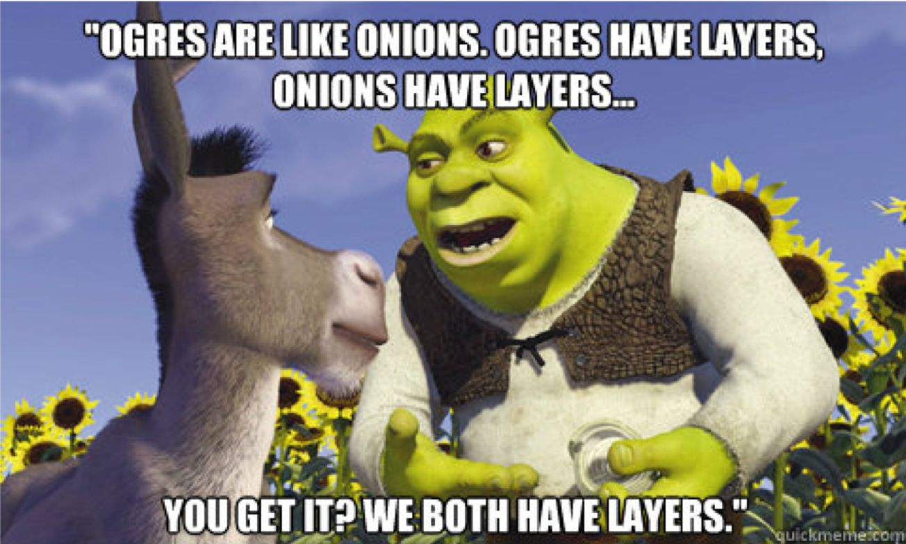
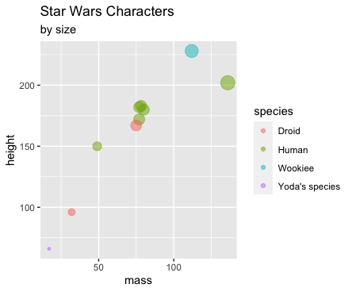

```{r setup, include=FALSE}
options(htmltools.dir.version = FALSE)
knitr::opts_chunk$set(warning = F,
                      message = F,
                      fit.retina = 3,
                      fig.align = "center")

hook_source <- knitr::knit_hooks$get('source')
knitr::knit_hooks$set(source = function(x, options) {
  x <- stringr::str_replace(x, "^[[:blank:]]?([^*].+?)[[:blank:]]*#<<[[:blank:]]*$", "*\\1")
  hook_source(x, options)
})
```

```{r xaringan-themer, include=FALSE, warning=FALSE}
library(xaringanthemer)
style_mono_accent(base_color = "#f0932b",
                  outfile = "xaringan-themer-orange.css")
```

```{r starwarsData, include=FALSE, warning=FALSE}
library(tidyverse)
library(knitr)
library(kableExtra)

empire <- starwars

empire <- empire[c(1:5, 10, 13, 14, 19, 21), c(1:3,8,10,11)]
empire$species <- factor(empire$species)

```

```{r midus, include=FALSE, warning=FALSE}
midus <- read.csv(here::here("R", "midus.csv"))

midus <- midus %>% 
  mutate_at(vars(2, 10, 11), list(factor)) %>%
  na.omit(.)
```

name: recap

# You've already learned *a lot*!
Hopefully you're feeling more comfortable with some of terminology used in programming:
- Objects
- Classes
- Functions
- Arguments
- Vectors
- Data.frames 
- Etc.
---

# Uhh...no?

.box-inv-2.large[You already know everything you need to do stats & plots!]
--

.pull-left[
##### Statistics

All statistics are computed with functions.

If you know the type of analysis you want to run, find the corresponding function and go for it!
]

--

.pull-right[
##### Plotting

All plots are made with functions. 

Slightly different is that one particular package is *a lot* better at plotting than `base` R. 
]
---

# Today
- Very basic statistics

- Introduction to plotting with `ggplot2`
  - There will be MUCH more on data visualization later
  
- PRACTICE PRACTICE PRACTICE

---

# About the MIDUS dataset

Variables available in this data file:
  - **Demographic variables**: age, sex
  - **Physical health variables**: self-rated physical health, heart problems, father had heart attack, BMI
  - **Mental health variables**: self-rated meantal health, self-esteem, life satisfaction *(life overall, work, health, relationship with spouse/partner, relationship with children)*, hostility *(stress reactivity & agression*)

--

Please load in `midus`, make sure:
- Make sure the variables `sex`, `heart_self`, and `heart_father` are `factor()` variables (rather than characters)
- Use the same `na.omit()` function to remove all `NA` values 
---

# Before we begin...
- Check to make sure you have the `ggplot2` package *installed*

- Check to make sure the `ggplot2` package is *loaded*

- If "no" to either, how can you solve this?
---

name: plot

# Data visualization with `ggplot2`
<center>



</center>
---
# Plotting with `ggplot2`

`ggplot2` has the following structure:


```{r, eval=FALSE}
ggplot(things that impact the entire plot) + 
  geom_something(things that impact just the something)
```

---
# Plotting with `ggplot2`

`ggplot2` has the following structure:


```{r, eval=FALSE}
ggplot(things that impact the entire plot) + #<<
  geom_something(things that impact just the something)
```


Things like:
- data.frame used for plotting
- defining your x & y axes


---
# Plotting with `ggplot2`

`ggplot2` has the following structure:


```{r, eval=FALSE}
ggplot(things that impact the entire plot) + 
  geom_something(things that impact just the something) #<<
```


`geom_` typically means **shape**. What shapes do you want to use to represent your data in the plot?
- `geom_histogram` -- histogram
- `geom_density` -- distributions
- `geom_violin` -- distributions
- `geom_point` -- scatter plot
- `geom_col` -- bar plot


---
# Plotting with `ggplot2`

The functions `ggplot()` and `geom_()` can take on different **aesthetics** as an argument, using `aes()`. 

**Aesthetics** are how you control what you want your plot to look like; how can you make it pretty? Examples:
- Which variables are the `x-` and `y-` axes?
- `color` (should you color the plot by some variable?)
- `fill` (very similar to `color`, should you fill the plot in somehow; used for bar graphs and boxplots)
- `shape` (do you want groups to have different shaped points?)
- `size` (how big should plotted data be?)

.small[*Note: person that made this package is from New Zealand; the British spellings and American spellings work! Although using tab-complete my auto-fill the British spellings*]

---
# Plotting with `ggplot2`
- Usually `aes()` contains some information that comes directly from the **data**
- If the information is *not* based on the data, it does not need to be inside an `aes()` argument. 

```{r, out.height='40%', out.width='40%'}
ggplot(data = midus, aes(x = age, y = BMI)) +
  geom_point() #<<
```

---
# Plotting with `ggplot2`
- Usually `aes()` contains some information that comes directly from the **data**
- If the information is *not* based on the data, it does not need to be inside an `aes()` argument. 

```{r, out.height='40%', out.width='40%'}
ggplot(data = midus, aes(x = age, y = BMI)) +
  geom_point(color = "cornflowerblue") #<<
```

---
# Plotting with `ggplot2`
- Usually `aes()` contains some information that comes directly from the **data**
- If the information is *not* based on the data, it does not need to be inside an `aes()` argument. 

```{r, out.height='40%', out.width='40%'}
ggplot(data = midus, aes(x = age, y = BMI)) +
  geom_point(aes(color = sex)) #<<
```

---
name: e1

# Exercise 1
Make a scatter plot of `self_esteem` (x-axis) against `life_satisfaction` (y-axis)

Make the points of the scatter plot a different `shape` based on the `sex` variable (for example, males might be circles and females might be squares)

Make the `color` of the points different based on `sex`

Set the `size` of all points equal to `3`

---
# Remember this???


---
name: ttest

# Statistical Analyses
We're going to practice plotting with `ggplot2` while learning some really basic statistical tests.

--

**Is there a difference in `hostility` between men and women in the `midus` sample?**

.box-inv-2.medium[
Statistic: T-test
<br>
Plot: boxplot
]

---
# A note about formulas
You can read the `~` (tilda) as "by" or "predicted by"

`hostility ~ sex` means...
  - "hostility by sex"
  - "is hostility predicted by sex?"

---
# T-tests
**Is there a difference in `hostility` between men and women in the `midus` sample?**

```{r}
t.test(hostility ~ sex,
       data = midus)
```
---

# T-tests
**Is there a difference in `hostility` between men and women in the `midus` sample?**

```{r, out.height='40%', out.width='40%'}
ggplot(data = midus, aes(x = sex, y = hostility)) +
  geom_boxplot()

```
---
name: e2

# You try!

Is there a difference in life satisfaction between people who have had heart problems compared to people who have not had heart problems?

.box-inv-2.medium[
Statistic: T-test
<br>
Plot: boxplot
]

BONUS:
- Look at the help page for `t.test()`. How do you run a one-tailed t-test? Run it! Does your answer change?
- How could you `fill` the boxplots so that males and females are shown in different colors? 
- Look at the help page for `labs()` and see if you can give your plot a title and different x- & y-axes labels. 

---
name: cor

# Correlations
**Does `self_esteem` correlate with `life_satisfaction`?**

.box-inv-2.medium[
Statistic: Correlation
<br>
Plot: scatter plot
]

##### Lots of options for correlations!
- `cor()` gives straight correlation; no frills
- `cor.test()` gives probabilities but only for one pair of values at a time
- `corr.test()` is part of the `psych` package and reports sample sizes along with probabilities
---

# Correlations
**Does `self_esteem` correlate with `life_satisfaction`?**

```{r}
# Stored as it's own object. Play with it in your Global Environment!
esteemVsLifeSat <- cor.test(x = midus$self_esteem,
                             y = midus$life_satisfaction)

esteemVsLifeSat
```

---

# Correlations
**Does `self_esteem` correlate with `life_satisfaction`?**

```{r, out.height='40%', out.width='40%'}
ggplot(data = midus, aes(x = self_esteem, y = life_satisfaction)) +
  geom_point()
```
---
name: e3
# You try!
**Does `age` correlate with `BMI`?**

.box-inv-2.medium[
Statistic: Correlation
<br>
Plot: scatter plot
]


BONUS:
- set the `size` of all points to 1.5
- change the x- & y-axes labels and add a title and subtitle
- make the shape of the points different based on if they've ever been diagnosed with a heart issue or not
---
name: anova

# ANOVA
Say you wanted to dichotomize your `self_esteem` variable into those with **high self-esteem** (above the mean) and those with **low self-esteem** (below the mean). 

You want to see if `sex` and your newly dichotomized `self_esteem` variables predict `BMI`. 

.box-inv-2.medium[
Statistic: 2x2 ANOVA
<br>
Plot: bar plot
]
---
# Dichotomizing variables
**As a general rule, don't do this**

.small[BUT, it does make for a nice teaching example `r emo::ji("smiley")`]

```{r}
# create the groups; store as a new variable
midus$self_esteem_di <- ifelse(test =
                                 midus$self_esteem > mean(midus$self_esteem),
                               yes = "high",
                               no = "low")

# make sure the new variable is treated as a factor
midus$self_esteem_di <- factor(midus$self_esteem_di)

# for us to view it
head(midus[,c(1,2,3,12)])
```
---
# ANOVA
**Does `sex` and your newly dichotomized `self_esteem` variable predict `BMI`?** (no interaction)


```{r}
anova1 <- aov(BMI ~ sex + self_esteem_di, data = midus)
summary(anova1)
```

---

# ANOVA
**Does `sex` and your newly dichotomized `self_esteem` variable predict `BMI`?** (**WITH** interaction)

```{r}
anova2 <- aov(BMI ~ sex * self_esteem_di, data = midus)
summary(anova2)
```
---
# ANOVA
**Does `sex` and your newly dichotomized `self_esteem` variable predict `BMI`?** 

Bar plots suck. Height of each bar should reflect that group's **mean**. So we first need to calculate the means, and store them in a data.frame. 

```{r}
femaleHigh <- subset(midus, sex == "Female" & self_esteem_di == "high")
femaleHighMean <- mean(femaleHigh$BMI)

femaleLow <- subset(midus, sex == "Female" & self_esteem_di == "low")
femaleLowMean <- mean(femaleLow$BMI)

maleHigh <- subset(midus, sex == "Male" & self_esteem_di == "high")
maleHighMean <- mean(maleHigh$BMI)

maleLow <- subset(midus, sex == "Male" & self_esteem_di == "low")
maleLowMean <- mean(maleLow$BMI)

meansData <- data.frame(sex = c("Female", "Female", "Male", "Male"),
                        self_esteem_di = c("high", "low", "high", "low"),
                        meanBMI = c(femaleHighMean,
                                    femaleLowMean,
                                    maleHighMean,
                                    maleLowMean))

```
---
# ANOVA
**Does `sex` and your newly dichotomized `self_esteem` variable predict `BMI`?** 

Then we can plot, using our **NEW** data.frame .small[*(Note: we will cover a __MUCH__ easier way of doing this when we talk about `tidyverse` in the next section)*]
```{r, out.height='40%', out.width='40%'}
ggplot(data = meansData, aes(x = sex, y = meanBMI)) +
  geom_col(aes(fill = self_esteem_di), position = "dodge")
```

---
name: e4

# You try!

Below is some code that trichotomizes `age` into the following groups:
- 28-40 -- "young"
- 40-60 -- "middle"
- 60-84 -- "old"

Copy (& run) the following code into your script so you can do the next exercise:
```{r}
midus$age_category <- cut(x = midus$age,
                          breaks = c(28, 40, 60, 84),
                          labels = c("young", "middle", "old"),
                          include.lowest = TRUE)
```

**NOW**, is there a main effect of `age_category`, a main effect of `heart_self`, and is there a `age_category x heart_self` interaction on `BMI`?

.box-inv-2.medium[
Statistic: 3x2 ANOVA
<br>
Plot: bar plot
]
---

# Fill in the missing bits of this code

```{r, eval=FALSE}
youngYesHeart <- subset(midus, age_category == "young" & heart_self == "Yes")
youngYesHeartMean <- mean(youngYesHeart$BMI)

youngNoHeart <- subset(midus, age_category == "young" & heart_self == "")
youngNoHeartMean <- mean(youngNoHeart$BMI)

middleYesHeart <- subset(midus, age_category == "" & heart_self == "Yes")
middleYesHeartMean <- mean()

middleNoHeart <- subset(midus, age_category == "" & heart_self == "No")
middleNoHeartMean <- mean(BMI)

oldYesHeart <- subset(midus, age_category == "" & heart_self == "")
oldYesHeartMean <- mean()

oldNoHeart <- subset(midus, age_category == "" & heart_self == "")
oldNoHeartMean <- mean()
```
---
# Data prep for bar plot

Now that you've filled in (& run!) the previous code, turn all of that into a data.frame you can use. .small[*(remember, we're going to cover a __MUCH__ easier way of doing this when we talk about `tidyverse`)*]

```{r, eval=FALSE}
meansData <- data.frame(age_category = c("young", "young", "middle", "middle",
                                         "old", "old"),
                        heart_self = c("Yes", "No", "Yes", "No", "Yes", "No"),
                        meanBMI = c(youngYesHeartMean,
                                    youngNoHeartMean,
                                    middleYesHeartMean,
                                    middleNoHeartMean,
                                    oldYesHeartMean,
                                    oldNoHeartMean))

```

---
# You try!
Finally, make your bar plot using the new data.frame we just made!

<center>

</center>
---
name: reg

# Regression
1. Is `life_satisfaction` predicted by `self_esteem`?

2. Are `self_esteem` and `hostility` both independent predictors of `life_satisfaction`?

3. Is there an interaction between `self_esteem` and `hostility` predicting `life_satsifaction`?

.box-inv-2.medium[
Statistic: Simple & Multiple Regression
<br>
Plot: scatter plot with mean, +1SD, and -1SD of `hostility`
]
---
# Regression
1. Is `life_satisfaction` predicted by `self_esteem`?
  - Simple regression
  - `lm(life_satisfaction ~ self_esteem, data = midus)`

2. Are `self_esteem` and `hostility` both independent predictors of `life_satisfaction`?
  - Multiple regression; no interaction
  - `lm(life_satisfaction ~ self_esteem + hostility, data = midus)`

3. Is there an interaction between `self_esteem` and `hostility` predicting `life_satsifaction`?
  - Multiple regression; with interaction
  - `lm(life_satisfaction ~ self_esteem * hostility, data = midus)`
---

# An extra pacakge: `ggeffects`

Has a function called `ggpredict` that makes it very easy to visualize interactions of continuous variables. 

```{r, echo=FALSE, out.height='55%', out.width='55%'}
library(ggeffects)

mod1 <- lm(life_satisfaction ~ self_esteem * hostility, data = midus)

predictedVals <- ggpredict(model = mod1, terms = c("self_esteem", "hostility"))

ggplot(predictedVals, aes(x = x, y = predicted, group = group)) +
  geom_smooth(aes(ymin = conf.low, ymax = conf.high,
                  color = group, fill = group),
              stat = "identity", alpha = .2) +
  geom_smooth(aes(color = group, fill = group),
              method = "lm", size = 1.1) +
  labs(x = "Self-Esteem",
       y = "Predicted Values of\nLife Satisfaction",
       color = "Hostility",
       fill = "Hostility",
       title = "Relationship Between Life Satisfaction and\nSelf-Esteem at Different Levels of Hostility",
       subtitle = "With 95% CIs") +
  theme_classic() +
  scale_fill_discrete(name = "Hostility",
                      labels = c("-1SD", "Mean", "+1SD")) +
  scale_color_discrete(name = "Hostility",
                      labels = c("-1SD", "Mean", "+1SD")) 

```
---
# Things to note about regression
- Assign your `lm()` object to your global environment. You can get coefficients, predicted values etc.

--

- If you want the relationship betwen X1 and Y, *after controlling for* X2, you can make a scatter plot with the model's **fitted* values. 

--

- If you want to view the output table of a regression, use `summary()` (just like we did with ANOVA).

--

- If you want the $R^2$, $F$-statistic etc., assign the `summary(model)` object to your global environment.

--

- Check out the `broom` package to format your regression outputs into a nice data.frame. 
---
name: e5

# You try!

[MAKE UP AN EXERCISE HERE]
---
name: resources
# R Resources

The **only** way to get better is to **PRACTICE**! Some helpful resources:

- Online tutorials like [.url[Coursera]](https://www.coursera.org/courses?query=r), [.url[Code School/Pluralsight]](https://www.pluralsight.com/search?q=R), and [.url[Code Academy]](https://www.codecademy.com/catalog/language/r)
- [.url[`swirl`]](https://swirlstats.com/) package helps you learn R from inside RStudio! Strong recommend!
- Favorite websites for reference:
  - [.url[Quick-R]](https://www.statmethods.net/)
  - [.url[Cookbook for R]](http://www.cookbook-r.com/)
  - **STACK OVERFLOW** (almost always top answer from Google search)
- [.url[Reddit]](https://www.reddit.com) has a shocking number of R-related subreddits
- Jenine Harris's new [**.url[Statistics with R]**](https://www.amazon.com/Statistics-Solving-Problems-Using-Real-World-ebook-dp-B083V6TF1L/dp/B083V6TF1L/ref=mt_other?_encoding=UTF8&me=&qid=) book
- [**.url[R for Data Science]**](https://r4ds.had.co.nz/) is very `tidyverse`-heavy; go through our `tidyverse` portion first, then check the book out
- [**.url[Learning Statistics with R]**](https://learningstatisticswithr.com/) by Danielle Navarro; textbook for grad stats
- **#rstats** on Twitter is a huge and welcoming community!

.large[Google, Google, Google!]
---
# Congratulations!

You made it through our `R` Basic Training!

.pull-left.small[
Up next:
- Learn to clean and prepare your data more effectively with **`tidyverse`**. This is a HUGE part of the `R` ecosystem, so please don't skip this! It will make your life a lot easier!

- How to generate reports (PDF, Word, or HTML) files that integrate your thoughts and your code. This is the core of **`reproducibility`** and will allow you to share code with your advisors, collaborators, and journals in a much prettier and easier manner.

- Here we covered the basics of plotting with `ggplot2`, but learn just how flexible it can be for **`data visualization`**. Make your plots incredible!
]

.pull-right[

]