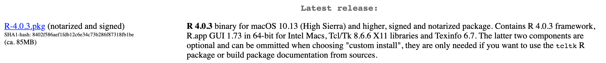
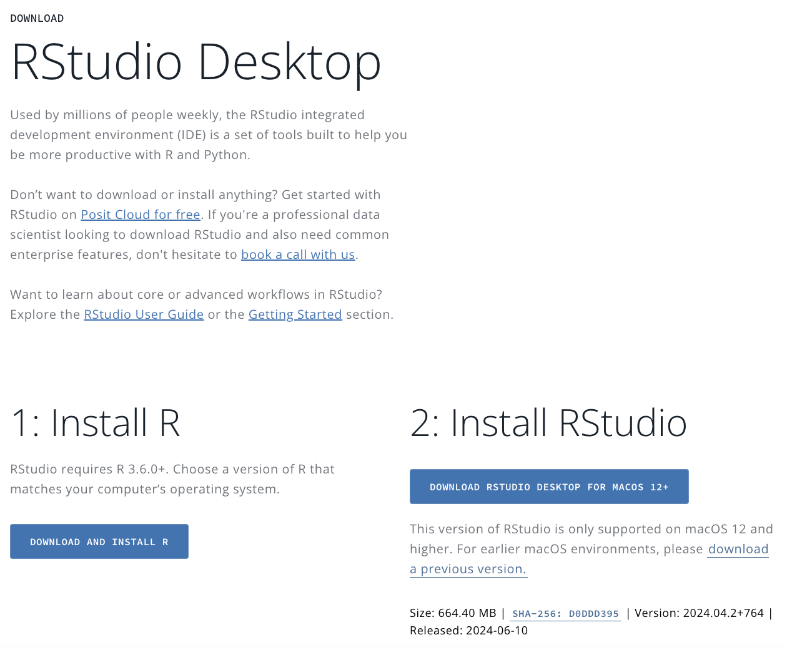

```{r setup, include=FALSE}
options(htmltools.dir.version = FALSE)
knitr::opts_chunk$set(warning = F,
                      message = F,
                      fit.retina = 3,
                      fig.align = "center")

hook_source <- knitr::knit_hooks$get('source')
knitr::knit_hooks$set(source = function(x, options) {
  x <- stringr::str_replace(x, "^[[:blank:]]?([^*].+?)[[:blank:]]*#<<[[:blank:]]*$", "*\\1")
  hook_source(x, options)
})
```

```{r xaringan-themer, include=FALSE, warning=FALSE}
library(xaringanthemer)
style_mono_accent(base_color = "#eb4d4b",
                  outfile = "xaringan-themer-red.css")
```

# What is R?

**R** is a programming language

**RStudio** is a program that makes it easy to actually use R

.small[An analogy: Let's say you post a video on Instagram. The video is like the programming language **R**. It's the content you're trying to share with the world. **RStudio** is more like Instagram. It's the platform you're using. You could have shared it on YouTube or something else to share the same video. But you happen to like Instagram, so you're using that.]

---

# Installing R

The first thing to do is install **R**:

.box-inv-1.large[
Before anything, make sure your operating system is up to date!
]

---

# Installing R

#### Go to the CRAN (Comprehensive `R` Archive Network) [.url[https://cran.r-project.org]](https://cran.r-project.org/)
---

# Installing R

#### Click on "Download R for `XXX` where `XXX` is either Mac or Windows


**If you use Mac:**
  - Scroll down to the first `.pkg` file. As of 1/21/2021, it is `R-4.0.3.pkg`.

<center>

</center>

  - You will also need to [**.url[download and install XQuartz]**](https://www.xquartz.org/)
    
---
# Installing R

#### Click on "Download R for `XXX` where `XXX` is either Mac or Windows

  
  
**If you use Windows:**
  - Click on "base" or the bolded "install R for the first time" link. 
    
<center>    
    
</center>

---

# Installing RStudio

Next up, we're going to install **RStudio**. This is the integrated development environment (IDE) that we'll use to interact with R. 

Once we have **RStudio** installed, you will almost never open **R**. You will just go directly to **RStudio**. 

---

# Installing RStudio

#### Go to the [.url[RStudio site]](https://rstudio.com/products/rstudio/download/#download)

It should automatically detect what operating system you're using, and something like this should appear (but matching your own operating system):

<center>

</center>

If the operating system presented matches your actual operating system, go ahead and click Download. Follow all the prompts as you normally would. 

---
# Installing RStudio

#### Go to the [.url[RStudio site]](https://rstudio.com/products/rstudio/download/#download)

If the operating system presented does **not** match your actual operating system, scroll down on the page until you find the one that does. 

Click Download for the appropriate version (make sure to check your Downloads file!), and follow all prompts as you normally would. 
---

# Note for WINDOWS users!

.box-inv-1.medium[
Know whether your computer is a 32-bit or 64-bit computer *before* installing R and RStudio! 
  - When you are installing R, by default it will install both. When it gives you the chance, you should de-select whichever option you do not have. (e.g., if you have a 64-bit computer, you do NOT need to install the 32-bit version). 
  - If you forget to do this, that's OK! When you first open RStudio it might give you the option to run the 32-bit or 64-bit version. *Uncheck the check-box for the version of R you DON'T want!*
]

---

# Success!

If you are able to open up RStudio successfully, without any weird warning messages appearing, you should be good to go! 

If you have trouble installing either R or RStudio, please contact me ASAP!

<center>

</center>