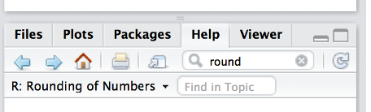
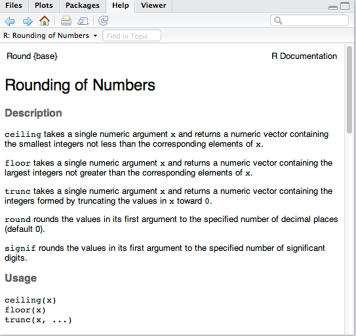
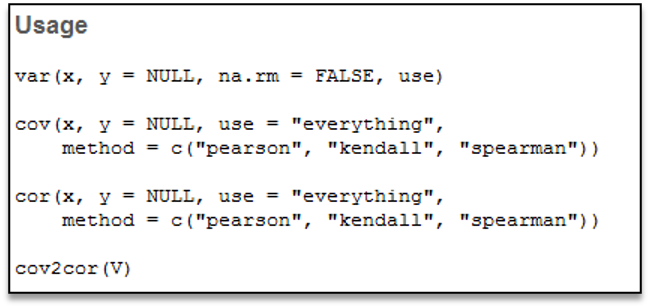
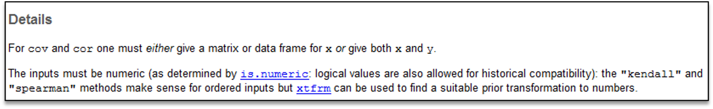
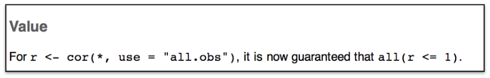

```{r setup, include=FALSE}
options(htmltools.dir.version = FALSE)
knitr::opts_chunk$set(warning = F,
                      message = F,
                      fit.retina = 3,
                      fig.align = "center")

hook_source <- knitr::knit_hooks$get('source')
knitr::knit_hooks$set(source = function(x, options) {
  x <- stringr::str_replace(x, "^[[:blank:]]?([^*].+?)[[:blank:]]*#<<[[:blank:]]*$", "*\\1")
  hook_source(x, options)
})
```

```{r xaringan-themer, include=FALSE, warning=FALSE}
library(xaringanthemer)
style_mono_accent(base_color = "#22a6b3",
                  outfile = "xaringan-themer-teal.css")
```

```{r starwarsData, include=FALSE, warning=FALSE}
library(tidyverse)
library(knitr)
library(kableExtra)

empire <- starwars

empire <- empire[c(1:5, 10, 13, 14, 19, 21), c(1:3, 8, 10, 11)]
empire$species <- factor(empire$species)

```
name: recap

# Plan for today

- Mini "Quiz" on **objects**, **classes**, and **indexing**

- Actions we perform on our objects
    - **operators**
    - **functions**

- Getting help when we need it

---
name: miniquiz
class: inverse, middle, center

# Go take your first mini quiz!
When you're done, come back here
---
name: operator

# Operators
An **operator** is a simple calculation

.pull-left.box-inv-5.small[
  +


  -


  *
  
  
  /
  
  
  ^
  
  
  %%
]
.pull-right.box-inv-5.small[
  addition


  subtraction


  multiplication
  
  
  division
  
  
  taking powers
  
  
  modulus
]
---
# Order of Operations

#### Important note: Order of operations matters!

```{r}
(8-4)/2

8-(4/2)
```
---
name: logoperator

# Logical Operators
Test whether a statement is `TRUE` or `FALSE`

.pull-left.box-inv-5.small[
  `==`


  `!=`


  `>`
  
  
  `>=`
  
  
  `<`
  
  
  `<=`
]
.pull-right.box-inv-5.small[
  equality


  inequality


  greater than
  
  
  greater than or equal to
  
  
  less than
  
  
  less than or equal to
]
---
# Logical Operators
- Return a value of `TRUE` or `FALSE`

--

  - `empire$gender == "female"`
  
--

- Which Starwars character is more than 150 cm tall?

--

  - `empire$height > 150`
  
--

- Are any Starwars characters exactly 150cm tall?

--

  - `empire$height == 150`
  - **WARNING:** `empire$height = 150` will change your data!
---
name: functions

# Functions
- `R` is not *just* a calculator. You often want to do something more complex.

- To perform more complicated actions, we use **_functions_**

  - **functions** are commands that describe, manipulate, or analyze objects
  - They are the **verbs** of programming languages
  - This is why we use `R`! No one wants to calculate a regression by hand...
---
# Functions have 3 parts

**Function name**
  - Each function has one and only one name
```{r}
# The function name is `log`
log(10)
```
---
# Functions have 3 parts

**Arguments**
  - One argument is always specified -- the input; this is the object that the function acts on.
  - Other arguments control *how* the function acts. For example, do you want the natural log? Or log base 10?
  - Each function has defaults for it's arguments. You should know where to find these and how to change them (we will talk about this in the next video).
```{r}
# The argument here is the input, or `10`
log(10)
```
---
# Functions have 3 parts

**Output**
  - The output of a function can be *any* of the object types & and of any class or even a combination of these
  - Outputs can be a single value, vector, data.frame, matrix, list, or a plot
  - *You can store the output by assigning it to another object!*
```{r}
# The output is `2.302`
log(10)

# If we want to store `2.302` for later
newObject <- log(10)

# Now print out what is contained in `newObject`
newObject
```
---
# Mathematical functions
Some obvious ones:
- `sqrt()` square root
- `round()` rounding a number
- `log()` logarithm
- `exp()` exponentiation
- `abs()` absolute value

Example:
```{r}
sqrt(85)
```
---

# Functions you'll use a lot!
`c()` - combine or concatenate

--

`length()` - find out how long a vector is (this is the same as getting the last position)

--

`factor()` - change a character vector into a factor vector (is there meaning? Ex: treatment vs. control, male vs. female, session 1 vs. session 2 etc.)

--

`table()` - really nice for getting quick counts (ex: how many males and females are there?)

--

`cbind()` and `rbind()` - add a vector to an existing data.frame. `cbind()` adds a new column. `rbind()` adds a new row

---
# Multiple arguments
Most functions take more than 1 argument (more than just the input object).

Separate these arguments with commas `,`

```{r}
round(x = 5.86921, digits = 3)
```
---
# Arguments have names
#### Use the argument names!
```{r}
# perfect
round(x = 5.86921, digits = 3)

# also perfect
round(digits = 3, x = 5.86921)
```
---
# Arguments have names
#### Use the argument names!
```{r}
# right answer bc right order
round(5.86921, 3)

# wrong answer bc wrong order
round(3, 5.86921)
```
---
class: inverse, middle, center
name: practice1

# Go do Practice #1
When you are finished, come back here
---
# Great, but how do I know what the arguments are for a function?
Two ways:
  1. In RStudio, press the **tab** key to see the names of arguments and descriptions. (*note, this might not work in the online practice assignments, but it should definitely work when running RStudio locally*)

<center>


</center>
--
  2. Look in the R Documentation
---
name: help
# Looking at the documentation for help

.pull-left[
Go to the `help` tab



]
--
.pull-right[
Or type `?round` into the console


]
---
# Breakdown of help documentation
Try `typing code` to look up the R documentation for the correlation function, which is called `cor`. 

This will be the example we use. 
---
<center>


</center>
---
<center>


</center>
--
<center>


</center>
--
<center>



</center>
--
<center>


</center>
---
<center>



</center>
--
<center>



</center>
--
<center>


</center>
---
# All together
**Logical operators** evaluate `TRUE` or `FALSE`
  - In `data$gender == "female"` the `==` is the **logical operator**
  - However, `gender == "female"` doesn't work! R doesn't know where to look!

--

**Indexing** allows you to get a subset of your data
  - For a 2-dimensional data.frame, `data[rows, columns]`
  - If you want *all* the rows, `data[ ,columns]` (& vice versa)

--

**COMBINING THESE** is powerful!
  - `data[data$gender == "female", ]` is correct!

--
  - `data[gender == "female"]` is *incorrect*! Can you find the 2 reasons why?
  
--


.center.small[*Note: we will go through other ways of doing this; but understanding the _logic_ is really, really important!*]

---
class: inverse, middle, center
name: practice2

# Go do Practice #2
When you are finished, go on to the next video
