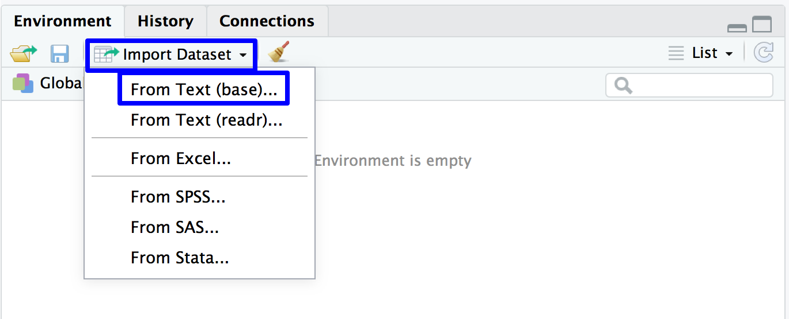

```{r setup, include=FALSE}
options(htmltools.dir.version = FALSE)
knitr::opts_chunk$set(warning = F,
                      message = F,
                      fit.retina = 3,
                      fig.align = "center")

hook_source <- knitr::knit_hooks$get('source')
knitr::knit_hooks$set(source = function(x, options) {
  x <- stringr::str_replace(x, "^[[:blank:]]?([^*].+?)[[:blank:]]*#<<[[:blank:]]*$", "*\\1")
  hook_source(x, options)
})
```

```{r xaringan-themer, include=FALSE, warning=FALSE}
library(xaringanthemer)
style_mono_accent(base_color = "#be2edd",
                  outfile = "xaringan-themer-purple.css")
```

```{r starwarsData, include=FALSE, warning=FALSE}
library(tidyverse)
library(knitr)
library(kableExtra)

empire <- starwars

empire <- empire[c(1:5, 10, 13, 14, 19, 21), c(1:3, 8:10)]
empire$species <- factor(empire$species)

```
name: recap

# Recap
.box-inv-7.small.left[**Packages** are a collection of functions and data sets]
  1. You **install** the package once; must be connected to the internet
  2. You **load** the package every time you use it; do not need to be connected to the internet
  
--

.box-inv-7.small.left[How do you find the function you need? How do you now what package it's in?] 
- **G-o-o-g-l-e!**
- "structural equation modeling in R"

--

.box-inv-7.small.left[How do you know how to use the function? What are the function's **arguments**?]
- Help documentation in R
- `? function.name`

--

.box-inv-7.medium[Today we will talk about how to get your data files into R]
---
name: directories
# Directories
Your computer is made up of a series of folders
<br>
<br>
<br>
<br>

---
# File paths
These are the instructions that tell the computer where to find your file. What series of folders does the computer need to look to find your stuff?

`/Users/Coop/Box Sync/S55-5962_RSkillLab_Spring2020`


---
# File paths
In order to get the actual file, include the name in the file path

`/Users/Coop/Box Sync/S55-5962_RSkillLab_Spring2020/day1.pptx`


---
# R is lazy!

### Working Directory
  - Where `R` is going to *look for* files
  - Where `R` is going to *save* files
---

# Working directory
How do you know your working directory?
  - `getwd()` 
  
How do you change your working directory?
  - `setwd("/your/path/goes/here")`
  - Note the quotes!
  - *HINT: press tab within the quotes and see what happens!*

---
name: rproject

# An Alternative: RProjects
Getting and setting your working directory can be a pain in the $%^
  - What happens if you reorganize your computer and you want to move the files? 
  
--

`RProjects` provides a nice alternative with several added benefits

  1. It syncs to Github. Excellent for version control and open science!
  2. Your project is it's own contained ecosystem. If you move it on your computer, it doesn't matter. No need to get/set your working directory. 
  3. Easy to look for files within that project (rather than the entire computer)
  4. *(If you work with things that require randomly doing something--like generate a random dataset--RProjects makes it easier)*

---
class: inverse, middle, center

# Demo of making a RProject & using Github
---
# Resources for setting up Github

---
name: files

# .R files
- text files
- contain the code that you've written 
- (equivalent to syntax files in SPSS)
- Also called **scripts**
  
--

Why use them?
- Keep track of what functions you use
- Save only the commands/functions/progress that is useful
- Make notes to yourself!
  - `# Updated code for R class!`
  - `# reliability estimates for depression scale`
  - `# scatter plot for BMI predicting diabetes diagnosis`
- Share your analyses with collaborators and readers
---

# Other file types
- `.R` (script)
- `.RProject` -- not where you would write any form of code
- `.Rmd` -- aka "RMarkdown" or "RNotebook"; will talk about for reproducibility!
- Your data!

---
name: opening

# Your data
Original data files
  - Most of the time, these will either be `.csv` or `.txt`, depending on how you collect the data

These are *NOT* altered by `R`! *(different from SPSS)*

If your data is not one of these two formats, don't worry! `R` can do a lot of stuff!

We will work with `.csv` to keep things simple. 
---
# Loading .csv files


---
# Loading .csv files


---
# Loading .csv files


---
# Loading .csv files

The following line of code will appear in your console:

`midus <- read.csv("~/Desktop/rSkillLab/midus.csv")`

.box-inv-7.large[I STRONGLY recommend copying/pasting this line of code into your script (.R) file!]
---

# Typical workflow in R
1. Open a script (new or existing)

2. Prepare to run analyses:
  - Set your working directory (if not using RProject)
  - Load your data
  - Load any packages you might want to use in the analyses
  
3. Write code/run analyses

4. Save your script!
  - Make sure that this includes the code to open your `.csv` from your **Dropbox/Box/Github** etc.
  - Again, note: `R` does't change the original data file!
---

# Typical format of .R file


---
class: inverse, middle, center
name: practice1

# Go do Practice #1
When you are finished, go on to the next video


