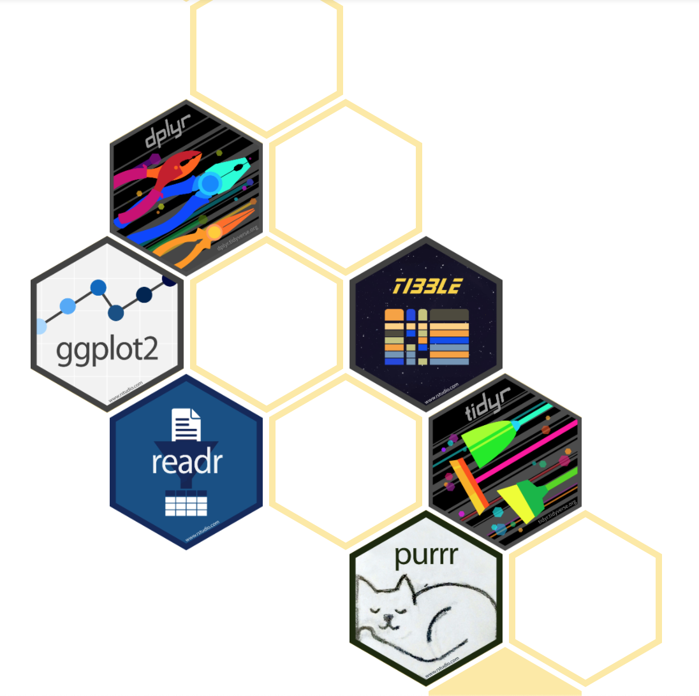

```{r setup, include=FALSE}
options(htmltools.dir.version = FALSE)
knitr::opts_chunk$set(warning = F,
                      message = F,
                      fit.retina = 3,
                      fig.align = "center")

hook_source <- knitr::knit_hooks$get('source')
knitr::knit_hooks$set(source = function(x, options) {
  x <- stringr::str_replace(x, "^[[:blank:]]?([^*].+?)[[:blank:]]*#<<[[:blank:]]*$", "*\\1")
  hook_source(x, options)
})
```

```{r xaringan-themer, include=FALSE, warning=FALSE}
library(xaringanthemer)
style_mono_accent(base_color = "#f9ca24",
                  outfile = "xaringan-themer-yellow.css")
```

# What is the `tidyverse`?

.pull-left[

]

.pull-right[

> "The `tidyverse` is an **opinionated** collection of R packages designed for data science. All packages share an underlying design philosophy, grammar, and data structures."

]
---
# Data Wrangling

This series of `tidyverse` packages is exceptionally good for **data wrangling**. 

  - Cleaning messy data
  - Data preparation 
  - Getting ready for analyses
  - In this ecosystem, non-messy data is referred to as *"tidy"* data

---
# Lots and lots of packages
This is an ecosystem that contains A LOT of packages. We will specifically work with 3 of them:

  - `ggplot2`
  - `dplyr`
  - `tidyr`

--

I personally find thinking of these packages as separate things really confusing. It's a series of packages, and (to me), it makes more sense to think of it as a hollistic ecosystem. Rather than separately installing/loading each package...
---
name: install

# Getting the `tidyverse`
...I prefer to install and load `tidyverse` packages as a single unit. 

To install:
```{r, eval=FALSE}
install.packages("tidyverse")
```

To load:
```{r, eval=FALSE}
library(tidyverse)
```

.medium[Double check that you already have `tidyverse` installed. You should already have it from the [6: Packages Practice Set](/practice/06-practice).

If you do not have this, go ahead and install it now.
]
---
# Loading `tidyverse`
When you load the `tidyverse` package, it will autmatically load several packages for you. Rather than remembering which function came from which package, I personally only load the overall `tidyverse` package. 

However, you can install/load each package separately. It just takes more work.
---
name: fwd

# This section
There are 2 sections (in addition to this one) spanning the `tidyverse`.

  1. The first will introduce you to the `tidyverse` syntax, as well as several functions from the `dplyr` package. 
  
  2. The second will introduce you to a few functions from the `tidyr` package.
  
  3. We have already been introduced to `ggplot2`, but will cover it in much more depth when we get to the Data Visualization section.
  
You DO NOT need to remember which functions come from which package. I'm only breaking it up this way to keep things short and sweet. 


