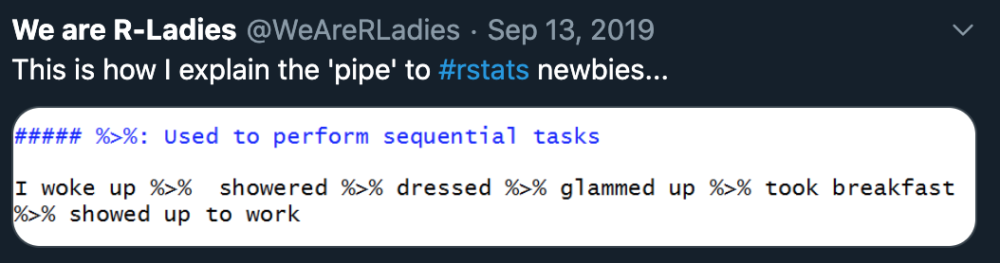

```{r setup, include=FALSE}
options(htmltools.dir.version = FALSE)
knitr::opts_chunk$set(warning = F,
                      message = F,
                      fit.retina = 3,
                      fig.align = "center")

hook_source <- knitr::knit_hooks$get('source')
knitr::knit_hooks$set(source = function(x, options) {
  x <- stringr::str_replace(x, "^[[:blank:]]?([^*].+?)[[:blank:]]*#<<[[:blank:]]*$", "*\\1")
  hook_source(x, options)
})
```

```{r xaringan-themer, include=FALSE, warning=FALSE}
library(xaringanthemer)
style_mono_accent(base_color = "#6ab04c",
                  outfile = "xaringan-themer-green.css")
```

# What is the `tidyverse`?

.pull-left[

]

.pull-right[
> "The `tidyverse` is an **opinionated** collection of R packages designed for data science. All packages share an underlying design philosophy, grammar, and data structures."

]
---
# Plan for today

- Learn basic syntax for nearly all `tidyverse` packages
- Introduce functions that come from the `dplyr` package
  - `filter()`
  - `select()`
  - `mutate()`
  - `summarize()`
  - `group_by()`
---

# About the MIDUS dataset

Variables available in this data file:
  - **Demographic variables**: age, sex
  - **Physical health variables**: self-rated physical health, heart problems, father had heart attack, BMI
  - **Mental health variables**: self-rated meantal health, self-esteem, life satisfaction *(life overall, work, health, relationship with spouse/partner, relationship with children)*, hostility *(stress reactivity & agression*)

--

Please load in `midus`, make sure:
- Make sure the variables `sex`, `heart_self`, and `heart_father` are `factor()` variables (rather than characters)
- Use the same `na.omit()` function to remove all `NA` values
---
name: syntax

# Syntax & Piping

- All of the `tidyverse` packages use **piping** as a way to make code easier to read.

- Think of it kind of like making a cohesive paragraph of code, rather than scribbling down a bunch of random lines. 

- The format looks like this:

```{r, eval=FALSE}
originalData %>% 
  function1(someVariable) %>% 
  function2(someVariable) %>% 
  function3(someVariable)
```

---
# Syntax & Piping
```{r, eval=FALSE}
originalData %>% #<<
  function1(someVariable) %>% 
  function2(someVariable) %>% 
  function3(someVariable)
```

First thing that enters is your original data.frame. The end of the line has this `%>%` symbol. This is called a **pipe**. 
---
# Syntax & Piping
```{r, eval=FALSE}
originalData %>% 
  function1(someVariable) %>% #<<
  function2(someVariable) %>% 
  function3(someVariable)
```

Next up is some function that is performed on a variable. This variable COMES FROM the `originalData` data.frame. Another way to think about it is that the function *inherits* the data.frame from above. That means you don't need to keep re-typing `originalData`.

Again, the end of the line is followed by the `%>%` pipe operator. 
---
# Syntax & Piping
```{r, eval=FALSE}
originalData %>% 
  function1(someVariable) %>% 
  function2(someVariable) %>% #<<
  function3(someVariable)
```

Same thing for the next function. However, instead of inheriting from `originalData`, function 2 will inherit *the output* of function 1! 

Again, the end of the line is followed by the `%>%` pipe operator. 

---
# Syntax & Piping
```{r, eval=FALSE}
originalData %>% 
  function1(someVariable) %>% 
  function2(someVariable) %>% 
  function3(someVariable) #<<
```

Finally, we get to function 3. It will inherit *the output* of function 2.

Notice that there is no `%>%` pipe operator at the end of this line. That's because this "paragraph" of code is now over.
---
# Syntax & Piping
- These `%>%` pipes are used to perform **SEQUENTIAL** tasks!
- You can read the `%>%` as *and then...*

<center>

</center>

--

- Don't use `<-` *inside* the piped function. Only at the very beginning if you want to store the output.
- Keep `%>%` and the *end* of each line! Not at the beginning. 
- Shortcut for inserting pipe:
  - <kbd>command</kbd> + <kbd>shift</kbd> + <kbd>m</kbd> for Mac users 
  - <kbd>control</kbd> + <kbd>shift</kbd> + <kbd>m</kbd> for Windows users

---
name: filter

# `filter()` Function
To illustrate how this works, let's start with the `filter()` function. `filter()` is another way to subset your data.frame based on some condition. It is the `tidyverse` equivalent of `subset()`.

```{r, include=FALSE, message=FALSE, warning=FALSE}
library(tidyverse)
library(kableExtra)
midus <- read.csv(here::here("R", "midus.csv"))

midus <- midus %>% 
  mutate_at(vars(2, 10, 11), list(factor)) %>%
  na.omit(.)
```

Let's say we want to make a new data.frame that included only female participants...
```{r}
femaleMidus <- midus %>% 
  filter(sex == "Female")
```

```{r, echo=FALSE}
kable(head(femaleMidus))
```
---
# Spelling/capitalization etc. always count
Let's say we want to make a new data.frame that included only female participants...
```{r}
femaleMidus <- midus %>% 
  filter(sex == "female")
```

```{r, echo=FALSE}
kable(head(femaleMidus))
```
---

# Now with multiple logical operators
Let's say we want to make a new data.frame that included  male participants who have reported having some form of heart problem and are over the age of 50. 
```{r}
oldMenHeart <- midus %>% 
  filter(sex == "Male" & heart_self == "Yes" & age > 50)
```

```{r, echo=FALSE}
kable(head(oldMenHeart))
```

---
# Is `tidyverse` totally different from `base R`?

**No!** You still have:
  - objects
  - assignment of objects
  - functions
  - functions that take in arguments
  - logical operators like `==` and `>`
  - multiple logical operators like `&` and `|`

The only thing that's different is the inclusion of `%>%` and the way you build your "code paragraphs". But all of the principles that we've learned thus far, still apply to everything in the `tidyverse`.
---
name: select

# `select()` function
This is another way to select variables. It can replace indexing, which is helpful when you are in these `tidyverse` code chunks (or paragraphs).

This function can take in column indexes, variable names, or both!

```{r}
# first 3 columns only!
firstThree <- midus %>% 
  select(1:3)
```

```{r, echo=FALSE}
kable(head(firstThree))
```
---
# `select()` function

```{r}
# BMI, both heart_self and heart_father
otherThree <- midus %>% 
  select(BMI, 10:11)
```

```{r, echo=FALSE}
kable(head(otherThree))
```
---

# `select()` function
To remove a variable, put a `-` (minus) sign in front of the variable you want to get rid of
```{r}
# Keep all variables EXCEPT sex & physical_health_self
removal <- midus %>% 
  select(-sex, -5)
```

```{r, echo=FALSE}
kable(head(removal))
```
---
name: mutate

# `mutate()` function
`mutate()` is kind of tricky. On it's own, will simply add a new variable to the end of your data.frame based on something. 

For example, if we wanted to get the square root of BMI...
```{r}
sqrtMidus <- midus %>% 
  mutate(BMI_sqrt = sqrt(BMI))

head(sqrtMidus)
```
---
# `mutate()` function
BUT, you can add different endings (suffixes) to it
  - `mutate_at()`
  - `mutate_all()`
  - `mutate_if()`

I find `mutate_at()` to be the most useful, personally. It is especially nice for making sure the variables you need to be factors are actually factors!

.small[Note: you can add suffixes `_at`, `_all`, and `_if` to many `tidyverse` functions! `mutate()` happens to be the one where I find this most useful, so I'm using it as an example.]
---
# `mutate()` function
For example, to set up the `midus` data.frame, you were asked to make sure that `sex`, `heart_self`, and `heart_father` were all considered factors. Your code probably looked something like:

```{r, eval=FALSE}
midus$sex <- factor(midus$sex)
midus$heart_self <- factor(midus$heart_self)
midus$heart_father <- factor(midus$heart_father)
```
--
When instead, it could look something like this:
```{r, eval=FALSE}
midus <- midus %>% 
  mutate_at(vars(2, 10, 11), list(factor))
```

- `vars(2, 10, 11)` says "OK, I'm going to mutate some variables. Which ones?" 
- `list(factor)` says, "give me a list of functions you want me to apply to each of the variables you fed me"

.tiny[Note: I have found that the help documentation for some of these functions has not updated accordingly. Search the internet and pay attention to your package version number.]
---
# THERE IS NO RIGHT WAY TO CODE!
Whether you used this...
```{r, eval=FALSE}
midus$sex <- factor(midus$sex)
midus$heart_self <- factor(midus$heart_self)
midus$heart_father <- factor(midus$heart_father)
```

...or this...

```{r, eval=FALSE}
midus <- midus %>% 
  mutate_at(vars(2, 10, 11), list(factor))
```

....**doesn't matter at all!** The only things that count are:
  - Were you able to do what you wanted to? 
  - Can YOU read the code and know what it's doing?
  - Can SOMEONE ELSE read the code and know what it's doing?
  
---

# A `filter()` & `mutate_at()` example

Let's say we `filter()` so that we only have females in our data.set.

```{r}
femalesOnly <- midus %>% 
  filter(sex == "Female")
```

In our new data.frame, the variable `sex` should only have 1 level for "Female". That is, all the "Male" participants have been removed. So as a factor, there should only be 1 category or 1 level. Let's check:
```{r}
levels(femalesOnly$sex)
```

Uh oh! That's not quite right.

---

# A `filter()` & `mutate_at()` example

Let's tell R to make `sex` into a factor again (kind of like re-populate the variable).

```{r}
femalesOnly <- midus %>% 
  filter(sex == "Female") %>% 
  mutate_at(vars(sex), list(factor))

# check the levels again
levels(femalesOnly$sex)
```

Now we got it! You could have first done the `filter()` function, ended the code chunk/paragraph, and then typed:
`femalesOnly$sex <- factor(femalesOnly$sex)`. The downside to this is that it's nice to keep all your functions (verbs/actions) in one place, if you can.
---
name: summary

# `summarize()` function

This is great for summarizing your data *(shocking, I know `r emo::ji("open_mouth")`)*

Remember that awfulness for making bar plots? This is how we can do it easily!

```{r}
midus %>% 
  summarize(meanAge = mean(age))
```

---
# `summarize()` function
You can go crazy with this!

```{r}
midus %>% 
  summarize(meanAge = mean(age), # mean
            sdAge = sd(age), # standard deviation
            varAge = var(age), # variance
            medianAge = median(age)) # median
```

.box-inv-4.small[Fun fact: the person that wrote much of the `tidyverse` packages is from New Zealand, where they use British spellings. Therefore, `summarise()` is the exact same thing as `summarize()`. Your tab-complete might fill in the British versions!]

---
name: group

# `group_by()` function
We can make `summarize()` even more powerful by adding the `group_by()` function. 

You will NOT see anything directly change to your data.frame if you were to just run this factor. However, on the back end (behind the scenes), it tells R to do something *for each level of a categorical variable*. 

If we want the mean age of those with and without heart problems:

```{r}
midus %>% 
  group_by(heart_self) %>% 
  summarize(meanAge = mean(age))
```
---
# `group_by()` function
We can go crazy with this too!

```{r}
midus %>% 
  group_by(heart_self, sex) %>% 
  summarize(meanAge = mean(age),
            sdAge = sd(age),
            meanBMI = mean(BMI),
            sdBMI = sd(BMI))
```

---
name: rand

# Pro Tips
As you can see, the suite of `tidyverse` packages can be really, really helpful! Some things to keep in mind:
  - You can put a non-tidyverse function into one of these code chunks (paragraphs)
    - If you do this, you sometimes need to give the function an input argument. Use the `.` for this. 
    - Ex: `midus %>% na.omit(.)`
  - You can have as many functions in each paragraph as you want. Just remember that everything is *sequential*!
    - If the output of your paragraph isn't what you think it should be, go line by line until you find the problem. Do NOT include the `%>%` when you run the line of code, though! R will wait for you to finish your sentence...
---

# Other useful `dplyr` functions

  - `recode()` is great for recoding variables. I especially like this for when you have something like `1` and `2` reflecting categorical variables. Recode them into something more meaningful! This is often nested within a `mutate()` or `mutate_at()` function.
  
  - `rename()` for renaming columns
  
  - `arrange()` will order the rows of a data.frame by some column. 
  
  - `n_distinct()` finds the number of unique entries. For example, if you have "male" and "female", the result of `n_distinct()` should be 2, even if there are thousands of rows. Now let's say there's a spelling error in one of these rows (e.g., "feemale"), now the result of `n_distinct()` will be 3...that should let you know there's a problem. 
  
  - lots & lots of others...