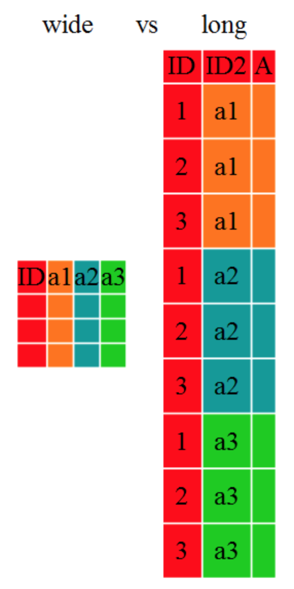
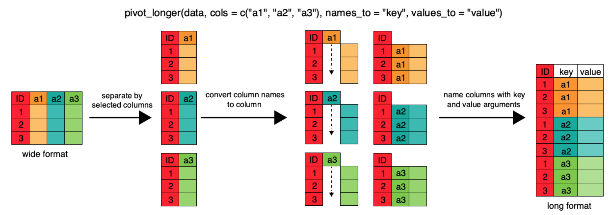

```{r setup, include=FALSE}
options(htmltools.dir.version = FALSE)
knitr::opts_chunk$set(warning = F,
                      message = F,
                      fit.retina = 3,
                      fig.align = "center")

hook_source <- knitr::knit_hooks$get('source')
knitr::knit_hooks$set(source = function(x, options) {
  x <- stringr::str_replace(x, "^[[:blank:]]?([^*].+?)[[:blank:]]*#<<[[:blank:]]*$", "*\\1")
  hook_source(x, options)
})
```

```{r xaringan-themer, include=FALSE, warning=FALSE}
library(xaringanthemer)
style_mono_accent(base_color = "#22a6b3",
                  outfile = "xaringan-themer-teal.css")
```

# Recap
- `tidyverse` is an *opinionated* collection of pacakges
- All packages within it's ecosystem use the same syntax:
  - `%>%` pipe operators at the end of the line read as *"and then"*
  
    > "I took my original data.frame %>%
    
    >  I kept only 5 out of the original 20 columns %>% 
      
    >  I added a new column that was based on the 2nd column %>% 
      
    >  I grouped the data based on a categorical column %>% 
      
    >  I got descriptive statistics per level of the categorical var"
    
---
# Recap
- `tidyverse` is an *opinionated* collection of pacakges
- All packages within it's ecosystem use the same syntax:
  - `%>%` pipe operators at the end of the line read as *"and then"*
  
    > `originalData %>%`
    
    > `select(1:5) %>% `
      
    > `mutate(newVar = sqrt(var1)) %>% `
      
    > `group_by(factorVar) %>%` 
    
    > `summarize(meanVar = mean(var))`

---
# This time
Functions from the `tidyr` package (but DON'T memorize which functions come from which packages!)

  - Go from long to wide format
  - Split columns and combine them
  - Missing data

---
name: lw

# Long vs. Wide data
**Long data** - Each column is a variable and each row is an observation. Each row does NOT need to be a unique participant.

**Wide data** - Each row is a particular participant, and columns can contain multiple observations for the same data. 

```{r, echo=FALSE, message=FALSE, warning=FALSE}
library(tidyverse)
test1 = data.frame(Subject = c(1, 2, 3),
                   Time1 = c(.2, .8, 1.3),
                   Time2 = c(.4, .9, 1.0),
                   Time3 = c(.3, .7, 1.1))

test2 = data.frame(Subject = c(1,2,3,1,2,3,1,2,3),
                   TimePoint = c(1,1,1,2,2,2,3,3,3),
                   Score = c(.2,.8,1.3,.4,.9,1.0,.3,.7,1.1))
```

.pull-left[


.tiny[https://swcarpentry.github.io/r-novice-gapminder/14-tidyr/
]
]
--

.pull-right[

```{r, echo=FALSE}
test1
test2
```
]

---
# Long vs. Wide data

For the most part, you want your data to be in the **long** format
  - Especially for plotting in `ggplot2`!
  - (some analyses, like reliability, require the wide format, but most stick with long)

However, we often receive data in the wide format. It is useful to be able to go between the two. `tidyr` makes this easy with:
  - `pivot_wider()` to go from long to wide
  - `pivot_longer()` to go from wide to long

---
name: pw

# `pivot_wider()` function
This function takes in long data and makes it wide. Important arguments:
  - `names_from = ` which columns to get the *name* of the output column.
  - `values_from = ` which columns to get the *value* of the output column. 

---
# `pivot_wider()` function
Let's take the example data.frame I showed earlier. Since it's completely arbitrary, I'm going to call it `generic`

```{r, echo=FALSE}
generic = test2
```

```{r}
generic
```

---
# `pivot_wider()` function
This `generic` data.frame is in the **long** format. To make it into the **wide** format, let's use `pivot_wider()`

```{r}
wideGeneric <- generic %>% 
  pivot_wider(names_from = TimePoint,
              values_from = Score)

wideGeneric
```

---
# `pivot_wider()` function
Sometimes, it's a bit more complicated. Let's add some more variables to `generic` to test this out. 
  - `hairColor` factor with 2 levels (brown & blonde)
  - `happiness` scale of 1 to 10 measured at each time point
  

```{r}
generic <- generic %>% 
  mutate(hairColor = rep(c("brown", "blonde", "blonde"), times = 3),
         happiness = c(10, 2, 6, 9, 2, 5, 10, 3, 4))

generic
```

---
# `pivot_wider()` function
Now, let's say we want each time point's `Score` and `happiness` variables in the wide format...
```{r}
wideGenericMore <- generic %>% 
  pivot_wider(names_from = TimePoint,
              values_from = c(Score, happiness))

wideGenericMore
```

---
name: pl

# `pivot_longer()` function
The exact opposite of `pivot_wider()` is `pivot_longer`. This takes a wide data.frame and makes it into a **long** data.frame. Arguments are now `names_to =` and `values_to =`. You also need to include a `cols =` argument to say which columns you want into the longer format.

Before doing this with code, here's a schematic that might be helpful:



.tiny[https://swcarpentry.github.io/r-novice-gapminder/14-tidyr/]

---
# `pivot_longer()` function
Let's keep going with our current example, starting from `wideGenericMore`
.medium[]
```{r}
longGeneric <- wideGenericMore %>% 
  pivot_longer(cols = 3:8,
               names_to = "valueType",
               values_to = "allScores")

longGeneric
```
]

---

# `pivot_longer()` function
For both of these `pivot` functions, you can use the `-` (minus) sign to say "everything except this column". For example:

```{r}
longGeneric <- wideGenericMore %>% 
  pivot_longer(cols = c(-hairColor, -Subject),
               names_to = "valueType",
               values_to = "allScores")

longGeneric
```

---
# The `pivot` functions
Some things to notice:

  - In `pivot_longer`, the arguments take in strings (aka, need quotations!). That's because you need to tell R what to name something. 
  
  - In `pivot_wider`, the arguments take in variable names that already exist. So you do not need to wrap those in quotation marks.
  
  - These are the types of functions that I mess up ALL. THE. TIME. Use your History tab!

---
name: sep

# `separate()` function

In our latest iteration, `longGeneric`, we have a column called `valueType` where it is a name, then an underscore (`_`), and a number, ex: `Score_1`. 

We can use `separate()` to make split `valueType` into 2 separate columns...1 for the `Score` and another for the `1`. 

```{r}
longGeneric %>% 
  separate(col = valueType,
           into = c("variableName", "timePoint"))
```

---
# `separate()` function

Note that I did not specify that I wanted to separate based on the underscore.
  - When it is simple like this, R can automatically detect it.
  - But if it's a bit trickier, you can specify how to separate in the `sep =` argument.
    - For example, `sep = ": "` if you want to separate on a colon + space. 

---
name: un

# `unite()` function
The opposite of separate is `unite()`. For instance, let's say we want to create a variable called `bogus` that looks something like `brown: Score` or `blonde: happiness`. The separator is a colon + space.

```{r}
longGeneric %>% 
  unite(col = "bogus",
        hairColor, valueType,
        sep = ": ")
```

---
name: missing

# Missing values in `tidyverse`
- Like `base R` and others, many `tidyverse` functions have an argument for `na.rm =`. 
- You can add a `drop_na()` function to your `tidyverse` chunk. This function is part of `tidyr` and it will get rid of any rows that contain missing values. It's the equivalent of `na.omit()`
- Do everything in your power to make sure missing values are treated as `NA` and *not* something else. Ex:
  - `999` -- Many measurements can have a value of 999...
  - `" "` -- Spaces are treated as a character string, not truly missing! Remember, the class of your object is based on the least specific object. So if you have a vector of integers, but one missing value that is `" "`, the class of your vector will be a character! Same thing goes for `.` (periods).
- If you have something like `999` and you want to replace that with an `NA`, either of the following will work:
  - `data[data == 999] <- NA` (for the entire dataset)
  - `data$column[data$column == 999] <- NA` (for a single column)
  - `data <- gsub(pattern = 999, replacement = NA, x = data)` (but this will find anything with 999, so be careful!)
