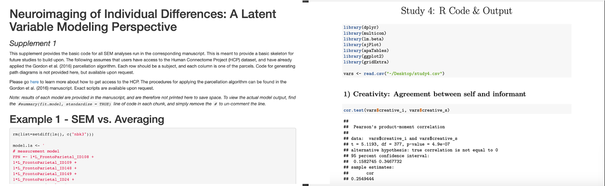

```{r setup, include=FALSE}
options(htmltools.dir.version = FALSE)
knitr::opts_chunk$set(warning = F,
                      message = F,
                      fit.retina = 3,
                      fig.align = "center")

hook_source <- knitr::knit_hooks$get('source')
knitr::knit_hooks$set(source = function(x, options) {
  x <- stringr::str_replace(x, "^[[:blank:]]?([^*].+?)[[:blank:]]*#<<[[:blank:]]*$", "*\\1")
  hook_source(x, options)
})
```

```{r xaringan-themer, include=FALSE, warning=FALSE}
library(xaringanthemer)
style_mono_accent(base_color = "#4834d4",
                  outfile = "xaringan-themer-blue.css")
```

# The "Reproducibility Crisis"

<center>

</center>


*Note: It's not just Psychology! Neuroscience, Political Science, Public Health, etc... Nearly every scientific discipline has issues!*

---
# The "Reproducibility Crisis"

How did the authors actually do their analyses?
  - Did they transform their variables? If so, how?
  - How did they handle missing data?
  - Did they do what they said they were going to do in the Methods section of the paper?
  
Can we check that they did everything correctly? 
  - We need to be able to *reproduce* their findings
  - In order to reproduce a figure, you need the data and the code!
    - Code needs to be in a format that **other humans** can read!

---
# Make Your Life Prettier

- Format code and text so that it's easier to read
  - Comments in a script are great, but it can get cumbersome
- This is great for homework assignments, showing your research advisor or boss your findings, and publishing code along with your manuscripts!
- Some examples: 

<center>

</center>

---
# How do we do this?
To make our code pretty and readable, we're going to use something called **Markdown**. It's a way to take plain text and convert it into a pretty, formatted document like HTML, PDF, or even MS Word. 

  - Specifically, it's a way to write formatted text without writing full-blown HTML.
  - It is not specific to `R`! Lots of things use Markdown! For example, the [.url[README files on Github like this one]](https://github.com/facebook/react) (scroll down to formatted text). Learning this will help even if you decide to leave academia. 
  - **RMarkdown** is simply Markdown but within `R`. This will, obvs, be our focus.

---
# Why use RMarkdown?
...but my script has lots of comments and it's fine, right? 

NO!

  - .R scripts are monotonous
  - Make a professional document or report
    - Headers
    - Bullet lists
    - **Clearly differentiate between text and code**
    - Link to websites, insert pictures etc. 
  - MUCH easier to read!
  - MUCH easier to reproduce!

---
name: check

# Before we begin
You will need the following packages. I'm 95% sure that `R` automatically installs the first two packages when you install `R`. The third package you should have already intalled as part of one of the practice sets. However, please check your Packages tab now -- if you do not have any of these, please install them!

  - `rmarkdown`
  - `knitr`
  - `kableExtra`

---
# Before we bgin
When you go to `File > New File >` you will see options for RMarkdown & RNotebook.

We are going to work with RNotebook.

  - Frankly, they are nearly identical, including having the same file extension (`.Rmd`), so it doesn't matter much tbh
  - It's slightly easier to preview an RNotebook, so we'll stick to that.
  - *I will use RMarkdown and RNotebook interchangably from here on out, because they are seriously that similar!*
  - .small[Those of you coming from Python `r emo::ji("snake")`, this is the equivalent of a Jupyter notebook]

---
name: fwd

# This section
There are 2 sections (in addition to this one) spanning reproducibility with RMarkdown. 

  1. The first will introduce you to the skeleton of a `.Rmd` document. This is a way to get familiar with the basics.
  
  2. The second will show you all the paramters you can change to make your document even prettier. This is to give you a taste of all of the flexibility available at your fingertips. 