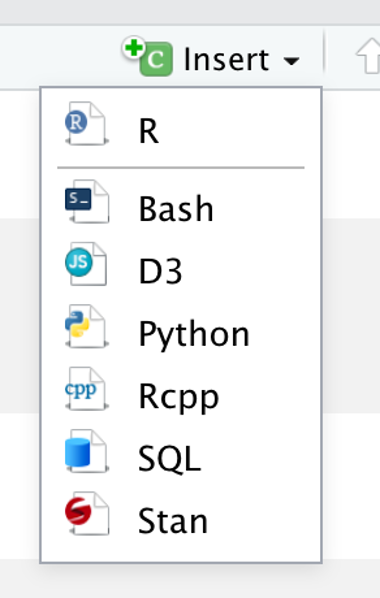

```{r setup, include=FALSE}
options(htmltools.dir.version = FALSE)
knitr::opts_chunk$set(warning = F,
                      message = F,
                      fit.retina = 3,
                      fig.align = "center")

hook_source <- knitr::knit_hooks$get('source')
knitr::knit_hooks$set(source = function(x, options) {
  x <- stringr::str_replace(x, "^[[:blank:]]?([^*].+?)[[:blank:]]*#<<[[:blank:]]*$", "*\\1")
  hook_source(x, options)
})
```

```{r xaringan-themer, include=FALSE, warning=FALSE}
library(xaringanthemer)
style_mono_accent(base_color = "#be2edd",
                  outfile = "xaringan-themer-purple.css")
```

# Recap
- Reproducibility across all sciences is a **huge** issue!
- We need to be able to reproduce scientific findings
  - This means the data & code from a given paper must be easy to access and **human readable**
- When it comes to programming in `R`, using **RMarkdown** can help us make sure that other humans can understand our analyses

<center>

</center>

.tiny[Artwork by [Allison Horst](https://twitter.com/allison_horst)]
---
# Anatomy of RNotebook
The anatomy of all `.Rmd` files (RNotebook or RMarkdown):

.box-7.large.align-left[
1\. Document Information
]
.box-7.large.align-left[
2\. Formatted Text &nbsp;&nbsp;&nbsp;&nbsp;&nbsp;&nbsp;&nbsp;&nbsp;&nbsp;&nbsp;&nbsp;&nbsp;&nbsp;&nbsp;
]
.box-7.large.align-left[
3\. Code Chunks &nbsp;&nbsp;&nbsp;&nbsp;&nbsp;&nbsp;&nbsp;&nbsp;&nbsp;&nbsp;&nbsp;&nbsp;&nbsp;&nbsp;&nbsp;&nbsp;&nbsp;&nbsp;&nbsp;
]

---
# Anatomy of RNotebook
The anatomy of all `.Rmd` files (RNotebook or RMarkdown):

.box-inv-7.large.align-left[
1\. Document Information
]
.box-7.large.align-left[
2\. Formatted Text &nbsp;&nbsp;&nbsp;&nbsp;&nbsp;&nbsp;&nbsp;&nbsp;&nbsp;&nbsp;&nbsp;&nbsp;&nbsp;&nbsp;
]
.box-7.large.align-left[
3\. Code Chunks &nbsp;&nbsp;&nbsp;&nbsp;&nbsp;&nbsp;&nbsp;&nbsp;&nbsp;&nbsp;&nbsp;&nbsp;&nbsp;&nbsp;&nbsp;&nbsp;&nbsp;&nbsp;&nbsp;
]

---
name: di

# Document Information

.pull-left[
- Title
- Subtitle
- Date
- Author
- Output type
]

.pull-right[


This is sometimes called a YAML header.
]

---
# Document Information
.pull-left[
- Title
- Subtitle
- Date
- Author
- Output type
]

.pull-right[


.box-inv-7[IMPORTANT: Do NOT change any of the tabs/indents in the YAML header. If you copy something from the internet, pay attention to this!]
]

---
# Anatomy of RNotebook
The anatomy of all `.Rmd` files (RNotebook or RMarkdown):

.box-7.large.align-left[
1\. Document Information
]
.box-inv-7.large.align-left[
2\. Formatted Text &nbsp;&nbsp;&nbsp;&nbsp;&nbsp;&nbsp;&nbsp;&nbsp;&nbsp;&nbsp;&nbsp;&nbsp;&nbsp;&nbsp;
]
.box-7.large.align-left[
3\. Code Chunks &nbsp;&nbsp;&nbsp;&nbsp;&nbsp;&nbsp;&nbsp;&nbsp;&nbsp;&nbsp;&nbsp;&nbsp;&nbsp;&nbsp;&nbsp;&nbsp;&nbsp;&nbsp;&nbsp;
]
---

# Formatted Text
You need to tell R how you want your text to be formatted:
  - Headers
  - Bolded text
  - Italicized text
  - Hyperlinks
  - Bullet/numbered lists
---
name: head

# Headers

The number of `#` indicates what size and level your header should be.

<center>

</center>
---
# Headers

<center>

</center>
---
# Headers

<center>

</center>
---
name:bi

# Bold & Italics

**Bold text**
  - \*\*bold text \*\*
  - \_\_bold text \_\_ (2 underscores)

*Italicized text*
  - \* italicized text \*
  - \_ italicized text \_

To **_combine_**, pick `*` for one and `_` for the other
  - \*\*\_combine\_\*\*
  - \_\*\*combine\*\*\_
  - \*\_\_combine\_\_\*
  - \_\_\*combine\*\_\_

---
name: links

# Hyperlinks

- The word(s) you want to be the link go inside square brackets `[ ]`

- Immediately after, it's a pair of parentheses `( )` that contains the actual link. 

<br>
<br>
<center>
.url.large[[Google]].large[(www.google.com) is my friend!]
</center>
<br>
<br>
<center>
.large[[Google](www.google.com) is my friend!]
</center>
---
name: lists

# Bullet Lists - Unordered

- First line must end with a `:` (colon)
- Must have an empty line
- Must have a space after the bullet

.pull-left[
#### Unformatted
`Brazilian States:`

`- Rio Grande do Sul`  
`- Parana`  
`- Rio de Janeiro`
]

.pull-right[
#### Formatted
Brazilian States:

- Rio Grande do Sul
- Parana
- Rio de Janeiro
]


.small[Bullets can be `-` (dashes), `+` (plus), or `*` (asterisk), but all come out looking like what you see here.]
---
# Bullet Lists - Ordered
Same thing, but now with numbers

.pull-left[
#### Unformatted
`Brazilian States:`

`1. Rio Grande do Sul`  
`2. Parana`  
`3. Rio de Janeiro`
]

.pull-right[
#### Formatted
Brazilian States:

1. Rio Grande do Sul
2. Parana
3. Rio de Janeiro
]
---
# Bullet Lists - Nested
You can have organized, nested lists. Go to the next line, and press **2 spaces**. Then put your new bullet symbol. 
  - Do NOT press <kbd>tab</kbd>. For whatever reason, R doesn't like it for Markdown.
  - If you still are stuck, try 4 spaces -- that should work

.pull-left[
#### Unformatted

]

.pull-right[
#### Formatted
Brazilian States & Capitals:

1. Rio Grande do Sul
    * Porto Alegre
      - This is the best!
2. Parana
    * Curitiba
3. Rio de Janeiro
    * Rio de Janeiro
]

---
# Anatomy of RNotebook
The anatomy of all `.Rmd` files (RNotebook or RMarkdown):

.box-7.large.align-left[
1\. Document Information
]
.box-7.large.align-left[
2\. Formatted Text &nbsp;&nbsp;&nbsp;&nbsp;&nbsp;&nbsp;&nbsp;&nbsp;&nbsp;&nbsp;&nbsp;&nbsp;&nbsp;&nbsp;
]
.box-inv-7.large.align-left[
3\. Code Chunks &nbsp;&nbsp;&nbsp;&nbsp;&nbsp;&nbsp;&nbsp;&nbsp;&nbsp;&nbsp;&nbsp;&nbsp;&nbsp;&nbsp;&nbsp;&nbsp;&nbsp;&nbsp;&nbsp;
]

---
name: code

# Code Chunks
- This is what makes RMarkdown so cool!
- Type your code directly into a code chunk and work with it just like you would a `.R` script file
- When you're done, click <kbd>knit</kbd> at the top to generate your pretty report
  - All code chunks will be executed (unless you say otherwise...see next lecture)
---

# Code Chunks

<center>

</center>

Each code chunk:
  - **Starts and ends** with three backticks
    - if you don't have the ending 3, you're gonna have a bad time
  - Has `{r}` at top next to the first 3 backticks
  - Has gray background
  - Looks like normal code
  - Runs like normal code

---

# Making Code Chunks

.pull-left[
To make a code chunk:
  - Use the `insert` button
  - Manually type the backticks & `{r}`
  - Keyboard shortcuts
    - PCs: <kbd>ctrl</kbd> + <kbd>alt</kbd> + <kbd>i</kbd> 
    - Macs: <kbd>cmd</kbd> + <kbd>opt</kbd> + <kbd>i</kbd>
]

.pull-right[

]
---

# A finished product
<center>

</center>

---
# Code Chunks
All code will run in a code chunk
  - It's very literal!
  - We can't see `midus` or `mean_age`
    - These are stored as objects
    - If you want to see them, you need to tell R to show them to you
  - We needed to import `midus`
    - If it was in your Environment *before* knitting the file AND you did *not* import your data, it would fail
    - Whatever data you use, you need to import it!
---
name: tab

# Viewing data.frames
To help make data.frames readable for humans, use the `kable()` function
  - comes from the `knitr` package, although surprisingly, you don't need to manually load this one
---
<center>

</center>
---

# Next up

Chaning parameters in the YAML header and in code chunks to make the output just right. 
<center>

</center>
