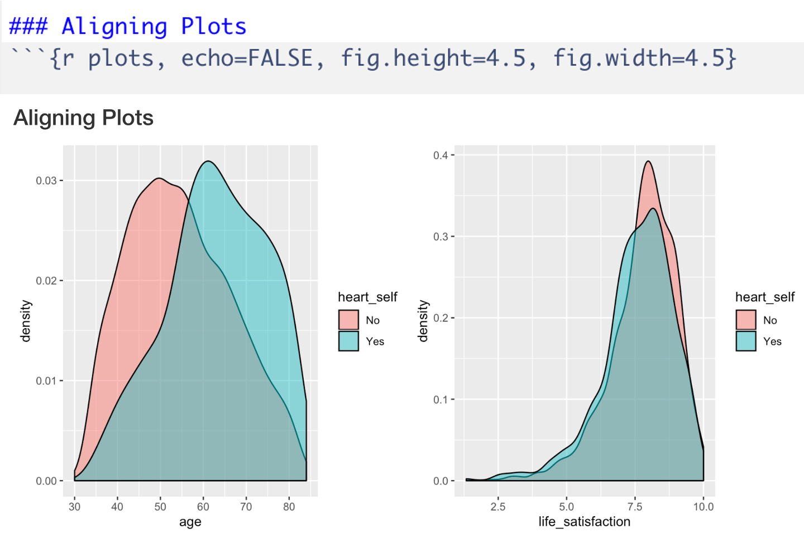

```{r setup, include=FALSE}
options(htmltools.dir.version = FALSE)
knitr::opts_chunk$set(warning = F,
                      message = F,
                      fit.retina = 3,
                      fig.align = "center")

hook_source <- knitr::knit_hooks$get('source')
knitr::knit_hooks$set(source = function(x, options) {
  x <- stringr::str_replace(x, "^[[:blank:]]?([^*].+?)[[:blank:]]*#<<[[:blank:]]*$", "*\\1")
  hook_source(x, options)
})
```

```{r xaringan-themer, include=FALSE, warning=FALSE}
library(xaringanthemer)
style_mono_accent(base_color = "#eb4d4b",
                  outfile = "xaringan-themer-red.css")
```

# Anatomy of .Rmd

<center>
.box-1.large.align-left[
1\. Document Information 

2\. Formatted Text

3\. Code Chunks
]
</center>

---
# Today
All the different parameters you can add to your code chunks and document information (aka yaml header) for added flexibility.


.medium[Absolutely, 100% do **NOT** memorize *any* of this!]

---
name: par

# Parameter
A parameter is the thing that goes within the curly brackets `{ }` at the top of a code chunk. Some useful ones we will cover:
  - Programming languge (necessary)
  - Name of chunk (strongly encouraged)
  - Echo
  - Include
  - Eval
  - Message/Warning
  - Figure parameters

---

# What programming language?

.pull-left[
- Default is `R` (obviously)
- But it can be different...
]

.pull-right[


]

---

# Name of chunk

.pull-left[
- No comma (`,`) after the programming language parameter
- Name your chunk something that you will remember and makes sense!
  - Do **not** include spaces in the name
  - Do **not** include special characters like `#`, `$`, `%`, etc. 
    - Dashes (`-`) and underscores (`_`) are OK
- Naming your chunk should help you navigate your document
]

--

.pull-right[

]

---
# The `echo` parameter

The `echo` parameter refers to if the code in the chunk should show up in your output document.
  - If you want your code to appear, `echo = TRUE` (this is the default behavior)
  - If you only the *OUTPUT* of the code to appear (not the code itself), set `echo = FALSE`


All the code will be run and executed no matter what!
---
# `echo = TRUE`

.pull-left[

]

.pull-right[

]
---
# `echo = FALSE`

.pull-left[

]

.pull-right[

]

---
# The `include` parameter

`include` is very similar to `echo` except *both* the code AND the output will not be shown. 
  - All code will be run and executed!
  
At the top of each .Rmd, it is helpful to have a code chunk, usually called `setup`. It's a great place to:

  - import your dataset (`read.csv`)
  - load the necessary packages (`library()`)
  - set options that will apply to the entire document (later slides)
  - etc...
    
For the most part, the people you send this file to do not need to see any of the above `r emo::ji("point_up_2")`. So it's a good place to use `include = FALSE`. 

---
# The `include` parameter

.pull-left[

]

.pull-right[

]
---

# The `eval` parameter
- Should the code run at all?
- Default is `TRUE`
- This is sometimes nice when you're trying to teach a concept or explain how something works. 

--

.pull-left[

]

.pull-right[

]

---

# Messages & Warnings
- Sometimes functions will result in code that shows you *non-error* messages or warnings in the console. Examples: 
    
    - When you load a package `ggplot::alpha is masked by psych::alpha`
    - `removed any NA`
    
- These are fine for personal use, but if you're sharing your codde, they don't need to see these things

- The default behavior of RMarkdown is to show you the messages and warnings 

- To change, add `message = FALSE` and `warnring = FALSE` parameters

.small[Note, it's hard to tell the difference between messages and warnings, so I usually do both]

---
# `message = TRUE`

.pull-left[

]

.pull-right[

]

---
# `message = FALSE`

.pull-left[

]

.pull-right[

]

---
# Figures

How big do you want your figures to be on the page? 
  - can modify with `fig.width` & `fig.height`
  - default is 7x7 inches, but you might want to make that smaller if you want to see 2 next to each other

How do you want your figures to be aligned on the page?
  - right? left? lenter?
  - can modify with `fig.align`
  - default is to not make any adjustments at all

---
# Problem with Figures


---
# Problem with Figures


---
# Solution to Figures


---
# Solution to Figures


---
# Parameters
- If you want to modify each individual code chunk, put the parameter within the curly brackets `{ }` (like we've been talking about)
- If you want to apply that same parameter to the *entire* document:
  - Have a setup chunk (this is good practice anyways)
  - Inside the setup chunk, you'll write something like this:
  
  

.small[You'll want to look it up for the exact parameter, but it usually starts with `knitr::opts_chunk`]

---
name: yaml

# Other things
  - Table of contents
  - Code folding
  - Inline code
  - Equations
  - Running code in RMarkdown
  - Variables & environment
  - Output file types

---
# Table of Contents

- The Table of Conents is based on Markdown headers (`#`)
- You specify if you want one at all in the YAML header
- It will show headers 1 (`#`) through 3 (`###`) by default
- If you want to modify this, you can do so with `toc_depth`

---
# Table of Contents - default

.pull-left[

]

.pull-right[

]

---
# Table of Contents - `toc_depth: 5`

.pull-left[

]

.pull-right[

]

---
# Table of Contents - HTML Only!
- If your output file is an HTML file, you can have the Table of Contents float down the side of your screen while you scroll!
- Use `toc_float` in the YAML header

--

.pull-left[

]

.pull-right[

]
---
# Code Folding - HTML Only!
- Give the person you are sharing the document with the option of looking at your code
- Add `code_folding: "hide"` to the YAML header
--

.pull-left[

]

.pull-right[

]
---
# Code Folding - HTML Only!
.pull-left[

]

.pull-right[

]
---
# Inline Code
- Sometimes you want to acknowledge that something is code in formatted text. Ex: I am formatted text, but `this` is `code`.
- This is called "inline code"
- Wrap the text within single backtics 


--


---
# Inline Code
- You can also run some `R` code the same way 
- This is helpful when: 
  - You stored a value that you'd like to share
  - You want to show someting in a way your audience will like (e.g., rounding a number)
- This is NOT great for lots of code! Meant to be a quick thing.

--
<center>


</center>
---
# Equations
- LaTeX works well in RMarkdown. Really great for equations/matrices
- For an equation, surround with `$`


--


- Equation of a line is $y = mx+b$
- Greek letters are fun $\alpha$, $\beta$, $\omega$, 
- If you want your equation to be centered on the page, use double `$$`

$$ c^2 = a^2 + b^2$$
---
# Running Code
- You can run code within a code chunk just like an .R script (go line by line or highlight lots of lines and hit <kbd>Run</kbd>)
- OR you can use the green arrow at the top right corner of the code chunk to run all lines within that chunk.


---
# Running Code
- You can also use the other button to run all code chunks *above* the current chunk!
- This is wonderful when you think you're working with the wrong variable, or you screw up your data.frame and want to get it back to how it was


---
# Reminder!
You **need** to make sure that the variables/datasets you want to work with are imported or created within the .Rmd file!
  - When a .Rmd file knits, it starts as though there is NOTHING in your Environment and NONE of the packages are loaded...like a brand new R session
  - If you import your data through the GUI, and *don't* put that code into the .Rmd file, when you go to <kbd>knit</kbd>, it won't find your file and it won't work properly
  - The same is true if you make a variable in your Console, but forget to put that code into your .Rmd file

---

# Other file types
- We've mainly been working with HTML files. Other options include Word and PDF .small[(and some more advanced things like slides -- all of the slides in this class were made with RMarkdown!)]

--

- Word Documents
  - This works...OK-ish. The only weird thing is that it will say you can't edit the file after it knits. You need to save it as a new file in order to edit it. But it will usually prompt you to do so. 
  - Also, formatting tables in Word is really annoying. 

--

- PDF Documents
  - If you have a Mac, this should work seamlessly
  - If you have a PC, you need to have LaTeX on your computer, which is usually installed with MiKTeX. See the Resources tab for how to do this -- it's very annoying. 
  
---

# Don't forget about R's Cheatsheets!
`Help > Cheatsheets` or Google `RMarkdown cheatsheet`

Also, there are cheatsheets for *a lot* of things, including `dplyr` and `ggplot2`. Again, never memorize anything!