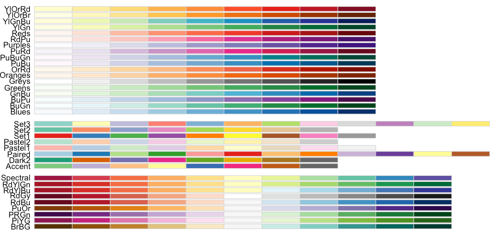
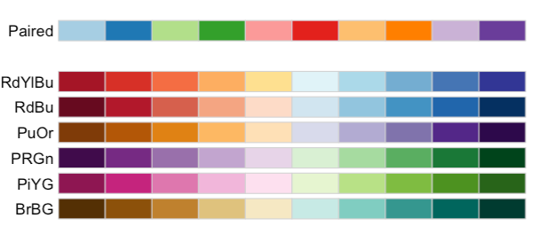
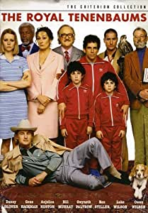
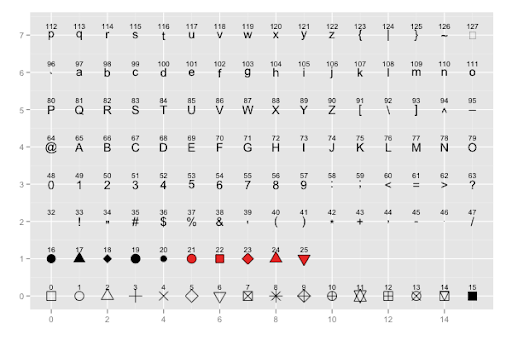

```{r setup, include=FALSE}
options(htmltools.dir.version = FALSE)
knitr::opts_chunk$set(warning = F,
                      message = F,
                      fit.retina = 3,
                      fig.align = "center")

hook_source <- knitr::knit_hooks$get('source')
knitr::knit_hooks$set(source = function(x, options) {
  x <- stringr::str_replace(x, "^[[:blank:]]?([^*].+?)[[:blank:]]*#<<[[:blank:]]*$", "*\\1")
  hook_source(x, options)
})
```

```{r xaringan-themer, include=FALSE, warning=FALSE}
library(xaringanthemer)
style_mono_accent(base_color = "#22a6b3",
                  outfile = "xaringan-themer-teal.css")
```

```{r starwarsData, include=FALSE, warning=FALSE}
library(tidyverse)
library(knitr)
library(kableExtra)

empire <- starwars

empire <- empire[c(1:5, 10, 13, 14, 19, 21), c(1:3,8,10,11)]
empire$species <- factor(empire$species)

```

```{r midus, include=FALSE, warning=FALSE}
midus <- read.csv(here::here("R", "midus.csv"))

midus <- midus %>% 
  mutate_at(vars(2, 10, 11), list(factor)) %>%
  na.omit(.)
```

# Last time
- `ggplot` is built on **LAYERS**
  - Layer 1: `ggplot(data =   , aes(x =   , y =  )) +`
  - Layer 2: `geom_something(size =   , aes(color =   ))`
  - Layer 3: `labs(x = "x-axis label", y = "y-axis lable")`
  
- `geom_` controls the shape of the data points
  - `geom_density` for density plots
  - `geom_point` for scatter plots
  - `geom_bar` for bar plots, etc...

- Aesthetics control something in that particular layer
  - If it comes from the data, wrap it inside `aes()`
  - If not, no need for the `aes()`
  - Aesthetics we looked at: `size`, `color`, `fill`, `alpha`

---
# Today

Customizing our plots
  - Color palettes
  - Themes
  - Manually changing things in your plot

---
name: pal

# Color Palettes
These can be very useful:

  - You have a TON of data and want to maximize the differences between colors
  - You want your colors to scale from dark to light (or vice versa)
  - You want to use colors that are colorblind friendly
  - You're bored of the default `ggplot2` colors
  
--

The most popular collection of palettes comes from a package called `RColorBrewer`. If you don't already have this installed, please do so now.

---

# `RColorBrewer` Palettes
All of the color palettes available through `RColorBrewer` (and to view this yourself):

```{r, eval=FALSE}
library(RColorBrewer)
display.brewer.all()
```

<center>

</center>

---
# `RColorBrewer` Palettes
You don't have to stare at all of these. See if they fit your specifications. For example:

```{r, eval=FALSE}
# find palettes with 10 colors that are color blind friendly
display.brewer.all(n = 10, colorblindFriendly = TRUE)
```

<center>

</center>
---

# `RColorBrewer` Palettes
Once you know the name of the palette you want to use, you add a **LAYER** with the info

.pull-left.pull-left-small[
.code-small[
```{r eval=FALSE}
ggplot(data = empire,
       aes(x = name,
           y = mass)) +
  geom_col(aes(fill = name)) +
  scale_fill_brewer(palette = "PRGn") #<<
```
]
]

.pull-right.pull-right-large[
```{r, echo=FALSE}
ggplot(data = empire,
       aes(x = name,
           y = mass)) +
  geom_col(aes(fill = name)) +
  scale_fill_brewer(palette = "PRGn") 
```
]

---
# `RColorBrewer` Palettes

- The format is `scale_SOMETHING_brewer`
- `SOMETHING` needs to match the aesthetic
- We used `fill`, so it's `scale_fill_brewer`
- If you used `color`, it would be `scale_color_brewer`

---

# Want more color palettes?
There are seriously **_TONS_** of color palettes available to you. Some are great, and some are kind of ridiculous. Examples:
  - Wes Anderson themed palettes (check it out [.url[here]](https://github.com/karthik/wesanderson#wes-anderson-palettes))
  - The package `ggsci` contains color palettes for scientific journals & sci-fi TV shows. See [.url[here]](https://cran.r-project.org/web/packages/ggsci/vignettes/ggsci.html#futurama).
  - For a complete list, check out [.url[this Github repo]](https://github.com/EmilHvitfeldt/r-color-palettes).

.pull-left[
<center>


</center>
]

.pul-right[
<center>


</center>
]

---

# Non-`RColorBrewer` palettes

.pull-left.pull-left-small[
No matter what, you'll need to install the packages that contain the palettes
.code-small[
```{r, eval=FALSE}
# This package includes color palettes
# for scientific journals & sci fi shows!
install.packages("ggsci")
library(ggsci)

ggplot(data = empire,
       aes(x = name,
           y = mass)) +
  geom_col(aes(fill = name)) +
  scale_fill_futurama() + #<<
  labs(title = "Good News, Everyone!") 

```
]

.small[Always check the help documentation if you don't know how to use it!]
]

.pull-right.pull-right-large[
```{r, echo=FALSE}
# This package includes color palettes
# for scientific journals & sci fi shows!
library(ggsci)

ggplot(data = empire,
       aes(x = name,
           y = mass)) +
  geom_col(aes(fill = name)) +
  scale_fill_futurama() + #<<
  labs(title = "Good News, Everyone!") 

```
]

---
name: theme

# Themes

Themes change the *entire look* of your plot. Most of the themes you need are built into the main `ggplot2` package.

If you want more themes, check out:
  - the `ggthemes` package
  - the `ggthemer` package
  - My fav: to make plots in the style of XKCD comics, see [.url[here]](https://xkcd.r-forge.r-project.org/)
  
We will stick to the basic themes just so you can get a sense of things.

---

# Side Note

Before we get going, let's create the same `age_category` variable that we made in the [09: Stats & Plot Practice](/practice/09-practice)

```{r}
midus$age_category <- cut(x = midus$age,
                          breaks = c(28, 40, 60, 84),
                          labels=c("young", "middle", "old"),
                          include.lowest = TRUE)
```

---
# Themes

.pull-left.pull-left-small[
### No specified theme 
The default for `ggplot2` plots

.code-small[
```{r, eval=FALSE}
ggplot(data = midus,
       aes(x = heart_father,
           y = life_satisfaction)) +
  geom_violin(aes(fill = heart_father)) + 
  labs(x = "Dad Heart Attack?",
       y = "Life Satisfaction",
       title = "No Set Theme")
```
]
]

.pull-right.pull-right-large[
```{r, echo=FALSE}
ggplot(data = midus,
       aes(x = heart_father,
           y = life_satisfaction)) +
  geom_violin(aes(fill = heart_father)) + 
  labs(x = "Dad Heart Attack?",
       y = "Life Satisfaction",
       title = "No Set Theme")
```
]

---
# Themes

.pull-left.pull-left-small[
### Black & White theme

.code-small[
```{r, eval=FALSE}
ggplot(data = midus,
       aes(x = heart_father,
           y = life_satisfaction)) +
  geom_violin(aes(fill = heart_father)) + 
  labs(x = "Dad Heart Attack?",
       y = "Life Satisfaction",
       title = "Black & White Theme") +
  theme_bw() #<<
```
]
]

.pull-right.pull-right-large[
```{r, echo=FALSE}
ggplot(data = midus,
       aes(x = heart_father,
           y = life_satisfaction)) +
  geom_violin(aes(fill = heart_father)) + 
  labs(x = "Dad Heart Attack?",
       y = "Life Satisfaction",
       title = "Black & White Theme") +
  theme_bw() #<<
```
]

---
# Themes

.pull-left.pull-left-small[
### Black & White theme
You can still modify the theme. For example, let's change the baseline font size to be much smaller
.code-small[
```{r, eval=FALSE}
ggplot(data = midus,
       aes(x = heart_father,
           y = life_satisfaction)) +
  geom_violin(aes(fill = heart_father)) + 
  labs(x = "Dad Heart Attack?",
       y = "Life Satisfaction",
       title = "Black & White Theme") +
  theme_bw(base_size = 7) #<<
```
]
]

.pull-right.pull-right-large[
```{r, echo=FALSE}
ggplot(data = midus,
       aes(x = heart_father,
           y = life_satisfaction)) +
  geom_violin(aes(fill = heart_father)) + 
  labs(x = "Dad Heart Attack?",
       y = "Life Satisfaction",
       title = "Black & White Theme") +
  theme_bw(base_size = 7) #<<
```
]

---
# Themes

.pull-left.pull-left-small[
### Classic theme

.code-small[
```{r, eval=FALSE}
ggplot(data = midus,
       aes(x = heart_father,
           y = life_satisfaction)) +
  geom_violin(aes(fill = heart_father)) + 
  labs(x = "Dad Heart Attack?",
       y = "Life Satisfaction",
       title = "Classic Theme") +
  theme_classic() #<<
```
]
]

.pull-right.pull-right-large[
```{r, echo=FALSE}
ggplot(data = midus,
       aes(x = heart_father,
           y = life_satisfaction)) +
  geom_violin(aes(fill = heart_father)) + 
  labs(x = "Dad Heart Attack?",
       y = "Life Satisfaction",
       title = "Classic Theme") +
  theme_classic() #<<
```
]

---
# Themes

.pull-left.pull-left-small[
### Dark theme

.code-small[
```{r, eval=FALSE}
ggplot(data = midus,
       aes(x = heart_father,
           y = life_satisfaction)) +
  geom_violin(aes(fill = heart_father)) + 
  labs(x = "Dad Heart Attack?",
       y = "Life Satisfaction",
       title = "Dark Theme") +
  theme_dark() #<<
```
]
]

.pull-right.pull-right-large[
```{r, echo=FALSE}
ggplot(data = midus,
       aes(x = heart_father,
           y = life_satisfaction)) +
  geom_violin(aes(fill = heart_father)) + 
  labs(x = "Dad Heart Attack?",
       y = "Life Satisfaction",
       title = "Dark Theme") +
  theme_dark() #<<
```
]

---
# Themes

.pull-left.pull-left-small[
### Void theme

.code-small[
```{r, eval=FALSE}
ggplot(data = midus,
       aes(x = heart_father,
           y = life_satisfaction)) +
  geom_violin(aes(fill = heart_father)) + 
  labs(x = "Dad Heart Attack?",
       y = "Life Satisfaction",
       title = "Void Theme") +
  theme_void() #<<
```
]
]

.pull-right.pull-right-large[
```{r, echo=FALSE}
ggplot(data = midus,
       aes(x = heart_father,
           y = life_satisfaction)) +
  geom_violin(aes(fill = heart_father)) + 
  labs(x = "Dad Heart Attack?",
       y = "Life Satisfaction",
       title = "Void Theme") +
  theme_void() #<<
```
]

---

# The Nitty Gritty of Themes
What if you like a theme, but you still want to make changes? For example, you like the *black & white* theme, but you still want to:
  - get rid of major grid lines
  - remove the title from your legend
  - center the title
  - make a black box around your legend, and fill it with the color gray

--

To do this, you first define your theme, then add another `theme()` layer that includes arguments with your specific changes. You pick an argument you want to change, set it equal to one of the following 4 options, and finally put your changes inside one of these 4 options. You can think of these as "wrappers":
  - `element_text`
  - `element_rect`
  - `element_line`
  - `element_blank`

This gives us an **overwhelming** amount of flexibility. **GOOGLE IS YOUR FRIEND!**

---

# Nitty Gritty of Themes

.pull-left[

.code-small[
```{r, out.width='75%'}
# without changes
ggplot(data = midus,
       aes(x = heart_father,
           y = life_satisfaction)) +
  geom_violin(aes(fill = heart_father)) + 
  labs(x = "Dad Heart Attack",
       y = "Life Satisfaction",
       title = "Black and White Theme") +
  theme_bw()
```

]
]

.pull-right[

.code-small[
```{r, out.width='73%'}
# WITH changes
ggplot(data = midus,
       aes(x = heart_father,
           y = life_satisfaction)) +
  geom_violin(aes(fill = heart_father)) + 
  labs(x = "Dad Heart Attack",
       y = "Life Satisfaction",
       title = "Black and White Theme") +
  theme_bw() +
  theme(panel.grid.major = element_line(color = NA), #<<
        legend.title = element_blank(), #<<
        plot.title = element_text(hjust = 0.5), #<<
        legend.background = element_rect(color = "black", #<<
                                         fill = "gray")) #<<
```

]
]

---
name: man

# Manually Changing Things

As you can tell, there are __*many*__ ways to change aspects of `ggplot2` plots. Next up is a selection of changes that are fairly common. To find the exact values for something, use Google!
  - "change shapes in ggplot2" -- good search
  - "shapes plot R" -- bad search 

The random assortment:
  - Manually set the shape of points in a scatterplot
  - Manually set the color/fill
  - Grayscale
  - Changing the location, title, and labels of the Legend
  - Change scale of plot axes
  - Change angle of text labels

---
name: shcol

# Manually setting shapes, colors, and fills

.pull-left[
- Shapes take on certain numbers
]

.pull-right[
<center>

</center>
]
  
- Colors & fills
  - Can take a name like `"cornflowerblue"` ([.url[see here for more preset colors]](http://sape.inf.usi.ch/quick-reference/ggplot2/colour)) 
  - Can take a hex code
    - 6 digit alphanumeric
    - always leads with a `#`
    - Hex code of cornflowerblue = #6495ed

---

# Manually setting shapes, colors, and fills

.pull-left.pull-left-small[
.code-small[
```{r, eval=FALSE}
ggplot(data = midus,
       aes(x = self_esteem,
           y = life_satisfaction)) +
  geom_point(aes(color = age_category,
                 shape = age_category)) +
  labs(x = "Self-Esteem",
       y = "Life Satisfaction",
       title = "Manually Setting Shapes") +
  scale_shape_manual(values = c(9,10,11)) #<<
```
]

The variable "age_category" has 3 levels: young, middle, old. So if you want to manually set the shapes for the 3 levels, you need to supply 3 values!
]

.pull-right.pull-right-large[
```{r, echo=FALSE}
ggplot(data = midus,
       aes(x = self_esteem,
           y = life_satisfaction)) +
  geom_point(aes(color = age_category,
                 shape = age_category)) +
  labs(x = "Self-Esteem",
       y = "Life Satisfaction",
       title = "Manually Setting Shapes") +
  scale_shape_manual(values = c(9,10,11)) #<<
```
]

---
# Manually setting shapes, colors, and fills

.pull-left.pull-left-small[
.code-small[
```{r, eval=FALSE}
ggplot(data = midus,
       aes(x = self_esteem,
           y = life_satisfaction)) +
  geom_point(aes(color = age_category,
                 shape = age_category)) +
  labs(x = "Self-Esteem",
       y = "Life Satisfaction",
       title = "Manually Setting Shapes") +
  scale_shape_manual(values = c(9,10,11)) +
  scale_color_manual(values = c("seagreen4", #<<
                                "darkorchid", #<<
                                "#FF6700")) #<<
```
]

Same thing for colors! 
]

.pull-right.pull-right-large[
```{r, echo=FALSE}
ggplot(data = midus,
       aes(x = self_esteem,
           y = life_satisfaction)) +
  geom_point(aes(color = age_category,
                 shape = age_category)) +
  labs(x = "Self-Esteem",
       y = "Life Satisfaction",
       title = "Manually Setting Shapes") +
  scale_shape_manual(values = c(9,10,11)) +
  scale_color_manual(values = c("seagreen4", #<<
                                "darkorchid", #<<
                                "#FF6700")) #<<
```
]

---

# Grayscale
Many academic journals charge more money for color printing (which is dumb), so you might want everything to be on some form of grayscale. `0` = black, `1` = white.

.pull-left.pull-left-small[
.code-small[
```{r, eval=FALSE}
ggplot(data = midus,
       aes(x = self_esteem,
           y = life_satisfaction)) +
  geom_boxplot(aes(fill = age_category)) +
  labs(x = "Self-Esteem",
       y = "Life Satisfaction",
       title = "All Grey") +
  theme_classic() +
  scale_fill_grey(start = 0, end = 0.8, #<<
                  labels = c("young", #<<
                             "middle", #<<
                             "old")) #<<
```
]
]

.pull-right.pull-right-large[
```{r, echo=FALSE}
ggplot(data = midus,
       aes(x = self_esteem,
           y = life_satisfaction)) +
  geom_boxplot(aes(fill = age_category)) +
  labs(x = "Self-Esteem",
       y = "Life Satisfaction",
       title = "All Grey") +
  theme_classic() +
  scale_fill_grey(start = 0, end = 0.8, #<<
                  labels = c("young", #<<
                             "middle", #<<
                             "old")) #<<
```
]

---
name: leg

# Changing the legend
.pull-left.pull-left-small[
.small[
The title of your legend will be the name of your variable. If you have something like `age_category`, that doesn't look as nice as a formatted title. You *can* change the variable name within your dataset. But that can often have unintended consequences.

If all you're doing is changing the title of the legend, this is probably the simplest method:
]

.code-small[
```{r, eval=FALSE}
ggplot(data = midus,
       aes(x = self_esteem,
           y = life_satisfaction)) +
  geom_point(aes(color = age_category,
                 shape = age_category),
             alpha = .5) +
  labs(x = "Self-Esteem",
       y = "Life Satisfaction",
       title = "Legend Change",
       color = "Age (by group)", #<<
       shape = "Age (by group)") #<<
```
]
]
 
.pull-right.pull-right-large[
```{r, echo=FALSE}
ggplot(data = midus,
       aes(x = self_esteem,
           y = life_satisfaction)) +
  geom_point(aes(color = age_category,
                 shape = age_category),
             alpha = .5) +
  labs(x = "Self-Esteem",
       y = "Life Satisfaction",
       title = "Legend Change",
       color = "Age (by group)", #<<
       shape = "Age (by group)") #<<
```
]

---

# Changing the legend
.pull-left.pull-left-small[
If you want to change other aspects of the legend, like the location and the labels...

.code-small[
```{r, eval=FALSE}
ggplot(data = midus,
       aes(x = self_esteem,
           y = life_satisfaction)) +
  geom_point(aes(color = age_category,
                 shape = age_category),
             alpha = .5) +
  labs(x = "Self-Esteem",
       y = "Life Satisfaction",
       title = "Legend Change Part 2") +
  scale_color_discrete(name = "Age (by group)", #<<
                       labels = c("YOUNG",#<<
                                  "MID",#<<
                                  "OLD")) + #<<
  theme(legend.position = "bottom") #<<
```
]
]
 
.pull-right.pull-right-large[
```{r, echo=FALSE}
ggplot(data = midus,
       aes(x = self_esteem,
           y = life_satisfaction)) +
  geom_point(aes(color = age_category,
                 shape = age_category),
             alpha = .5) +
  labs(x = "Self-Esteem",
       y = "Life Satisfaction",
       title = "Legend Change Part 2") +
  scale_color_discrete(name = "Age (by group)",
                       labels = c("YOUNG", "MID", "OLD")) +
  theme(legend.position = "bottom")
```
]

---
# Changing the legend
.pull-left.pull-left-small[
To get rid of a legend (which you often will do if you have 2 aesthetics mapped), set the appropriate `guide = FALSE`

.code-small[
```{r, eval=FALSE}
ggplot(data = midus,
       aes(x = self_esteem,
           y = life_satisfaction)) +
  geom_point(aes(color = age_category,
                 shape = age_category),
             alpha = .5) +
  labs(x = "Self-Esteem",
       y = "Life Satisfaction",
       title = "Legend Change Part 2") +
  scale_color_discrete(name = "Age (by group)", 
                       labels = c("YOUNG",
                                  "MID",
                                  "OLD")) +
  theme(legend.position = "bottom") +
  scale_shape(guide = FALSE)
```
]
]
 
.pull-right.pull-right-large[
```{r, echo=FALSE}
ggplot(data = midus,
       aes(x = self_esteem,
           y = life_satisfaction)) +
  geom_point(aes(color = age_category,
                 shape = age_category),
             alpha = .5) +
  labs(x = "Self-Esteem",
       y = "Life Satisfaction",
       title = "Legend Change Part 2") +
  scale_color_discrete(name = "Age (by group)",
                       labels = c("YOUNG", "MID", "OLD")) +
  theme(legend.position = "bottom") +
  scale_shape(guide = FALSE)
```
]

---

# Changing the legend
.pull-left.pull-left-small[
Both legends gone...

.code-small[
```{r, eval=FALSE}
ggplot(data = midus,
       aes(x = self_esteem,
           y = life_satisfaction)) +
  geom_point(aes(color = age_category,
                 shape = age_category),
             alpha = .5) +
  labs(x = "Self-Esteem",
       y = "Life Satisfaction",
       title = "Legend Change Part 2") +
  scale_color_discrete(guide = FALSE) +
  scale_shape(guide = FALSE)
```
]
]
 
.pull-right.pull-right-large[
```{r, echo=FALSE}
ggplot(data = midus,
       aes(x = self_esteem,
           y = life_satisfaction)) +
  geom_point(aes(color = age_category,
                 shape = age_category),
             alpha = .5) +
  labs(x = "Self-Esteem",
       y = "Life Satisfaction",
       title = "Legend Change Part 2") +
  scale_color_discrete(guide = FALSE) +
  scale_shape(guide = FALSE)
```
]

---
name: coord

# Changing the scales of axes
You might want to adjust the scale of your axes to best reflect your data

.pull-left[
.code-small[
```{r, out.width='80%'}
ggplot(data = midus,
       aes(x = self_esteem)) +
  geom_density(aes(fill = heart_self),
               alpha = .5) +
  labs(x = "Self-Esteem",
       y = "Density",
       title = "Coord Change",
       subtitle = "Default") +
  theme_classic()
```

]
]

.pull-right[
.code-small[
```{r, out.width='80%'}
ggplot(data = midus,
       aes(x = self_esteem)) +
  geom_density(aes(fill = heart_self),
               alpha = .5) +
  labs(x = "Self-Esteem",
       y = "Density",
       title = "Coord Change",
       subtitle = "Adjusted Coordinates") +
  theme_classic() +
  xlim(c(0, 80))
```

]
]

---
name: txt

# Axis labels
Sometimes, you can get really cramped axis labels. There are different ways to deal with this. 

2 key things to know is that you can adjust vertically and horizontally:
  - `hjust` = horizontal justification. 0 = left-justified, 1 = right-justified, .5 = center-justified
  - `vjust` = vertical justification. 0 = bottom, 1 = top, .5 = center

BUT, if you change the angle on something, the horizontal/vertical thing gets really confusing. Just try both until you get what you want. 
  
.small[(Note: going to switch back to the `empire` data.frame for a better example)]

---

# Axis labels

.pull-left.pull-left-small[
Let's change only the **angle** of the labels...
.code-small[
```{r, eval=FALSE}
ggplot(data = empire,
       aes(x = name,
           y = mass)) +
  geom_col(aes(fill = name)) +
  scale_fill_futurama(guide = FALSE) +
  labs(title = "Good News, Everyone!",
       subtitle = "Angle Only") +
  theme(axis.text.x = element_text(angle = 90)) #<<

```
]
]

.pull-right.pull-right-large[
```{r, echo=FALSE}
ggplot(data = empire,
       aes(x = name,
           y = mass)) +
  geom_col(aes(fill = name)) +
  scale_fill_futurama(guide = FALSE) +
  labs(title = "Good News, Everyone!",
       subtitle = "Angle Only") +
  theme(axis.text.x = element_text(angle = 90))

```
]

---

# Axis labels

.pull-left.pull-left-small[
If you stare closely, you'll notice that the names don't line up with the tic marks! Even though this would normally be a horizontal alignment, you changed the angle of the text to 90...so we use the vertical alignment instead!
.code-small[
```{r, eval=FALSE}
ggplot(data = empire,
       aes(x = name,
           y = mass)) +
  geom_col(aes(fill = name)) +
  scale_fill_futurama(guide = FALSE) +
  labs(title = "Good News, Everyone!",
       subtitle = "Angle & Alignment") +
  theme(axis.text.x = element_text(angle = 90,
                                   vjust = .5)) #<<

```
]
]

.pull-right.pull-right-large[
```{r, echo=FALSE}
ggplot(data = empire,
       aes(x = name,
           y = mass)) +
  geom_col(aes(fill = name)) +
  scale_fill_futurama(guide = FALSE) +
  labs(title = "Good News, Everyone!",
       subtitle = "Angle & Alignment") +
  theme(axis.text.x = element_text(angle = 90,
                                   vjust = .5))

```
]

---

# Axis labels

.pull-left.pull-left-small[
What if we want the last letter of every label to be right up against the tic mark? Normally, this would be vertical alignment. But since we're flipped, it's not horizontal alignment.
.code-small[
```{r, eval=FALSE}
ggplot(data = empire,
       aes(x = name,
           y = mass)) +
  geom_col(aes(fill = name)) +
  scale_fill_futurama(guide = FALSE) +
  labs(title = "Good News, Everyone!",
       subtitle = "Angle & Alignment") +
  theme(axis.text.x = element_text(angle = 90,
                                   vjust = .5,
                                   hjust = 1)) #<<

```
]
]

.pull-right.pull-right-large[
```{r, echo=FALSE}
ggplot(data = empire,
       aes(x = name,
           y = mass)) +
  geom_col(aes(fill = name)) +
  scale_fill_futurama(guide = FALSE) +
  labs(title = "Good News, Everyone!",
       subtitle = "Angle & Alignment") +
  theme(axis.text.x = element_text(angle = 90,
                                   vjust = .5,
                                   hjust = 1))

```
]

---

# Axis labels

.pull-left.pull-left-small[
How about other angles? You just need to play around until you find one you like!
.code-small[
```{r, eval=FALSE}
ggplot(data = empire,
       aes(x = name,
           y = mass)) +
  geom_col(aes(fill = name)) +
  scale_fill_futurama(guide = FALSE) +
  labs(title = "Good News, Everyone!",
       subtitle = "Angle & Alignment") +
  theme(axis.text.x = element_text(angle = 45, #<<
                                   vjust = 1, #<<
                                   hjust = 1)) #<<

```
]
]

.pull-right.pull-right-large[
```{r, echo=FALSE}
ggplot(data = empire,
       aes(x = name,
           y = mass)) +
  geom_col(aes(fill = name)) +
  scale_fill_futurama(guide = FALSE) +
  labs(title = "Good News, Everyone!",
       subtitle = "Angle & Alignment") +
  theme(axis.text.x = element_text(angle = 45,
                                   vjust = 1,
                                   hjust = 1))

```
]

---

# Axis labels

.pull-left.pull-left-small[
As of the most recent version of `ggplot2` (v.3.3.0), you can now stagger the axis labels so they don't overlap!

Without adjusting anything,  notice how some of the labels overlap
.code-small[
```{r, eval=FALSE}
ggplot(data = empire,
       aes(x = name,
           y = mass)) +
  geom_col(aes(fill = name)) +
  scale_fill_futurama(guide = FALSE) +
  labs(title = "Good News, Everyone!",
       subtitle = "Overlapping Labels") 

```
]
]

.pull-right.pull-right-large[
```{r, echo=FALSE}
ggplot(data = empire,
       aes(x = name,
           y = mass)) +
  geom_col(aes(fill = name)) +
  scale_fill_futurama(guide = FALSE) +
  labs(title = "Good News, Everyone!",
       subtitle = "Overlapping Labels") 

```
]

---

# Axis labels

.pull-left.pull-left-small[
As of the most recent version of `ggplot2` (v.3.3.0), you can now stagger the axis labels so they don't overlap!

With adjustment, we can fix that by "dodging" the labels!
.code-small[
```{r, eval=FALSE}
ggplot(data = empire,
       aes(x = name,
           y = mass)) +
  geom_col(aes(fill = name)) +
  scale_fill_futurama(guide = FALSE) +
  labs(title = "Good News, Everyone!",
       subtitle = "Overlapping Labels") +
  scale_x_discrete(guide = guide_axis(n.dodge = 2)) #<<

```
]
]

.pull-right.pull-right-large[
```{r, echo=FALSE}
ggplot(data = empire,
       aes(x = name,
           y = mass)) +
  geom_col(aes(fill = name)) +
  scale_fill_futurama(guide = FALSE) +
  labs(title = "Good News, Everyone!",
       subtitle = "Overlapping Labels") +
  scale_x_discrete(guide = guide_axis(n.dodge = 2)) #<<

```
]

---
# Next up...

- Multipanel Figures
- Adding things like best fit lines, text etc.
