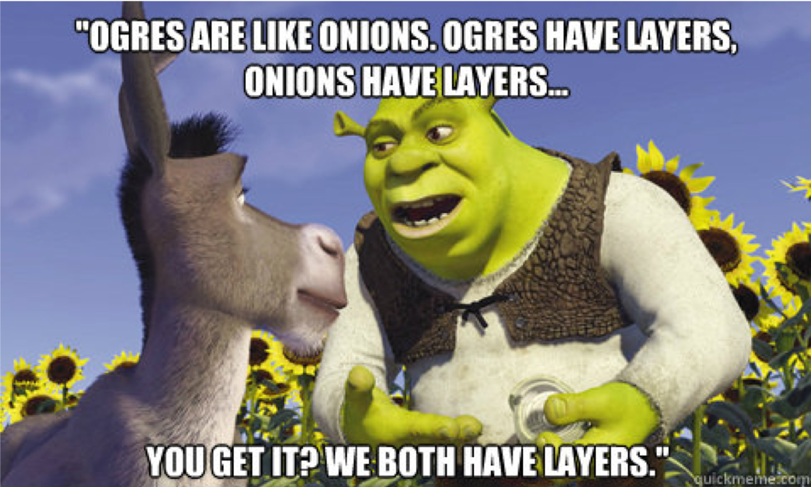

```{r setup, include=FALSE}
options(htmltools.dir.version = FALSE)
knitr::opts_chunk$set(warning = F,
                      message = F,
                      fit.retina = 3,
                      fig.align = "center")

hook_source <- knitr::knit_hooks$get('source')
knitr::knit_hooks$set(source = function(x, options) {
  x <- stringr::str_replace(x, "^[[:blank:]]?([^*].+?)[[:blank:]]*#<<[[:blank:]]*$", "*\\1")
  hook_source(x, options)
})
```

```{r xaringan-themer, include=FALSE, warning=FALSE}
library(xaringanthemer)
style_mono_accent(base_color = "#be2edd",
                  outfile = "xaringan-themer-purple.css")
```

```{r starwarsData, include=FALSE, warning=FALSE}
library(tidyverse)
library(knitr)
library(kableExtra)

empire <- starwars

empire <- empire[c(1:5, 10, 13, 14, 19, 21), c(1:3,8,10,11)]
empire$species <- factor(empire$species)

```

```{r midus, include=FALSE, warning=FALSE}
midus <- read.csv(here::here("R", "midus.csv"))

midus <- midus %>% 
  mutate_at(vars(2, 10, 11), list(factor)) %>%
  na.omit(.)

midus$age_category <- cut(x = midus$age,
                          breaks = c(28, 40, 60, 84),
                          labels=c("young", "middle", "old"),
                          include.lowest = TRUE)
```

# Last Time
Multipanel Plots
  - Faceting
  - Combining separates into 1
  
Adding Stuff
  - Lines
  - Text

---
# This time
Miscellaneous & Remaining Details
  - Error bars
  - Jittering
  - Adding layers
  - Debugging plots

---
# Layers on layers on layers

<center>

</center>