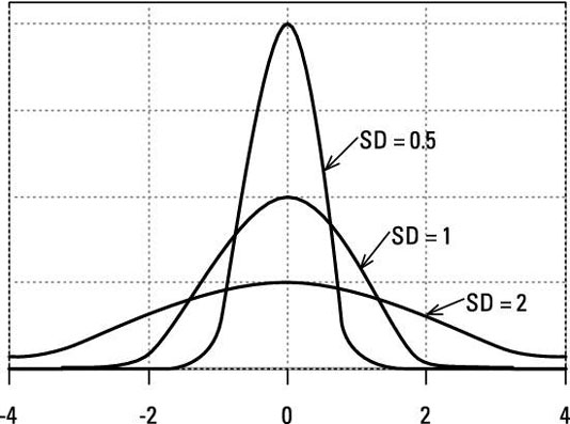

```{r setup, include=FALSE}
options(htmltools.dir.version = FALSE)
knitr::opts_chunk$set(warning = F,
                      message = F,
                      fit.retina = 3,
                      fig.align = "center")

hook_source <- knitr::knit_hooks$get('source')
knitr::knit_hooks$set(source = function(x, options) {
  x <- stringr::str_replace(x, "^[[:blank:]]?([^*].+?)[[:blank:]]*#<<[[:blank:]]*$", "*\\1")
  hook_source(x, options)
})
```

```{r xaringan-themer, include=FALSE, warning=FALSE}
library(xaringanthemer)
style_mono_accent(base_color = "#eb4d4b",
                  outfile = "xaringan-themer-red")
```

```{r packagesAndData, include=FALSE, warning=FALSE}
library(tidyverse)
library(knitr)
library(kableExtra)
library(flair)
library(lsr) # for mode and maxFreq functions

world <- read.csv(here::here("R", "world_happiness_2015.csv"))
```

name: Recap

# Mid Semester Check-in

These first 5 weeks have been jam packed with getting you up to speed using `R`. By now, you should feel comfortable with:

- Importing data
- Manipulating data (getting subsets, using logical operators, knowing the different data classes and when one is more appropriate than another, etc.)
- Plotting data with `ggplot2`

---

# Where we're going

The next 5 weeks are going to be dedicated in getting you up to speed on statistics. Everyone in this class should have taken Psych 300 (Intro Psych Stats) or equivalent. **_If you have not taken this class (or equivalent), you must get in touch with me ASAP._**

--

What you can expect:

- Refresh your memory about stats. The content presented will hopefully go into slightly more depth (for certain topics) than what you covered in Psych Stats. But it shouldn't be new, per se.
- Applying this theoretical knowledge to practical knowledge in `R`. You will be expected to know what the outputs mean (e.g., how to interpret them).
- As of now, there will not be any Practice Sets for this unit on statistics. I will update you if there are any changes on this front.
- No HW assignments. Quizzes based on lecture content (10 questions max/quiz). Lecture content longer and denser...but no HW!!

--

Why are we *not* going to talk about more advanced stats in these few weeks?

---
# This time

- Descriptive Stats
- Bias
- $z$-scores

---
# Why do we describe data?

- Understand your data

  - There's a lot to learn from descriptive statistics

- Find errors in data entry or collection

- Everybody lies...including numbers and data

<center>

</center>
---

# Happiness

Examples today are based on data from the [2015 World Happiness Report](https://worldhappiness.report/ed/2015/), which is an annual survey part of the [Gallup World Poll](https://www.gallup.com/178667/gallup-world-poll-work.aspx). 

You should be able to download the dataset from [20: Descriptives lecture](/lectures/20-lecture).

.tiny[Get in touch with me ASAP if you cannot download this dataset]

---

# `world` Data

```{r, echo=FALSE}

kable(head(world)) 
        

```

???
Data measured at country level, one row per country.

---
# About the `world` dataset

.code-small[
```{r}
colnames(world)
```
]

.small[
**Happiness**: “Please imagine a ladder, with steps numbered from 0 at the bottom to 10 at the top. The top of the ladder represents the best possible life for you and the bottom of the ladder represents the worst possible life for you. On which step of the ladder would you say you personally feel you stand at this time?”

**GDP**: Log gross domestic product per capita

**Support**: “If you were in trouble, do you have relatives or friends you can count on to help you whenever you need them, or not?”    

**Life**: Healthy life expectancy at birth

**Freedom**: “Are you satisfied or dissatisfied with your freedom to choose what you do with your life?”

**Corruption**: “Is corruption widespread throughout the government or not” and “Is corruption widespread within businesses or not?” (average of 2 questions)

**Generosity**: “Have you donated money to a charity in the past month?” (residual, adjusting for GDP)
]

---

# Distributions

A **distribution** often refers to a description of the [relative] number of times a variable X will take each of its unique values.

.code-small[
```{r, fig.height=4}

ggplot(data = world, aes(x = Happiness)) +
  geom_histogram(bins = 30, fill = "#eb4d4b", color = "black") +
  labs(title = "Distribution of Happiness Scores",
       xlab = "Happiness",
       ylab = "Frequency") +
  theme_classic()

```
]

---
name: centTen

# Central Tendencies

- **Mean** (average; $\mu$, $\bar{X}$ ) -- `mean()`
  
- **Median** (middle-est) -- `median()`
  
- **Mode** (most) -- No built-in R function for the mode! We can use a different function we've already seen:
  
```{r, eval=TRUE}
variable <- c(1,2,3,4,1,1,3,4,3,4,4,1,2,4,4)
table(variable)

variable <- c("hello", "world", "hello")
table(variable)
```

---
# The Mean Can Lie
It's important to remember that the mean of a population (or group) may not represent well some (or any) members of the population.

- Example: André-François Raffray and the French apartment


???

lawyer André-François Raffray in 1965

agreed to pay a woman $2500 francs each month and when she died, he would take possession of the apartment. 

Average life expectancy of French women was 74.5. Andre was 47 years old

the woman lived another 32 years to become the oldest person on record, outliving Andre by two years. He had paid more than twice the market value for the apartment

---
# If Normal, All Relatively Equal

.pull-left-small[
.code-small[
```{r, eval = FALSE, warning = FALSE, message = FALSE}
world %>%
  ggplot(aes(x = Happiness)) + 
  geom_histogram(bins = 30,
                 fill = "#eb4d4b",
                 color = "black") +
  geom_vline(aes(xintercept = mean(Happiness))) +
  geom_vline(aes(xintercept = median(Happiness))) + 
  geom_label(aes(x = mean(Happiness),
                 y = maxFreq(Happiness)),
             label = "mean") +
  geom_label(aes(x = median(Happiness),
                 y = maxFreq(Happiness)*2),
             label = "median") +
  theme_classic()
```
]
]

.pull-right-large[
```{r, echo=FALSE, warning = FALSE, message = FALSE}
world %>%
  ggplot(aes(x = Happiness)) + 
  geom_histogram(bins = 30,
                 fill = "#eb4d4b",
                 color = "black") +
  geom_vline(aes(xintercept = mean(Happiness))) +
  geom_vline(aes(xintercept = median(Happiness))) + 
  geom_label(aes(x = mean(Happiness),
                 y = maxFreq(Happiness)),
             label = "mean") +
  geom_label(aes(x = median(Happiness),
                 y = maxFreq(Happiness)*2),
             label = "median") +
  theme_classic()
```
]

---

# If Skewed...

.pull-left-small[
.code-small[
```{r, eval = FALSE, warning = FALSE, message = FALSE}
world %>%
  ggplot(aes(x = Corruption)) + 
  geom_histogram(bins = 30,
                 fill = "#eb4d4b",
                 color = "black") +
  geom_vline(aes(xintercept = mean(Corruption, na.rm = T))) +
  geom_vline(aes(xintercept = median(Corruption, na.rm = T))) + 
  geom_label(aes(x = mean(Corruption, na.rm = T),
                 y = maxFreq(Corruption)),
             label = "mean") +
  geom_label(aes(x = median(Corruption, na.rm = T),
                 y = maxFreq(Corruption)*2),
             label = "median") +
  theme_classic()
```
]
]

.pull-right-large[
```{r, echo=FALSE, warning = FALSE, message = FALSE}
world %>%
  ggplot(aes(x = Corruption)) + 
  geom_histogram(bins = 30,
                 fill = "#eb4d4b",
                 color = "black") +
  geom_vline(aes(xintercept = mean(Corruption, na.rm = T))) +
  geom_vline(aes(xintercept = median(Corruption, na.rm = T))) + 
  geom_label(aes(x = mean(Corruption, na.rm = T),
                 y = maxFreq(Corruption)),
             label = "mean") +
  geom_label(aes(x = median(Corruption, na.rm = T),
                 y = maxFreq(Corruption)*2),
             label = "median") +
  theme_classic()
```
]

...both the mean and median get pulled away from the mode. The mean is pulled further. 

---

name: disp

# Center and spread

- Distributions are most often described by their mean and **variance** or **standard deviation**

- These are both measures of dispersion; how fat or skinny are your distributions?

--

- The mean represents the average score in a distribution. A good measure of spread will tell us something about how the typical score deviates from the mean.
  - $x - \bar{x}$

--

- Why can't we use the average deviation?

---

# Average deviation

```{r}
x <- c(7,7,8,3,9,2)
mean(x)
x - mean(x)
sum(x - mean(x))
sum(x - mean(x))/length(x)
```
---

# Sum of Squares (SS)

Our solution is to square the deviation scores

```{r}
x <- c(7,7,8,3,9,2)
mean(x)
deviation <- x - mean(x)
deviation^2
sum(deviation^2)
```

*Is there any inherent meaning in the Sum of Squares?*

---

# Variance

We calculate the average squared deviation: this is our variance, $\sigma^2$:

```{r}
# nested functions galore!
sum((x - mean(x))^2)/length(x)

```

--

**Good things about variance:**
- It's additive.
  - Given two variables X and Y, if I create $Z = X + Y$ then $Var(Z) = Var(X) + Var(Y)$
- Represents all values in a dataset

--

**Bad things about variance:**
- What the heck does it mean?

---

# Standard Deviation

**Standard deviation $\sigma$** is the square root of the variance. 
```{r}
sqrt(sum((x - mean(x))^2)/length(x))
```

--




---
name: bias
class: inverse

# Bias

---

# Populations versus Samples

Why are these different? 

```{r}
# how we calculated variance "by hand" in this lecture
sum((x - mean(x))^2)/length(x)

# R's default variance function
var(x)
```

---

# Populations versus Samples

The value that represents the entire *population* is called a **parameter**.
  - Population parameters are represented with Greek letters (
  $\mu$
  ,
  $\sigma$
  )

We collect samples to estimate the properties of populations; the value that represents a *sample* is called a **statistic**.
  - Sample statistics are represented with Latin letters (
  $x$,
  $\bar{x}$
  ,
  $s$
  ).

--

**Bias**: An estimator is biased if its expected value and the true value of the parameter are different.
  - Our estimates of standard deviation & variance (in the formulas up until now) are biased
  - They *under*estimate variability in the population

---

# Populations versus Samples

.pull-left[
### Variance

*Population*
$$\sigma^2 = \frac{\Sigma(X_i-\mu)^2}{N}$$

*Sample*
$$s^2 = \hat{\sigma}^2 = \frac{\Sigma(X_i-\bar{X})^2}{N-1}$$
]

--

.pull-right[
### Standard Deviation

*Population*
$$\sigma = \sqrt{\frac{\Sigma(X_i-\mu)^2}{N}}$$

*Sample*
$$s = \hat{\sigma} = \sqrt{\frac{\Sigma(X_i-\bar{X})^2}{N-1}}$$
]

---
# Simulating Bias

```{r, echo = FALSE, warning = FALSE, message = FALSE, fig.width=15, fig.height=10}
set.seed(100917) #so everyone gets same random draws

#function to estimate variance using population formula
sample_var = function(x){
  sum((x - mean(x, na.rm=T))^2, na.rm=T)/length(which(!is.na(x)))
}
#number of samples
draws = 10000
#which sample sizes to test
sample_sizes = seq(from = 5, to = 100, by = 5)
#data frame to store simulations
var_estimates = data.frame(size = sample_sizes, sample = NA, estimate = NA)

for(i in sample_sizes){ # loop through sample sizes
  sample_est = numeric(length = draws) #create empty vectors
  estimate = numeric(length = draws)
  for(j in 1:draws){ # loop through draws
    sample = rnorm(n = i, mean = 1000, sd = 10) # randomly draw sample from pop with variance 100
    sample_est[j] = sample_var(sample) # calculate variance using population formula
    estimate[j] = var(sample) # calculate variance using sample formula
  }
  row = which(var_estimates$size == i) #which row in data frame does this belong to?
  var_estimates$sample[row] = mean(sample_est) # average of variance estimates (using pop) across draws
  var_estimates$estimate[row] = mean(estimate) # average of variances (using sample) across draws
}

var_estimates %>%
  mutate(population = 100) %>% #add population variable
  gather("var", "value", -size) %>% # long-form
  mutate(var = factor(var, 
                      levels = c("population","sample","estimate"),
                      labels = c("Population Variance",
                                 "Sample Variance", 
                                 "Sample Estimate of Population Variance"))) %>% #lovely labels
  ggplot(aes(x = size, y = value)) +
  geom_line(aes(color = var), size = 3) +
  scale_x_continuous("Sample Size", breaks = sample_sizes) +
  scale_color_discrete("")+
  geom_point() + 
  theme_bw(base_size = 25)
```

---
name: zs
class: inverse

# Standardized scores

---

# Why not always use raw scores?
```{r, echo=FALSE}
s1 = data.frame(Score = rnorm(n = 100, mean = 70, sd = 7),
                Scenario = rep("Scenario 1", times = 100))
s2 = data.frame(Score = rnorm(n = 100, mean = 70, sd = 2),
                Scenario = rep("Scenario 2", times = 100))
full = rbind(s1, s2)
full$Scenario = factor(full$Scenario)
```

.pull-left[
Scenario 1:
  - Mean = 70, N = 100
  - Range = 0 - 100
  - You get a 71. Good?
  
Scenario 2:
  - Mean = 70, N = 100
  - Range = 65 - 75
  - You get a 71. Good?
]

.pull-right[
.code-small[
```{r}
ggplot(full, aes(x = Score)) +
  geom_density(aes(fill = Scenario), alpha = .3) +
  theme_classic()

```
]
]

---
# Problem with Raw Scores

- Raw scores are only meaningful in the *context* of the distribution

- What distirbution are you looking at? Patients, controls, patients + controls etc.?

- What does the distribution itself look like? Skinny, fat?

- A raw score can't take all of this into consideration! What does an exam score of `71` mean *in context*?

---
# $z$-scores

- Raw scores are in the original metric's units (exam points, heigh in inches etc.)
- $z$-scores are in units of standard deviation; aka "standardized scores"
- Interpretation: distance from the mean, in standard deviations. 

Formula:

$$ z = \frac{x_i - \bar{x}}{s} $$
`R` function:

`scale()` -- but be warned, the output is usually a matrix

---

# $z$-scores

.pull-left-small[
Step 1: Take an entire set of raw scores (
$x_i$
)

Step 2: Convert them into $z$-scores

Step 3: Now look at the distribution of z-scores
]

.pull-right-large[
```{r, echo = FALSE,warning=FALSE, message = FALSE}
z1 = s1
z1$Score = scale(z1$Score)
z1$Scenario = rep("Z-Scores", times = 100)

s3 = s1
s3$Scenario = rep("Raw Scores", times = 100)

library(ggpubr)

p1 = ggplot(s3, aes(x = Score)) +
  geom_density(fill = "purple") +
  labs(x = "Raw Scores") +
  theme_classic()

p2 = ggplot(z1, aes(x = Score)) +
  geom_density(fill = "blue") +
  labs(x = "Z-Scores") +
  theme_classic()

ggarrange(p1, p2, nrow = 2)
```
]

---

# Properties of $z$-scores

.pull-left-small[
- $\bar{x} = 0$

- $s = 1$
]

.pull-right-large[
```{r, echo = FALSE,warning=FALSE, message = FALSE}
z1 = s1
z1$Score = scale(z1$Score)
z1$Scenario = rep("Z-Scores", times = 100)

s3 = s1
s3$Scenario = rep("Raw Scores", times = 100)

library(ggpubr)

p1 = ggplot(s3, aes(x = Score)) +
  geom_density(fill = "purple") +
  labs(x = "Raw Scores") +
  theme_classic()

p2 = ggplot(z1, aes(x = Score)) +
  geom_density(fill = "blue") +
  labs(x = "Z-Scores") +
  theme_classic()

ggarrange(p1, p2, nrow = 2)
```
]

---

# $z$-scores

$$ z = \frac{x_i - \bar{x}}{s} $$
**Why is this useful?**

--

- Compare across scales and unit of measures

- More easily identify extreme data

---

# Which variable has outliers?

```{r, warning=FALSE, message = FALSE}
psych::describe(world, fast =T)
```

---

# Which variable has outliers?

```{r,warning=FALSE, message = FALSE, highlight.output = c(9)}
world %>%
  mutate_if(is.numeric, scale) %>%
  psych::describe(., fast =T)
```


