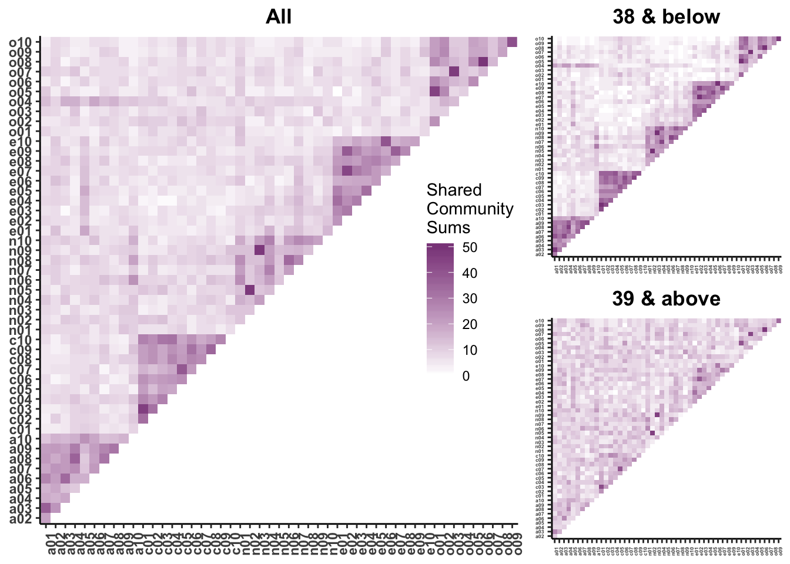

```{r setup, include=FALSE}
options(htmltools.dir.version = FALSE)
knitr::opts_chunk$set(warning = F,
                      message = F,
                      fit.retina = 3,
                      fig.align = "center")

hook_source <- knitr::knit_hooks$get('source')
knitr::knit_hooks$set(source = function(x, options) {
  x <- stringr::str_replace(x, "^[[:blank:]]?([^*].+?)[[:blank:]]*#<<[[:blank:]]*$", "*\\1")
  hook_source(x, options)
})
```

```{r packagesAndData, include=FALSE, warning=FALSE}
library(tidyverse)
library(ggpubr)
library(knitr)
library(MASS) # for simulating variables with specific correlations
library(ggExtra) # for marginal distributions
library(psych) # for dataset showing content overlap
```

## Recap

.pull-left[### Population Variability

**Sums of squares**
$$\small SS = \Sigma(X_i-\mu_x)^2$$
**Variance**
$$\small \sigma^2 = \frac{\Sigma(X_i-\mu_x)^2}{N} = \frac{SS}{N}$$
**Standard devation**
$$\scriptsize \sigma = \sqrt{\frac{\Sigma(X_i-\mu_x)^2}{N}}= \sqrt{\frac{SS}{N}} = \sqrt{\sigma^2}$$]


.pull-right[
###Sample variability
**Sums of squares**
$$\small SS = \Sigma(X_i-\bar{X})^2$$
**Variance**
$$\small s^2 = \frac{\Sigma(X_i-\bar{X})^2}{N-1} = \frac{SS}{N-1}$$
**Standard devation**
$$\scriptsize s = \sqrt{\frac{\Sigma(X_i-\bar{X})^2}{N-1}}= \sqrt{\frac{SS}{N-1}} = \sqrt{s^2}$$]
---

## Bi-variate descriptives

### Covariation 

"Sum of the cross-products"


### Population
$$SP_{XY} =\Sigma(X_i−\mu_X)(Y_i−\mu_Y)$$

### Sample
$$ SP_{XY} =\Sigma(X_i−\bar{X})(Y_i−\bar{Y})$$


???

**What does a large, positive SP indicate?**
A positive relationship, same sign

**What does a large, negatve SP indicate?**
A negative relationship, different sign

**What does SP close to 0 indicate?**
No relationship


---
name: cov

## Covariance
Sort of like the variance of two variables

### Population
$$\sigma_{XY} =\frac{\Sigma(X_i−\mu_X)(Y_i−\mu_Y)}{N}$$

### Sample
$$s_{XY} = cov_{XY} =\frac{\Sigma(X_i−\bar{X})(Y_i−\bar{Y})}{N-1}$$


---

## Covariance table


.medium[
$$\Large \mathbf{K_{XX}} = \left[\begin{array}
{rrr}
\sigma^2_X & cov_{XY} & cov_{XZ} \\
cov_{YX} & \sigma^2_Y & cov_{YZ} \\
cov_{ZX} & cov_{ZY} & \sigma^2_Z
\end{array}\right]$$
]

???
Point out that $cov_{xy}$ is the same as $cov_{yx}$

---
name: cor

## Correlation

- Measure of association

- How much two variables are *linearly* related

- -1 to 1

- Sign indicates direction of relationship

- Invariant to changes in mean or scaling

---

## Correlation

Pearson product moment correlation

### Population
$$\rho_{XY} = \frac{\Sigma z_Xz_Y}{N} = \frac{SP}{\sqrt{SS_X}\sqrt{SS_Y}} = \frac{\sigma_{XY}}{\sigma_X \sigma_Y}$$
### Sample
$$r_{XY} = \frac{\Sigma z_Xz_Y}{n-1} = \frac{SP}{\sqrt{SS_X}\sqrt{SS_Y}} = \frac{s_{XY}}{s_X s_Y}$$
???

**Why is it called the Pearson Product Moment correlation?**
Pearson = Karl Pearson
Product = multiply
Moment = variance is the second moment of a distribution
---

## Conceptually

Ways to think about a correlation:

- How two vectors of numbers co-relate (i.e., parent & child heights)

- Product of z-scores (mathematically, it is)

- The average squared distance between 2 vectors in the same space

---

## Effect size

- Recall that *z*-scores allow us to compare across units of measure; the products of standardized scores are themselves standardized. 

- The correlation coefficient is a **standardized effect size** which can be used communicate the **strength** of a relationship.

- Correlations can be compared across studies, measures, constructs, time. 

- Example: the correlation between age and height among children is $r = .70$. 

- Building blocks of regression!
    
---

## What is a large correlation?

- [Cohen (1988)](http://www.utstat.toronto.edu/~brunner/oldclass/378f16/readings/CohenPower.pdf): .1 (small), .3 (medium), .5 (large)
    - Often forgot: Cohen said only to use them when you had nothing else to go on, and has since regretted even suggesting benchmarks to begin with. 

- Meyer & Hemphill said .3 is average

---

name: affects

## What affects correlations?

It's not enough to calculate a correlation between two variables. You should always look at a figure of the data to make sure the number accurately describes the relationship. Correlations can be easily fooled by qualities of your data, like:

1. Skewed distributions

2. Outliers

3. Restriction of range

4. Nonlinearity

5. Multiple Groups 

6. Reliability

---

## Skewed distributions

```{r, echo = FALSE}
set.seed(101019) # so we all get the same random numbers
mu = c(3, 4)
Sigma = matrix(c(.8, .2, .2, .7), ncol =2) #diagonals are reliabilites, off-diagonals are correlations
data = mvrnorm(n = 150, mu = mu, Sigma = Sigma)
data = as.data.frame(data)
colnames(data) = c("x", "y")
data$x = data$x^4
```

```{r, fig.height = 5}
p = data %>% ggplot(aes(x=x, y=y)) + geom_point()
ggMarginal(p, type = "density")
```
---

## Outliers

```{r, echo = FALSE}
set.seed(101019) # so we all get the same random numbers
mu = c(3, 4)
Sigma = matrix(c(.8, 0, 0, .7), ncol =2) #diagonals are reliabilites, off-diagonals are correlations
data = mvrnorm(n = 50, mu = mu, Sigma = Sigma)
data = as.data.frame(data)
colnames(data) = c("x", "y")
data[51, ] = c(7, 10)
```

```{r, fig.height = 5}
data %>% ggplot(aes(x=x, y=y)) + geom_point() 
```
---

## Outliers

.pull-left[
```{r, eval=FALSE, message = FALSE, warning = FALSE}
data %>% ggplot(aes(x=x, y=y)) +
  geom_point() +
  geom_smooth(method = "lm",
              se = FALSE,
              color = "red") +
  geom_smooth(data = data[-51,], 
              method = "lm", 
              se = FALSE)
```
]

.pull-right[
```{r, echo=FALSE, message = FALSE, warning = FALSE}
data %>% ggplot(aes(x=x, y=y)) +
  geom_point() +
  geom_smooth(method = "lm",
              se = FALSE,
              color = "red") +
  geom_smooth(data = data[-51,], 
              method = "lm", 
              se = FALSE)
```
]

---

## Restriction of range

```{r, echo = FALSE}
set.seed(1010191) # so we all get the same random numbers
mu = c(100, 4)
Sigma = matrix(c(.7, .4, 4, .75), ncol = 2) #diagonals are reliabilites, off-diagonals are correlations
data = mvrnorm(n = 150, mu = mu, Sigma = Sigma)
data = as.data.frame(data)
colnames(data) = c("x", "y")
real_data = data
data = filter(data, x >100 & x < 101)
```

.pull-left[
```{r, eval = FALSE, message = FALSE, warning = FALSE}
data %>%
ggplot(aes(x=x, y=y)) +
  geom_point() +
  geom_smooth(method = "lm",
              se = FALSE,
              color = "red")
```
]

.pull-right[
```{r, echo = FALSE, message = FALSE, warning = FALSE}
data %>% ggplot(aes(x=x, y=y)) + geom_point() + geom_smooth(method = "lm", se = FALSE, color = "red")
```
]

???

What if I told you there were scores on X could range from 97 to 103?

---

## Restriction of range

.pull-left[
```{r, eval = FALSE, warning=F, message=F}
data %>%
ggplot(aes(x=x, y=y)) +
  geom_point() +
  geom_smooth(method = "lm",
              se = FALSE,
              color = "red") + 
  geom_point(data = real_data) +
  geom_smooth(method = "lm",
              se = FALSE,
              data = real_data,
              color = "blue")
```
]

.pull-right[
```{r, echo = FALSE, warning=F, message=F}
data %>%
ggplot(aes(x=x, y=y)) +
  geom_point() +
  geom_smooth(method = "lm",
              se = FALSE,
              color = "red") + 
  geom_point(data = real_data) +
  geom_smooth(method = "lm",
              se = FALSE,
              data = real_data,
              color = "blue")
```
]


???

**Can you think of example where this might occur in psychology?**
My idea: that many psychology studies only look at undergraduates (restricted age, restricted education) -- can't use these as predictors or covariates

---

## Nonlinearity

```{r, echo = FALSE, warning = FALSE, message=FALSE}
x = runif(n = 150, min = -2, max = 2)
y = x^2 +rnorm(n = 150, sd = .5)
data = data.frame(x,y)
```

.pull-left[
```{r, fig.height = 5, warning=FALSE, message=FALSE, eval=FALSE}
data %>% 
  ggplot(aes(x=x, y=y)) + 
  geom_point() + 
  geom_smooth(method = "lm",
              se = FALSE,
              color = "red")
```
]

.pull-right[
```{r, fig.height = 5, warning=FALSE, message=FALSE, echo=FALSE}
data %>% 
  ggplot(aes(x=x, y=y)) + 
  geom_point() + 
  geom_smooth(method = "lm",
              se = FALSE,
              color = "red")
```
]


---

## It's not always apparent

Sometimes issues that affect correlations won't appear in your graph, but you still need to know how to look for them.

- Multiple groups

- Low reliability (take a psychometrics or research methods course)

---

## Multiple groups

```{r, echo = FALSE}
set.seed(101019) # so we all get the same random numbers
m_mu = c(100, 4)
m_Sigma = matrix(c(.7, .4, 4, .75), ncol = 2) #diagonals are reliabilites, off-diagonals are correlations
m_data = mvrnorm(n = 150, mu = m_mu, Sigma = m_Sigma)
m_data = as.data.frame(m_data)
colnames(m_data) = c("x", "y")

f_mu = c(102, 3)
f_Sigma = matrix(c(.7, .4, 4, .75), ncol = 2) #diagonals are reliabilites, off-diagonals are correlations
f_data = mvrnorm(n = 150, mu = f_mu, Sigma = f_Sigma)
f_data = as.data.frame(f_data)
colnames(f_data) = c("x", "y")

m_data$gender = "male"
f_data$gender = "female"

data = rbind(m_data, f_data)
```

.pull-left[
```{r, fig.height = 5, message=F, warning=F, eval=FALSE}
data %>%
  ggplot(aes(x=x, y=y)) +
  geom_point() +
  geom_smooth(method = "lm", se = FALSE, color = "red")
```
]

.pull-right[
```{r, fig.height = 5, message=F, warning=F, echo=FALSE}
data %>%
  ggplot(aes(x=x, y=y)) +
  geom_point() +
  geom_smooth(method = "lm", se = FALSE, color = "red")
```
]

---

## Multiple groups

.pull-left[
```{r, fig.height = 5, message=F, warning=F, eval=FALSE}
data %>%
  ggplot(aes(x=x, y=y,
             color = gender)) +
  geom_point() +
  geom_smooth(method = "lm", se = FALSE) +
  guides(color = F)
```
]

.pull-right[
```{r, fig.height = 5, message=F, warning=F, echo=FALSE}
data %>%
  ggplot(aes(x=x, y=y,
             color = gender)) +
  geom_point() +
  geom_smooth(method = "lm", se = FALSE) +
  guides(color = F)
```
]

---

## Reliability

Which would you rather have?

- 1-item final exam vs. a 30-item final exam?
- fMRI during a minor earthquake vs. no earthquake?
- Cognitive testing with Blue Angels flying vs. not with the Blue Angels?

<center>

</center>

---

## Reliability

Which would you rather have?

- 1-item final exam vs. a 30-item final exam?
- fMRI during a minor earthquake vs. no earthquake?
- Cognitive testing with Blue Angels flying vs. not with the Blue Angels?

**All measurement includes _error_**

- Observed Score = True Score + Measurement Error

---

## Reliability

- Error is random; it cannot correlate with anything

- Because we don't measure our variables perfectly, we get lower correlations compared to the "true" correlations

- Kind of analgous to power -- it's a ceiling

- If we want valid measures, they need to be reliable

--

### So what do we do?
- If you're going to measure something, do it well

- Applies to *ALL* IVs and DVs, and all designs

- **Remember this when interpreting other research**

---

## What is the size of the correlation?

- Chemotherapy and breast cancer survival?
- Batting ability and hit success on a single at bat?
- Antihistamine use and reduced sneezing/runny nose?
- Combat exposure and PTSD?
- Ibuprofen on pain reduction?
- Gender and weight?
- Therapy and well being?
- Observer ratings of attractiveness?
- Gender and arm strength?
- Nearness to equator and daily temperature for U.S.?

---
## What is the size of the correlation?

- Chemotherapy and breast cancer survival? (.03)
- Batting ability and hit success on a single at bat? (.06)
- Antihistamine use and reduced sneezing/runny nose? (.11)
- Combat exposure and PTSD? (.11)
- Ibuprofen on pain reduction? (.14)
- Gender and weight? (.26)
- Therapy and well being? (.32)
- Observer ratings of attractiveness? (.39)
- Gender and arm strength? (.55)
- Nearness to equator and daily temperature for U.S.? (.60)

---
## Questions to ask yourself:
- What is your N?
- What is the typical effect size in the field?
- Study design?
- What is your DV?
- Importance?

---
name: viz

## Correlation matrices

Correlations are both a descriptive and an inferential statistic. As a descriptive statistic, they're useful for understanding what's going on in a larger dataset. 

Like we use the `summary()` or `describe()` (psych) functions to examine our dataset _before we run any infernetial tests_, we should also look at the correlation matrix. 

---

```{r}
library(psych)
data(bfi)
head(bfi)
```

---

```{r}
cor(bfi)
```

---

```{r}
round(cor(bfi, use = "pairwise"),2)
```

---

```{r}
round(cor(bfi, use = "complete"),2)
```

---
## Pairwise vs. Listwise Deletion

With **pairwise deletion**, different sets of cases contribute to different correlations.  That maximizes the sample sizes, but can lead to problems if the data are missing for some systematic reason.

--

**Listwise deletion** (often referred to in `R` as use complete cases) doesn't have the same issue of biasing correlations, but does result in smaller samples and potentially limited generalizability.

--

A good practice is comparing the different matrices; if the correlation values are very different, this suggests that the missingness that affects pairwise deletion is systematic.

---

```{r}
round(cor(bfi, use = "pairwise")- cor(bfi, use = "complete"),2)
```
---

## Visualizing correlations

For a single correlation, best practice is to visualize the relationship using a scatterplot. A best fit line is advised, as it can help clarify the strength and direction of the relationship. 

[http://guessthecorrelation.com/](http://guessthecorrelation.com/)


[Interpreting Correlations](https://rpsychologist.com/correlation/)
---

## Correlations Can Lie

```{r, echo = F, warning = FALSE, message=FALSE}
library(datasauRus)
datasaurus_dozen %>%
  filter(dataset == "away") %>%
  ggplot(aes(x = x, y = y)) +
  geom_point()+
  ggtitle(expression(paste(M[X], "= 54.3 ", S[X], "= 16.8 ", 
                           M[Y], "= 47.8 ", S[Y], "= 26.9 ",
                           "R = -.06"))) +
  theme_bw(base_size = 15)
```

---
## Correlations Can Lie


```{r, echo = F}
datasaurus_dozen %>%
  filter(dataset == "h_lines") %>%
  ggplot(aes(x = x, y = y)) +
  geom_point()+
  ggtitle(expression(paste(M[X], "= 54.3 ", S[X], "= 16.8 ", 
                           M[Y], "= 47.8 ", S[Y], "= 26.9 ",
                           "R = -.06"))) +
  theme_bw(base_size = 15)
```

---
## Correlations Can Lie

```{r, echo = F}
datasaurus_dozen %>%
  filter(dataset == "x_shape") %>%
  ggplot(aes(x = x, y = y)) +
  geom_point()+
  ggtitle(expression(paste(M[X], "= 54.3 ", S[X], "= 16.8 ", 
                           M[Y], "= 47.8 ", S[Y], "= 26.9 ",
                           "R = -.06"))) +
  theme_bw(base_size = 15)
```

---
## Correlations Can Lie

```{r, echo = F}
datasaurus_dozen %>%
  filter(dataset == "circle") %>%
  ggplot(aes(x = x, y = y)) +
  geom_point()+
  ggtitle(expression(paste(M[X], "= 54.3 ", S[X], "= 16.8 ", 
                           M[Y], "= 47.8 ", S[Y], "= 26.9 ",
                           "R = -.06"))) +
  theme_bw(base_size = 15)
```


---
## Correlations Can Lie

```{r, echo = F}
datasaurus_dozen %>%
  filter(dataset == "wide_lines") %>%
  ggplot(aes(x = x, y = y)) +
  geom_point()+
  ggtitle(expression(paste(M[X], "= 54.3 ", S[X], "= 16.8 ", 
                           M[Y], "= 47.8 ", S[Y], "= 26.9 ",
                           "R = -.06"))) +
  theme_bw(base_size = 15)
```


---
## Correlations Can Lie

```{r, echo = F}
datasaurus_dozen %>%
  filter(dataset == "bullseye") %>%
  ggplot(aes(x = x, y = y)) +
  geom_point()+
  ggtitle(expression(paste(M[X], "= 54.3 ", S[X], "= 16.8 ", 
                           M[Y], "= 47.8 ", S[Y], "= 26.9 ",
                           "R = -.06"))) +
  theme_bw(base_size = 15)
```

---
## Correlations Can Lie

```{r, echo = F}
datasaurus_dozen %>%
  filter(dataset == "star") %>%
  ggplot(aes(x = x, y = y)) +
  geom_point(size = 2)+
  ggtitle(expression(paste(M[X], "= 54.3 ", S[X], "= 16.8 ", 
                           M[Y], "= 47.8 ", S[Y], "= 26.9 ",
                           "R = -.06"))) +
  theme_bw(base_size = 15)
```

---
## Correlations Can Lie

```{r, echo = F}
datasaurus_dozen %>%
  filter(dataset == "dino") %>%
  ggplot(aes(x = x, y = y)) +
  geom_point(size = 2)+
  ggtitle(expression(paste(M[X], "= 54.3 ", S[X], "= 16.8 ", 
                           M[Y], "= 47.8 ", S[Y], "= 26.9 ",
                           "R = -.06"))) +
  theme_bw(base_size = 15)
```

---

## Visualizing correlation matrices

A single correlation can be informative; a correlation matrix is more than the sum of its parts. 

Correlation matrices can be used to infer larger patterns of relationships. You may be one of the gifted who can look at a matrix of numbers and see those patterns immediately. Or you can use **heat maps** to visualize correlation matrices. 

```{r, results = 'hide', message=FALSE, warning=FALSE}
library(corrplot)
```

---

```{r}
corrplot(cor(bfi, use = "pairwise"), method = "square")
```

---



.small[
[Beck, Condon, & Jackson, 2019](https://psyarxiv.com/857ev/)
]

---
name: infer

## What can we do with correlations?

- Descriptive statistic; describing the strength of association/relationship

- Inferential statistic + hypothesis testing:
    
    - Is a correlation significantly different from 0?
    - Is a correlation significantly different from a different number? **
    - Construct a confidence interval around our correlation **
    - Are two correlations significantly different from one another? **
    - Used as effect size measure in power calculations
    
--

** Need to use a Fisher r to z' transformation

---

## Fisher's r to z' transformation
.left-column[
If we want to make calculations based on $\rho \neq 0$ then we will run into a skewed sampling distribution.
]

```{r, echo = F}
r_sampling = function(x, r, n){
  z = fisherz(r)
  se = 1/(sqrt(n-3))
  x_z = fisherz(x)
  density = dnorm(x_z, mean = z, sd = se)
  return(density)
}


cor_75 = ggplot(data.frame(x = seq(-.99, .99)), aes(x)) +
  stat_function(fun = function(x) r_sampling(x, r = .75, 
                                             n = 30),
                geom = "area", fill = "#22a6b3") +
  scale_x_continuous(limits = c(-.99, .99)) +
  labs(subtitle = "r = .75, n = 30") +
  theme_bw(base_size = 20) +
  theme(plot.subtitle = element_text(size = 12))

cor_32 = ggplot(data.frame(x = seq(-.99, .99)), aes(x)) +
  stat_function(fun = function(x) r_sampling(x, r = .32, 
                                             n = 30),
                geom = "area", fill = "#22a6b3") +
  scale_x_continuous(limits = c(-.99, .99)) +
  labs(subtitle = "r = .32, n = 30")+
  theme_bw(base_size = 20) +
  theme(plot.subtitle = element_text(size = 12))


cor_n85 = ggplot(data.frame(x = seq(-.99, .99)), aes(x)) +
  stat_function(fun = function(x) r_sampling(x, r = -.85, 
                                             n = 30),
                geom = "area", fill = "#22a6b3") +
  scale_x_continuous(limits = c(-.99, .99)) +
  labs(subtitle = "r = -.85, n = 30")+
  theme_bw(base_size = 20) +
  theme(plot.subtitle = element_text(size = 12))

cor_75b = ggplot(data.frame(x = seq(-.99, .99)), aes(x)) +
  stat_function(fun = function(x) r_sampling(x, r = .75, 
                                             n = 150),
                geom = "area", fill = "#22a6b3") +
  scale_x_continuous(limits = c(-.99, .99)) +
  labs(subtitle = "r = .75, n = 150") +
  theme_bw(base_size = 20) +
  theme(plot.subtitle = element_text(size = 12))

cor_32b = ggplot(data.frame(x = seq(-.99, .99)), aes(x)) +
  stat_function(fun = function(x) r_sampling(x, r = .32, 
                                             n = 150),
                geom = "area", fill = "#22a6b3") +
  scale_x_continuous(limits = c(-.99, .99)) +
  labs(subtitle = "r = .32, n = 150")+
  theme_bw(base_size = 20) +
  theme(plot.subtitle = element_text(size = 12))


cor_n85b = ggplot(data.frame(x = seq(-.99, .99)), aes(x)) +
  stat_function(fun = function(x) r_sampling(x, r = -.85, 
                                             n = 150),
                geom = "area", fill = "#22a6b3") +
  scale_x_continuous(limits = c(-.99, .99)) +
  labs(subtitle = "r = -.85, n = 150")+
  theme_bw(base_size = 20) +
  theme(plot.subtitle = element_text(size = 12))


ggpubr::ggarrange(cor_n85, cor_32, cor_75, 
                  cor_n85b, cor_32b, cor_75b)
```

---
## Fisher's r to z' transformation

- Skewed sampling distribution will rear its head when:

    * $H_{0}: \rho \neq 0$

    * Calculating confidence intervals

    * Testing two correlations against one another

- r to z':

$$\large z^{'} = {\frac{1}{2}}ln{\frac{1+r}{1-r}}$$

???
ln = natural log
---
## Fisher’s r to z’ transformation

```{r, echo = F}
r = seq(-.99,.99,.01)
z = psych::fisherz(r)
data.frame(r,z) %>%
  ggplot(aes(x = r, y = z)) +
  geom_line() +
  scale_x_continuous(expr(r))+
  scale_y_continuous(expr(z_r))+
  theme_bw(base_size = 20)
```

.pull-right[
No longer bounded by 1 & -1
]

---
## How to do in R

```{r, eval=FALSE}
library(psych)
fisherz(r)
fisherz2r(z)
```

Use when...

- Is correlation different from a number other than 0?
- Are 2 correlations different from one another?
- Making a confidence interval around a correlation

---

class: inverse, center, middle

# Statistical Significance

# $\neq$

# Practical Significance
---
## What is the size of the correlation?

- Chemotherapy and breast cancer survival? (.03)
- Batting ability and hit success on a single at bat? (.06)
- Antihistamine use and reduced sneezing/runny nose? (.11)
- Combat exposure and PTSD? (.11)
- Ibuprofen on pain reduction? (.14)
- Gender and weight? (.26)
- Therapy and well being? (.32)
- Observer ratings of attractiveness? (.39)
- Gender and arm strength? (.55)
- Nearness to equator and daily temperature for U.S.? (.60)

---

## Special cases of the Pearson correlation

- **Spearman correlation coefficient**
    - Applies when both X and Y are ranks (ordinal data) instead of continuous
    - Denoted $\rho$ by your textbook, although I prefer to save Greek letters for population parameters. 

- **Point-biserial correlation coefficient**
    - Applies when Y is binary.
        - NOTE: This is not an appropriate statistic when you [artificially dichotomize data](../readings/Cohen_1983.pdf).

- **Phi (
$\phi$
) coefficient**
  - Both X and Y are dichotomous.

---

class: inverse

# Next time...

Regression!
