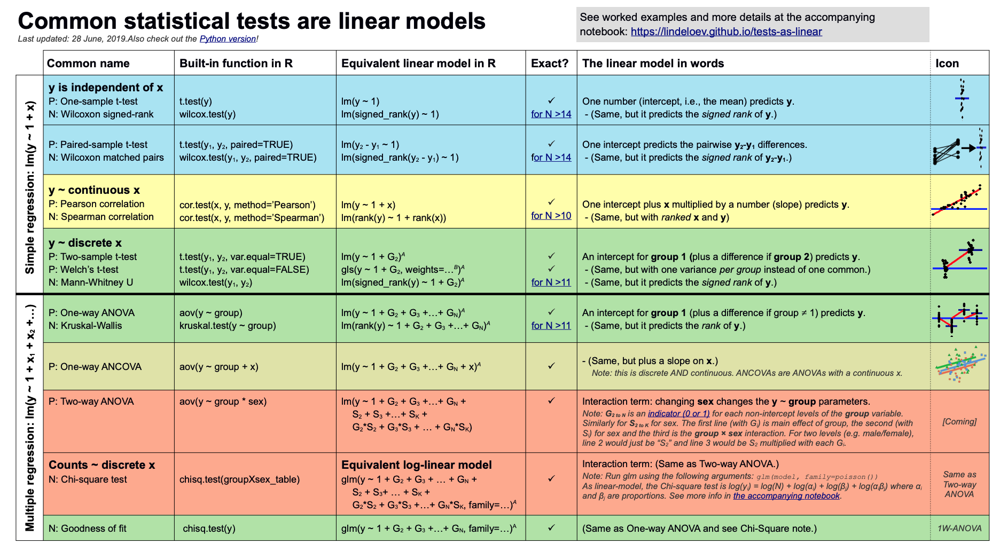

```{r setup, include=FALSE}
options(htmltools.dir.version = FALSE)
knitr::opts_chunk$set(warning = F,
                      message = F,
                      fit.retina = 3,
                      fig.align = "center")

hook_source <- knitr::knit_hooks$get('source')
knitr::knit_hooks$set(source = function(x, options) {
  x <- stringr::str_replace(x, "^[[:blank:]]?([^*].+?)[[:blank:]]*#<<[[:blank:]]*$", "*\\1")
  hook_source(x, options)
})
```

```{r, echo = F, warning = F, message = F, results = 'hide'}
library(psych)
library(tidyverse)
library(broom)

galton.data = psychTools::galton
```


## Recap

- Correlations are their own effect size

- On a scale of -1 to 1

- Useful for depicting relationships
  
---
name: reg

## Today

**Regression**

- What is it? Why is it useful

- Nuts and bolts

  - Equation

  - Ordinary least squares

  - Interpretation
  
---

## Regression

- Regression is an umbrella term -- lots of things fall under "regression" 
- This system can handle a variety of forms of relations, although all forms have to be specified in a *linear* way. 

--

The output of regression includes both effect sizes and statistical significance. We can also incorporate multiple influences (IVs) and account for their intercorrelations. 


---

### Regression

- **Scientific** use: explaining the influence of one or more variables on some outcome. 

  + Does this intervention affect reaction time?
  + Does self-esteem predict relationship quality?
  
- **Prediction** use: We can develop models based on what's happened in the past to predict what will happen in the figure.

  + Insurance premiums
  + Graduate school... success?
  
- **Adjustment**: Statistically control for known effects

  + If everyone had the same level of SES, would abuse still be associated with criminal behavior?

---

### How does Y vary with X?

- The regression of Y (DV) on X (IV) corresponds to the line that gives the mean value of Y corresponding to each possible value of X

- "Our best guess" regardless of whether our model includes categories or continuous predictor variables

---
name: eq

## Regression Equation

$$\Large Y = b_{0} + b_{1}X +e$$

$$\Large \hat{Y} = b_{0} + b_{1}X$$

???

$\hat{Y}$ signifies the predicted score -- no error

The difference between the predicted and observed score is the residual ($e_i$)

There is a different $e$ value for each observation in the dataset
---
name: ols

## OLS
- How do we find the regression estimates? 
- Ordinary Least Squares (OLS) estimation
- Minimizes deviations 

$$ min\sum(Y_{i}-\hat{Y})^{2} $$ 

- Other estimation procedures possible (and necessary in some cases)

---

 
```{r,echo=FALSE, message=FALSE, cache=TRUE, warning = F}
set.seed(123)
x.1 <- rnorm(10, 0, 1)
e.1 <- rnorm(10, 0, 2)
y.1 <- .5 + .55 * x.1 + e.1
d.1 <- data.frame(x.1,y.1)
m.1 <- lm(y.1 ~ x.1, data = d.1)
d1.f<- augment(m.1)
```

```{r plot1, echo=FALSE, cache=TRUE, eval = T}
ggplot(d1.f , aes(x=x.1, y=y.1)) +
    geom_point(size = 2) +
  geom_smooth(method = lm, se = FALSE) +
  theme_bw(base_size = 20)
```

---

```{r, echo=FALSE}
ggplot(d1.f , aes(x=x.1, y=y.1)) +
    geom_point(size = 2) +
  geom_point(aes(y = .fitted), shape = 1, size = 2) +
  theme_bw(base_size = 20)
```


---

```{r, echo=FALSE}
ggplot(d1.f , aes(x=x.1, y=y.1)) +
    geom_point(size = 2) +
  geom_point(aes(y = .fitted), shape = 1, size = 2) +
  geom_segment(aes( xend = x.1, yend = .fitted))+
  theme_bw(base_size = 20)
```


---

```{r, echo=FALSE}
ggplot(d1.f , aes(x=x.1, y=y.1)) +
    geom_point(size = 2) +
  geom_smooth(method = lm, se = FALSE) +
  geom_point(aes(y = .fitted), shape = 1, size = 2) +
  geom_segment(aes( xend = x.1, yend = .fitted))+
  theme_bw(base_size = 20)
```


---

```{r, echo = F}
new.i = 1.1
new.slope = -0.7
d1.f$new.fitted = 1.1 -0.7*d1.f$x.1

ggplot(d1.f , aes(x=x.1, y=y.1)) +
    geom_point(size = 2) +
  geom_abline(intercept = new.i, slope = new.slope, color = "blue", size = 1) +
  geom_point(aes(y = new.fitted), shape = 1, size = 2) +
  geom_segment(aes( xend = x.1, yend = new.fitted))+
  theme_bw(base_size = 20)
```

## compare to bad fit
---
$$\Large Y = b_{0} + b_{1}X +e$$

$$\Large \hat{Y} = b_{0} + b_{1}X$$

$$\Large Y_i = \hat{Y_i} + e_i$$

$$\Large e_i = Y_i - \hat{Y_i}$$

---

## OLS

The line that yields the smallest sum of squared deviations

$$\Large \Sigma(Y_i - \hat{Y_i})^2$$
$$\Large = \Sigma(Y_i - (b_0+b_{1}X_i))^2$$
$$\Large = \Sigma(e_i)^2$$

--

In order to find the OLS solution, you could try many different coefficients $(b_0 \text{ and } b_{1})$ until you find the one with the smallest sum squared deviation. Luckily, there are simple calculations that will yield the OLS solution every time.

---
## In `R`
What if we regress parent height onto child height?

.code-small[
```{r}
fit.1 <- lm(child ~ parent, data = galton.data)
summary(fit.1)
```
]

> A 1-unit change in X predicts a *b* change in Y

> A 1-standard deviation change in X predicts a *b* standard deviation change in Y

???

**Things to discuss**

- Coefficient estimates
- Statistical tests (covered in more detail soon)

---

## Child Height Predicted By Parent Height
```{r, echo=FALSE, cache=TRUE}
ggplot(galton.data, aes(x=parent, y=child)) +
    geom_point() +    
    geom_smooth(method=lm,   # Add linear regression line
                se=FALSE) +
  theme_bw(base_size = 20)
```

---

### Data, predicted, and residuals

```{r}
library(broom)
model_info = augment(fit.1)
head(model_info)
```

```{r}
describe(model_info)
```

???

Point out the average of the residuals is 0, just like average deviation from the mean is 0. 

---
name: fit

## Are we doing a good job?

- The way the world is = our model + error

- How good is our model? Does it "fit" the data well?

--

To assess how well our model fits the data, we simply take all the variability in our outcome and partition it into different categories. For now, we will partition it into two categories: the variability that is predicted by (explained by) our model, and variability that is not.

--

To the extent that we can generate different predicted values of Y *based on the different values of X*, we are doing well with our model.

---

## $R^2$

- $R^2$ is the amount of variance in Y that is explained by X (aka by your model)

- measure of **model fit**; more variance explained, better your model

---

## $R^2$


```{r, echo = 2:4, highlight.output = 17}
galton.data <- psychTools::galton
fit.1 = lm(child ~ parent, data = galton.data)
summary(fit.1) 
```


---

## Residual Standard Error

- $Residuals = Y - \hat{Y}$

- There is a residual for each individual (each person has an observed score and a predicted score)

- You can plot these residuals. The *dispersion* or spread of these residuals is called the **Residual Standard Error (RSE)**

- The RSE is the standard deviation of all of these residuals (in original units); it is the standard deviation of $Y$ that is **not** accounted for by the model

--

- If it's a fat distribution, that means the residuals are large; we're not doing great

- If it's a skinny distribution, then the residuals are smaller; we're doing a good job!

---

## RSE


```{r, echo = 2:4, highlight.output = 16}
galton.data <- psychTools::galton
fit.1 = lm(child ~ parent, data = galton.data)
summary(fit.1) 
```

---

## $R^2$ and residual standard deviation

.pull-left-small[
- two sides of same coin

- one in original units, the other standardized 
]


.pull-right-large[
```{r, echo = F}
set.seed(20200116)
x.1 = rnorm(1000,0,1)
e = seq(4, .01, by = -.1)
r2 = numeric(length = length(e))
rsd= numeric(length = length(e))
for(i in 1:length(e)){
  e.1 <- rnorm(1000, 0, e[i])
  y.1 <- .5 + .55 * x.1 + e.1
  d.1 <- data.frame(x.1,y.1)
  m.1 <- lm(y.1 ~ x.1, data = d.1)
  r2[i] = summary(m.1)$r.squared
  rsd[i] = summary(m.1)$sigma
}

data.frame(r2 = r2, rsd = rsd) %>%
  ggplot(aes(x = r2, y = rsd)) + 
  geom_line() +
  scale_x_continuous(expression(paste(R^2))) + 
  scale_y_continuous(expression(hat(sigma[e])))  +
  theme_bw(base_size = 20)
```
]

---
name: infer

## Inferential Tests

--

#### Omnibus test
- Test of whether the model fits the data

--

#### Regression Coefficients
- Is our predictor significant?

---

## Omnibus test
Overall, our goal is to partition variance. We want to know if the variance explained by our model is larger than the variance that is left over or *unexplained*. 

Our sampling distribution will be the $F$ distribution. The $z$ and the $t$ test for differences in means. $F$ distribution looks at the size of a **ratio of variances**. The ratio of explained to unexplained variance. The ratio of your regression to error.

Yes, this is analogous to ANOVA. But ANOVAs require categorical predictors. Regression is more flexible!

---

## ANOVA is a special case of regression!

```{r}
anova(fit.1)
```

---
## ANOVA is a special case of regression!

```{r}
summary(fit.1)
```

---

## Predictors

$$\Large H_{0}: \beta_{1}= 0$$

$$\Large H_{1}: \beta_{1} \neq 0$$
---
## Predictors

- Does X provide any predictive information? 

- Does X provide any explanatory power regarding the variability of Y? 

- Is the the average value the best guess (i.e., is Y bar equal to the predicted value of Y?)

- Is the regression line flat? 

- Are X and Y correlated?  

---

## Predictors

- **One-sample $t$-tests**

- $t = \frac{b}{se}$

.code-small[
```{r}
summary(fit.1)
```
]

---
name: code

## Coding Tips for Regression

- You either need to store the `lm` model as it's own object, and then call `summary()` on it. OR, you can nest `lm()` within the `summary()` function like: `summary(lm(child ~ parent, data = galton.data))`

.code-small[
```{r}
# summary(fit.1)

summary(lm(child ~ parent, data = galton.data))
```
]

---
## Coding Tips for Regression

- The `broom` package is part of the `tidyverse`, but it does not load automatically; you'll need to load it separately

`tidy()` creates a data.frame from the output table

```{r}
tidy(fit.1)
```

---

## Coding Tips for Regression

- The `broom` package is part of the `tidyverse`, but it does not load automatically; you'll need to load it separately

`augment` adds columns to a dataset, including things like fitted values and residuals. If it has a `.` in front of the column name, it was added. Also stored as a data.frame so we can use them later. 

```{r}
augment(fit.1)
```

---
## Coding Tips for Regression

`augment` adds columns to a dataset, including things like fitted values and residuals. If it has a `.` in front of the column name, it was added. Also stored as a data.frame so we can use them later. 

```{r, warning=FALSE, message=FALSE, echo = FALSE}
model_info %>% rename(y = child, x = parent) %>% select(x,y,.fitted,.resid) %>% gather("key", "value") %>%
  ggplot(aes(value, fill = key)) + geom_histogram(bins = 25) + guides(fill = F)+
  facet_wrap(~key, scales = "free") + theme_bw(base_size = 20)
```

---
## Coding Tips for Regression

- The `broom` package is part of the `tidyverse`, but it does not load automatically; you'll need to load it separately

`glance` gives you the F-test & fit measures
```{r}
glance(fit.1)
```

---
## Adding more predictors

- You can enter lots of variables into your regression; you aren't limited to just 1

- $Y = b_0 + {b_1}{X_1} + {b_2}{X_2} + ... + {b_n}{X_n} + e$

- Interpretation of $b$ coefficients changes slightly: "a 1-unit change in $X_1$ predicts a __ change in $Y$, *while controlling for* $X_2$

- Interactions get even more tricky (beyond our scope, sadly)

---

## It's. All. Regression. 

Really want to up your stats games? Go through [this site](https://lindeloev.github.io/tests-as-linear/) so you can see how it's all just actually regression. 

A cheatsheet:

<center>

</center>

---

class: inverse

## Next Time

Principles behind data visualizations

Get ready for some rants...

