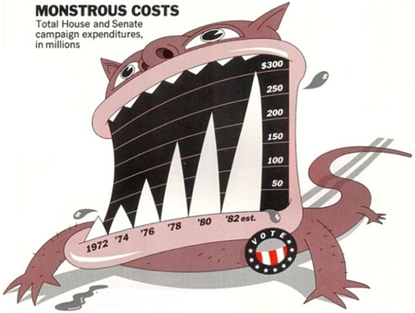
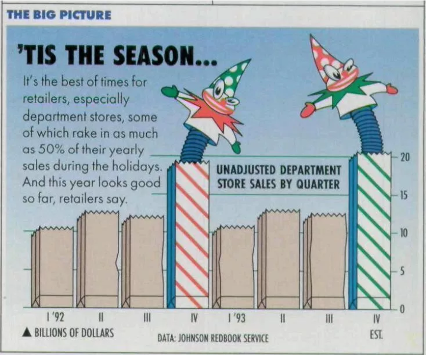
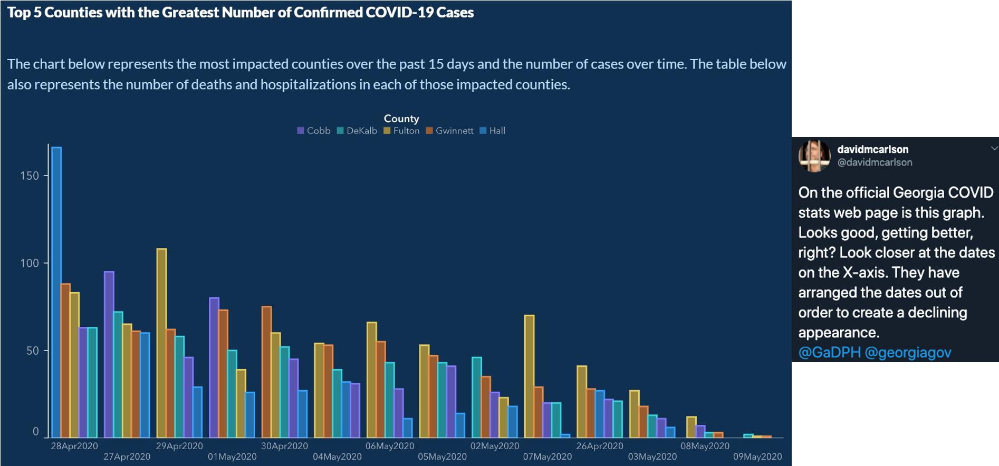
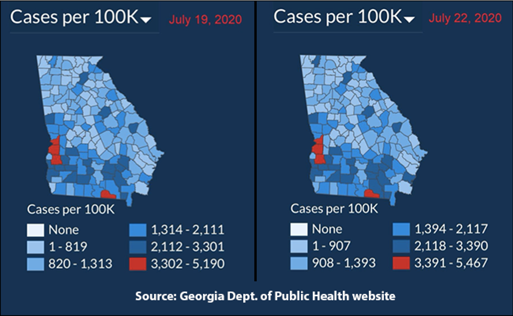
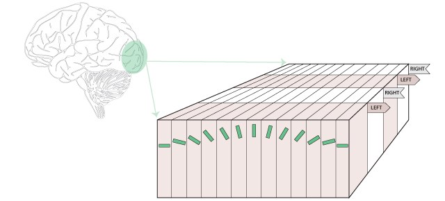
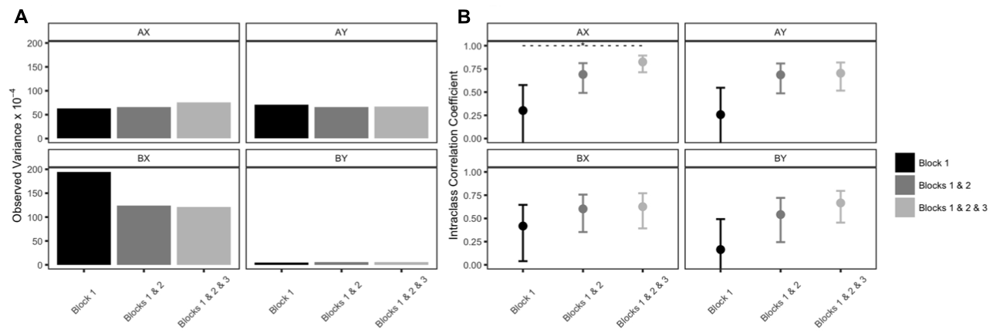

```{r setup, include=FALSE}
options(htmltools.dir.version = FALSE)
knitr::opts_chunk$set(warning = F,
                      message = F,
                      fit.retina = 3,
                      fig.align = "center")

hook_source <- knitr::knit_hooks$get('source')
knitr::knit_hooks$set(source = function(x, options) {
  x <- stringr::str_replace(x, "^[[:blank:]]?([^*].+?)[[:blank:]]*#<<[[:blank:]]*$", "*\\1")
  hook_source(x, options)
})
```

```{r, echo = F, warning = F, message = F, results = 'hide'}
library(psych)
library(tidyverse)
library(broom)
```

# Recap

- We have spent **a lot** of time working with `ggplot2`

- Everything covered this week can be applied with `ggplot2`

- Goal of this week is to get you to stop and think about your plots *before* you make them. What are the kinds of things you should be considering? 

---
# Stuff you already know

Data visualization is both an art *and* a science

Art:
  - Aesthetically pleasing
  - The story you're trying to tell
  
Science:
  - Graphical representation of specific types of data
  - The story you're trying to tell

---
class: inverse

# Warning


#### Making figures for academic purposes $\neq$ making figures for pure data viz purposes


---
# Today

- What kinds of things should you be thinking about when it comes to data viz *for academic papers*? 

--

- This will NOT be a course in web design or graphic design. If you want to take something like that, or typography, etc., check out the Art School!

---
# What should we be thinking about?

1. Telling your story

2. Contrast

3. Accessibility

---
# Telling your story

- Raw data are not intuitive. For the most part, you can't look at a spreadsheet of numbers and decipher any patterns. Especially with really big spreadsheets!

- We need a way to graphically show the data so that our human eyes can try to make sense of the data. 

- It is *so* easy to **LIE** with data! Balancing act of conveying your message and not lying. 

---
name: good

# What makes a good figure?

- Clear, descriptive title

- Axes are clearly labeled with variables and units of measurement

- Scale is:
  - consistent across axis
  - easily interpreted
  - chosen so that data are evenly distributed (remember restricted range from correlation?)
  
- Data points are represented clearly, with a good key/legend if needed

- Graph is the appropriate type for your data

---
name: avoid

# Things to avoid

- Chartjunk

- Misleading text/axes

- Inaccurate plotting

- So many COVID-19 data visualizations...

---

# Chartjunk

.pull-left[

]

.pull-right[

]

???
chartjunk is anything that gets in the way of reading the information displayed. this is stuff like unnecessry lines or grids behind the graph. patterns within the graph that might create the impression of movement or vibration lik the diagonal lines. or something called DUCKS which are any dressings added to the graph that are distracting. like this weird monster or the clowns. it can be fancy fonts or 3d effects or again, anything that detracts from the data itself. 

---

# Misleading Text/Axes



---

# Inaccurate Plotting

[This strange plot](https://sirota.substack.com/p/georgias-misleading-covid-map) was put out by Georgia's Health Department. It’s trying to show that basically there haven’t been any rael changes in COVID-19 statewide. But look at the values in the legend...They’ve changed them to basically keep the same graph. WUT?!




---

For more...

# [How bad Covid-19 data visualizations mislead the public](https://qz.com/1872980/how-bad-covid-19-data-visualizations-mislead-the-public/)

---
name: acc

# Accessibility is IMPORTANT

- Colorblindness sucks. ~1 in 12 men are colorblind (much lower in women)

- People have poor vision (glasses, anyone?)

- Plus, journals scale your figure sizes down so that it fits within the article (like within a column of text)

--

What can we do?

- Colors
- Contrast
- Big text size (bigger/bolder you can get away with less color contrast)

---

# Color Palettes

Also super helpful! `RColorBrewer` and `ggsci` are great. But there are millions of others. 

Ex: the color palette for all of the slides on this website? The Aussie color palette from [https://flatuicolors.com/palette/au](https://flatuicolors.com/palette/au)

**All you need are hex codes**. This is true for full color palettes and for a monochromatic palette that has different shades that provide *contrast*

---

# Contrast 

Think back to Cog Neuro or Bio Psych...you learned about the visual system

We have some visual systems dedicated to colors and details, and we have others that help us delineate edges (think about the orientation of a bar and the classic cat experiments)

<center>

</center>

--

Using colors in your visualizations to differentiate important things (groups, outcomes etc.) should be obvious. Using **contrast** to your advantage might not be as obvious.

---

# Contrast

When you have something side-by-side, you can have different colors. OR you can have the same color but a different shade/tone/tint. 


```{r, out.width="50%", echo=FALSE}
ggplot(data = iris, aes(x = Species, y = Petal.Length)) +
  geom_boxplot(aes(fill = Species)) +
  scale_fill_manual(values = c("#0b2c0b", "#228b22", "#bdefbd")) +
  labs(title = "Hey look, A Title") +
  theme_classic()
```

---

# Grayscale

The most obvious of this is grayscale (technically, it's not a hue, and you're dealing with saturation, but that's completely unimportant for this intro):

<center>

</center>


---

# Providing Contrast is Important

It lets the reader *easily* extract meaningful information. 

Shapes are nice too, but they take longer to process than contrasting colors (and like the boxplot, changing the shape isn't always an option)

--

Contrast should not be confused with HUE. Hue is just the color itself. Contrast refers to different shades/tints/tones of a color.

So many websites can help! Ex: [https://www.colorhexa.com/](https://www.colorhexa.com/)

---

# Text Size

#### Don't make your font size super uber small!

Some of us are getting old and our eyesight is fading

(I'm not bitter...yes I am...)

--

Also, academic journals scale down your figures. Better to make the text size larger so that when it gets scaled down, it's still readable.

---

# Self-evaluation

How do you know if you've made a good figure?

- Does it **EASILY** communicate what you want? 

- Do readers need to read and re-read your figure legend, or is your message clear?

- Is it accessible to people with poor eyesight or colorblindness?

- Does it **_faithfully_** reflect your data? Beauty + truth

--

There are some tools to help (but don't rely on them completely)

- [Contrast Checker](https://webaim.org/resources/contrastchecker/)


