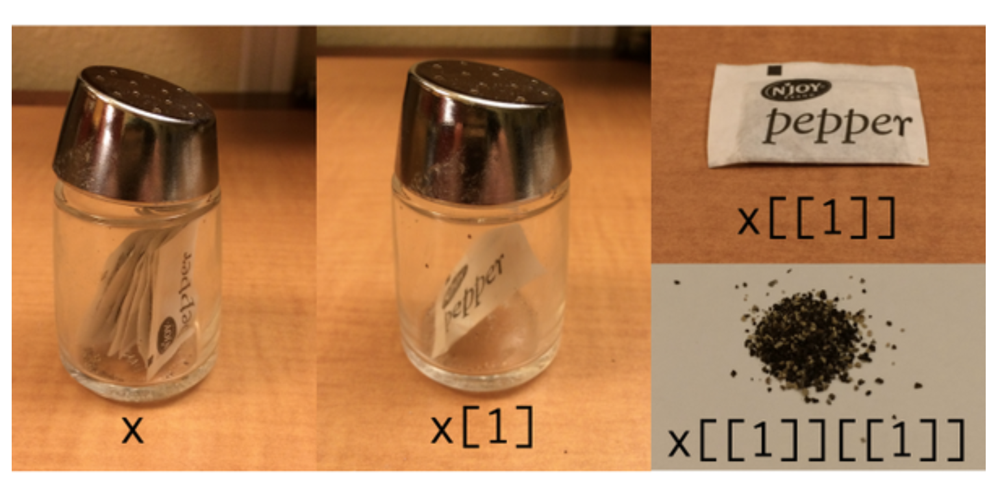

```{r setup, include=FALSE}
options(htmltools.dir.version = FALSE)
knitr::opts_chunk$set(warning = F,
                      message = F,
                      fit.retina = 3,
                      fig.align = "center")

hook_source <- knitr::knit_hooks$get('source')
knitr::knit_hooks$set(source = function(x, options) {
  x <- stringr::str_replace(x, "^[[:blank:]]?([^*].+?)[[:blank:]]*#<<[[:blank:]]*$", "*\\1")
  hook_source(x, options)
})
```

```{r, echo = F, warning = F, message = F, results = 'hide'}
library(psych)
library(tidyverse)
library(broom)
library(knitr)
```

# The Problem

- Copying and pasting code is not an efficient use of your time

- Often you want to do the same thing but with different inputs:
  - Get the mean of a variable for 20 different groups
  - Plot different variables as your x-axis against the exact same y-axis
  - Do the exact same analysis and make the same plots for the levels of an independent variable (e.g., patients and controls)

--

- In sum, you're trying to **iterate** (perform repeatedly)

---

# How do we address this?

In this class, we are going to talk specifically about `for loops`. Why?
  - They are *general purpose*. You will find them in nearly every single programming language. If you decide to not use R and instead go to Python or Matlab or whatever, you'll still come across them.
  - This is a fundamental component of programming. I would guess that you learn this within the first 2 weeks of CS 131. 

--

There are other ways to do this that are `R`-specific. We are NOT going to cover these (counterintutive, I know). 
  - the `apply` family of functions, including `lapply`
  - using the `purr` package from the `tidyverse`

---
name: lists

# Lists
Lists are basically vectors but where every element can be a totally different data class. Ex:

.code-small[
```{r}
myList <- list(6, head(iris), "hello world", c(1, 3, 5, 7, 9))
myList
```
]

---
# Lists
You can also name the elements in your list:

.code-small[
```{r}
myList <- list(Numberz = 6, DFs = head(iris), Chars = "hello world", VectorKing = c(1, 3, 5, 7, 9))
myList
```
]

---
# Lists

The weirdest thing about lists is accessing the elements within a list. Think of it like a book:
  - The element itself is like the chapter of a book
  - But there's a page that just says "Chapter 4" but doesn't contain any text
  - You need to tell `R` to go to the actual chapter

--

We can do this with double brackets `r emo::ji("point_down")`

```{r}
myList[1]

myList[[1]]
```

---

# Lists

Why does this matter? Say we wanted to take our number `6` from our list and add it to the number `12`

```{r, error = TRUE}
myList[1] + 12

myList[[1]] + 12
```

---

# Lists are weird

From Hadley Wickham, creator of `tidyverse`

---

# Now on to `for loops`

```{r, eval=FALSE}
for (i in 1:some number) {
  do something
}
```

*"For each element in 1 through ___, perform some function"*

*"Perform the function contained in this for loop on every single element in some list of elements"*

---

# `for loops`

```{r, eval=FALSE}
for (i in 1:some number) {
  do something
}
```

The important parts:

- You can iterate over anything: rows of a data.frame, columns of a data.frame, lists, or simple 1-dimensional vectors. The `1:some number` portion are the elements you’re iterating over. If you wanted to do something 5 times, you could say `1:5`. Most of the time, we don’t know that second number, though. So we can use a function. `1:nrow(data.frame)` or `1:length(list)` or `1:length(vector)`.

--

- The `i` stands for “each” and is the same type of `i` seen in equations. The top line then reads: “For each item/element in 1 through some number”.

--

- The part between the curly brackets `{ }` is what you want to do (it’s the body of the for loop).

---
# A Simple Example

For each number in 1 through 10, print the following: *"(number) squared is (that number squared)"*

So for the number 2, the output should be *"2 squared is 4"*

The functions we are going to use are `print()` and `paste0()`. 

.code-small[
```{r}
for (i in 1:10) {
  print(paste0(i, " squared is ", i^2))
}
```
]

---
# Storing the output
Is there any way for me to access any of the squared numbers from above? No!

If you want to store the output of a loop (which in almost all cases we do), you need to **initialize** an empty object. This means make a blank object *before* running your loop that will contain your stored results. 

--

Let's run the same loop as last time, but this time let's store the squared numbers, rather than just printing out some lines. 

.code-small[
```{r}
squaredNumbers <- NULL

for (i in 1:10) {
  squaredNumbers[i] <- i^2
}

squaredNumbers
```
]

---
# Recap

The basic steps of constructing a `for loop`:

1. Figure out what it is that you want to iterate through (numbers, columns of a data.frame, data.frames, a list, etc.)

2. Think about what you want your output to look like, and initialize an empty object that can store the output

3. Type out all of the steps within the body of the loop

---

# Applied Examples

What if you want to run the following models where the `y` variable stays the same, but the `x` variable changes? For this first example, let's say we only care about the $p$-value. 

- `lm(Sepal.Length ~ Sepal.Width, data = iris)`
- `lm(Sepal.Length ~ Petal.Length, data = iris)`
- `lm(Sepal.Length ~ Petal.Width, data = iris)`

```{r, echo=FALSE}
kable(head(iris))
```

---

# Applied Examples

Thinking through what we need to happen:

1. We're iterating through specific columns of the `iris` data.frame -- so we need to get those column names into a form we can iterate through. 

2. The output is a vector that contains $p$-values only

3. The body of the loop needs to contain the `lm()` functions

---

# Applied Example 1

```{r, warning=FALSE}
varsToIterate <- colnames(iris)[2:4]
sigValues <- NULL

for (i in 1:length(varsToIterate)) {
  model <- lm(Sepal.Length ~ iris[,i], data = iris)
  model <- tidy(model)
  sig <- model[[2,5]]
  sigValues[i] <- sig
}

sigValues
```

---
# Applied Example 1

You can make comments within `for loops`

```{r, warning=FALSE}
# get the column names in a format that we can iterate through
varsToIterate <- colnames(iris)[2:4]

# initialize an empty output vector
sigValues <- NULL

for (i in 1:length(varsToIterate)) {
  # run the model where i is the column that is varying
  model <- lm(Sepal.Length ~ iris[,i], data = iris)
  
  # the tidy function comes from the `broom` package
  model <- tidy(model)
  
  # find the p-value from the tidied model
  sig <- model[[2,5]]
  
  # store the p-value in the output
  sigValues[i] <- sig
}

# print the output
sigValues
```

---

# Applied Example 2
Now, what if you want to store the entire output of the model, not just the $p$-value? The output of `tidy(model)` is a data.frame. So the result of our loop will now be a **list of data.frames**, rather than a vector of $p$-values. Note the double brackets in `modelList[[i]]`!

```{r, warning = FALSE}
varsToIterate <- colnames(iris)[2:4]

modelList <- list()

for (i in 1:length(varsToIterate)) {
  model <- lm(Sepal.Length ~ iris[,i], data = iris)
  model <- tidy(model)
  modelList[[i]] <- model
}
```

---
# Applied Example 2

```{r}
print(modelList)
```

---

# Applied Example 2.1

Let's modify this slightly so that each output data.frame has a name associated with it (rather than 1, 2, 3)

```{r, warning = FALSE}
varsToIterate <- colnames(iris)[2:4]

modelList <- list()

for (i in 1:length(varsToIterate)) {
  name <- paste0(varsToIterate[i])
  
  model <- lm(Sepal.Length ~ iris[,i], data = iris)
  model <- tidy(model)
  modelList[[name]] <- model
}
```

---
# Applied Example 2.1

```{r}
print(modelList)
```

---
# Applied Example 3

Let's do the same thing but with some modifications:

- Let's also plot X & Y so we have a figure that corresponds with each model

- Instead of the output being a list of the different models, what if we wanted the information from all of the models to be contained within a data.frame? 

--

When it comes to looping through plots, there are a few odd things:

- the `sym()` function will take the quotes off of a string so that it can be evaluated properly
- `!!` says "actually evaluate what a variable stands for". This will make sense when you see it in the code.

---
# Applied Example 3
We want to store the model outputs AND a list of plots. So we need to intialize 2 things
.code-small[
```{r}
modelDF <- data.frame() # for models
plotList <- list() # for plots

for (i in 1:length(varsToIterate)) {
  nameX <- paste0(varsToIterate[i]) # a character string for labels
  nameY <- "Sepal.Length" # doesn't change in the loop!
  
  # make the models
  model <- lm(Sepal.Length ~ iris[,i], data = iris)
  model <- tidy(model)
  
  # add a column that repeats whatever nameX is
  # for us, this will make it easier to keep track of what "i" is
  model$predictor <- rep(nameX, times = nrow(model))
  
  # now bind the current model underneath the previous model
  # so that it's all contained within the same data.frame
  modelDF <- rbind(modelDF, model)
  
  # now make the plots
  nameXplot <- sym(varsToIterate[i])
  
  plotList[[i]] <- ggplot(data = iris, 
                          aes(x = !! nameXplot,
                              y = Sepal.Length)) +
    geom_point(color = "cornflowerblue") +
    labs(title = paste0(nameX, " by ", nameY),
         x = nameX,
         y = nameY)
}
```
]

---
# Applied Example 3

```{r}
modelDF
```

---
# Applied Example 3
.code-small[
```{r, out.width='30%'}
print(plotList)
```
]

---
# Bootstrapping

> to get oneself out of a situation using existing resources

--

In statistics...any test or metric that uses random sampling with replacement

--

- a bootstrapped mean 
- bootstrapped confidence intervals
- bootstrap anything your heart desires! 

---

# Bootstrapped Mean

Let's say we have a sample of 75 participants 

