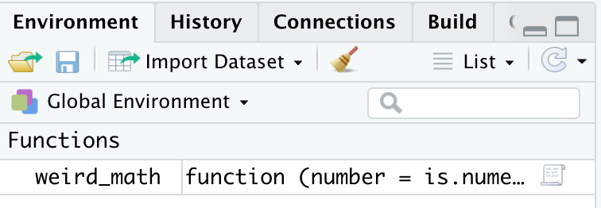
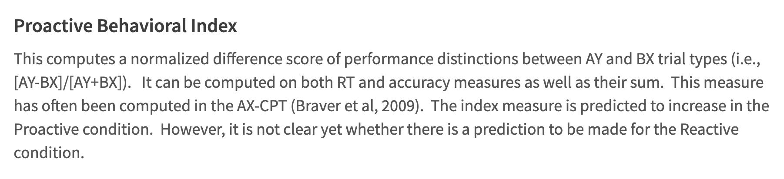
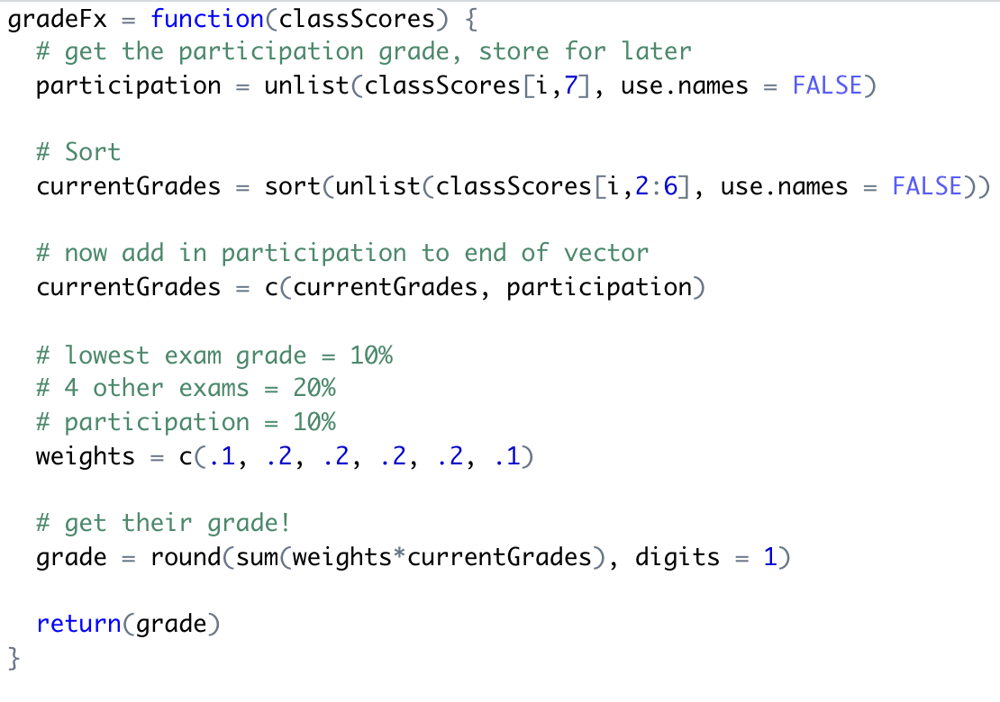

```{r setup, include=FALSE}
options(htmltools.dir.version = FALSE)
knitr::opts_chunk$set(warning = F,
                      message = F,
                      fit.retina = 3,
                      fig.align = "center")

hook_source <- knitr::knit_hooks$get('source')
knitr::knit_hooks$set(source = function(x, options) {
  x <- stringr::str_replace(x, "^[[:blank:]]?([^*].+?)[[:blank:]]*#<<[[:blank:]]*$", "*\\1")
  hook_source(x, options)
})
```

```{r, echo = F, warning = F, message = F, results = 'hide'}
library(psych)
library(tidyverse)
library(broom)
library(knitr)
```

# Recap

- Functions are the **verbs** of programming languages
- They perform actions *on* objects
- We can adjust how the function performs by modifying **arguments**
  - arguments are like adverbs
  - ex: `na.rm = TRUE`, `paired = TRUE`, `method = "spearman"`

---
# Who -- Who Makes Functions?

- `R` is open source -- this means that anyone anywhere can make packages that contain functions and publish them

--

- **THAT MEANS YOU!! YOU CAN DO THIS, TOO!**

<center>


</center>

---

# When You Should Make A Function?

- You need to do the same thing many times. *Make your life easier!*

--

- Sounds a lot like a `for loop`, right?

  - But `functions` are particularly helpful when you know you'll need to do this exact same thing again, *especially on a different dataset*!
  
--

- When you write a `for loop`, you'll write it specific to your dataset. When you write a `function`, it's better to write it in a **general** format so that you can fill in other datasets/columns/inputs that are not specific to your current dataset

---

# The Process

- First you need to define your function

--

- Then you need to make sure your function is in your Global Environment
  - Usually people write their functions as `.R` script files
  - The file is saved somewhere they can access (in a project directory)
  - In your analysis file (could be `.R` or `.Rmd`), you call your function's `.R` file

--

- Then you can use it exactly like you would a function from any other package

---
name: def

# Defining Your Function

```{r, eval=FALSE}

nameOfFunction <- function(input) {
  do something
  return(whatever you want the output to be)
}
```


- Use the keyword `function`
- Curly brackets
- Use the `return()` function to make sure that the output contains what you want

---
name: ex1

# Simple Example

Let's say you want a function that takes a number, squares it, and then multiplies by 100. 

```{r}
weird_math <- function(number = is.numeric) {
  
  num_squared <- number^2
  num_squared_100 <- num_squared * 100
  
  return(num_squared_100)
  
}
```

--

<center>




</center>

---

# Now let's use our function!

```{r}
weird_math(number = 6)
```

--

If we want to store the output of our function...
```{r}
newValue <- weird_math(number = 6)
newValue
```

--

If we wanted to store the output for a vector of numbers...
```{r}
vectorExample <- weird_math(number = 1:10)
vectorExample
```

---

# Some Tips

1. For your input, I suggest being as specific as possible for the *names* of arguments. You want your users (aka you in 9 months) to easily figure out what goes in each argument. 

--

2. You want to think carefully about the data class for the inputs. You don't technically need to specify it (with something like `is.numeric`), but you should think very carefully about what you want it to be. How do you anticipate someone using it? 

--

3. Think carefully about what you want your output to be! Do you want it to be a single number? Do you want to put together a data.frame and return the data.frame? Do you want a list? Etc. You have to think through things!

--

4. Everything we've talked about in this class when it comes to code you can use in a `function`. For instance, you can put a `for loop` within a `function`!

---
name: ex2

# Another Example

The AX-CPT is a cognitive control task. It has 4 different trial types: 

- AX = the target trial (what we tell participants to be on the lookout for)
- AY = a challenging trial type; correct cue, incorrect probe
- BX = a challenging trial type; incorrect cue, correct probe
- BY = the baseline trial; incorrect cue, incorrect probe

Each participant has a reaction time and accuracy measure for each of these trial types. There are a number of various derived measures we can calculate that are more useful than just looking at these individual trial types. For example:


<center>



</center>

---

# PBI Example

```{r, echo=FALSE}
axcpt = read.csv(here::here("R", "fakeaxdata.csv"))
```

```{r}
axcpt
```

---

# PBI Example

So let's make a function to calculate the PBI so that if you run the AX-CPT on a new dataset (maybe you collect data on a different population?), you don't need to re-code everything. 

```{r}
pbi <- function(ay,bx){
  pbi <- (ay-bx)/(ay+bx)
  pbi <- round(x = pbi, digits = 2)
  return(pbi)
}

# now run the function!
pbiValues <- pbi(ay = axcpt$ay_acc, bx = axcpt$bx_acc)
pbiValues
```

---
name: ex3

# One of my actual functions

This is the code I use to calculate grades when I teach Biological Psychology (yay neuro things!)

```{r, echo=FALSE}
biopsych = read.csv(here::here("R", "testgrades.csv"))
biopsych$Student[1:9] = paste0("Student ", 1:9)
biopsych
```

First I'm going to read in the `.R` file that has just the function in it. We use `source()` instead of `read.csv()`
```{r}
source(here::here("R", "gradingFunction.R"))
```

.small[Note you should ignore the `here::here` part of this. In your own work, you'll simply point a working directory to wherever the function is located]

---

# One of my actual functions

<center>



</center>

Notice how there is an `i` involved? 

---
# One of my actual functions

Now I'm going to use this function *within* a `for loop`! 

*"For each row in `biopsych`, apply the `gradeFx` function that I made"*

```{r}
for (i in 1:nrow(biopsych)) {
  biopsych$finalGrade[i] = gradeFx(classScores = biopsych)
}

biopsych
```

---

# What to make of all of this

You don't actually need to know what is happening in my grading function exactly. Here are the points to take home:

- `functions` and `for loops` should both make your life easier. They are a pain to get up and running, but once they are, they save you a TON of time. 

- You can put a `function` that you made within a `for loop`. You can also put a `for loop` within a function. For example, you can make a function just for bootstrapping confidence intervals if you wanted. 

- `functions` are especially helpful when you know you'll want to do the same thing on multiple datasets.

- Your flexibility is endless. The most important thing to do is to really consider what it is you have and what it is you *want* to do. Thinking through these problems is, **by far**, the hardest part of coding. 

