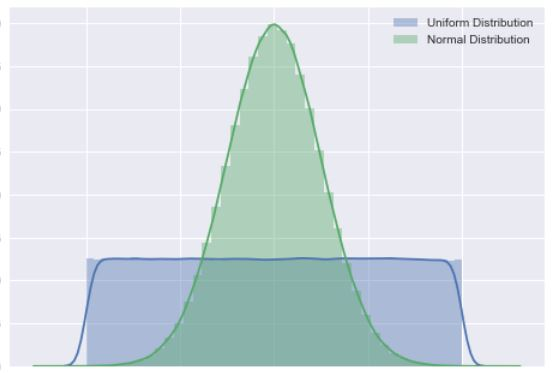

```{r setup, include=FALSE}
options(htmltools.dir.version = FALSE)
knitr::opts_chunk$set(warning = F,
                      message = F,
                      fit.retina = 3,
                      fig.align = "center")

hook_source <- knitr::knit_hooks$get('source')
knitr::knit_hooks$set(source = function(x, options) {
  x <- stringr::str_replace(x, "^[[:blank:]]?([^*].+?)[[:blank:]]*#<<[[:blank:]]*$", "*\\1")
  hook_source(x, options)
})
```

```{r, include=FALSE, message=FALSE, warning=FALSE}
library(ggplot2)
```

# Preamble
`R` is great, but the #rstats community is freaking **awesome**

- This tutorial comes from **Ariel Muldoon** (twitter: [@aosmith16](https://twitter.com/aosmith16?lang=en))
- 100% of the credit goes to Ariel! 
- The original tutorial is [here](https://aosmith.rbind.io/2018/08/29/getting-started-simulating-data/) and she has other really fantastic posts, too!

<center>


</center>

---

# Why Simulate?

Because collecting data is _**really, really hard**_

- Simulating data is useful when you're trying to prove something theoretically.
- Example via [twitter thread by Eiko Fried](https://twitter.com/EikoFried/status/1335971409064042498)
  - does adding noise to a variable change the underlying correlation with another variable (e.g., by adding noise you are basically saying that variable 1 is not super precise or adding measurement error)?
  - create your own data or correlation matrix and do it yourself! 
  - no need to collect data from participants

- Goal of today is to take you through some `R` functions that are useful for simulating data  
---
# Generating random numbers

One way to generate numeric data in `R` is to pull random numbers from some defined distribution. This can be done via functions for generating random deviates. These functions start with `r` (for *random*).

What distributions do you know? 

- Normal distribution (`rnorm()`)
- [Uniform distribution?](https://en.wikipedia.org/wiki/Continuous_uniform_distribution) (`runif()`)

<center>



</center>

- Others exist e.g., Poisson, binomial, F, log normal, beta, exponential, Gamma
- Even more available in different packages 

---

name: norm
# The rnorm() function

- The `rnorm()` function pulls values from a normal distribution
- Sometimes it's because you think the data *should* be normally distributed
- Other times it's because you just need some random numbers and you don't care very much about what they are or if they follow any particular distribution 

`rnorm(n, mean = 0, sd = 1)`

- The `n` argument is the number of values to generate.  
- The `mean` and `sd` are the parameters of the distribution.  You can see the default values are set to specific values.  Note that `sd` is the *standard deviation*, not the variance.  

---
name: seed
# Setting the random seed

- If you went into `R` right now and ran the code `rnorm(n = 5, mean = 0, sd = 1)`...then you ran that code *again*, you would get a different set of numbers as your output. 

- This is really bad for reproducibility! How can someone replicate your simulation study if the numbers they are getting are totally different?

--

- To get reproducibile random numbers, you need to **set the seed** via the `set.seed()` function.

- To my knowledge, it does not matter what number you put in the `set.seed()` function -- just as long as it is set to something. For instance, this class is Psych 4175, so maybe use `set.seed(4175)`. I often do `set.seed(1234)` because I'm such a creative person (lol)

- If you set the seed *before* running `rnorm()`, and then run the code twice, you should get the same set of numbers. 

---
# Change parameters in `rnorm()`

- For getting a quick set of numbers it's easy to use the default parameter values in `rnorm()` -- this is the standard normal distribution (mean = 0, sd = 1)

- You can change the parameter values to pull from a different normal distributions

- IQs have a mean of 100 and standard deviation of 15. If you want 20 simulated IQ scores, you would run `rnorm(n = 20, mean = 100, sd = 15)`. 

---
# Change parameters in `rnorm()`

- Now imagine that you wanted to create data to analyze using an ANOVA
- You would want the *means* of your groups to be *different*...
- But you want the *variances* of the groups to be the *same*
- So we could use various inputs for the means, but keep the `sd` parameter the same
- The code below draws from 3 different distributions centered at 3 different locations: 
  - one at 0
  - one at 5
  - one at 20

```{r}
rnorm(n = 10, mean = c(0, 5, 20), sd = 1)
```


.small[Note the repeating pattern in the output: the function iteratively draws one value from each distribution until the total number requested is reached.  This can lead to an imbalance in the sample size per distribution, such as what happens here.]

---

# Using a vector with *n*

The `rnorm()` function works differently when using a vector for the `n` argument, though, which is a little confusing.  If a vector is passed to `n`, the *length* of that vector is taken to be the sample size required (see the **Arguments** section of documentation for details).

For instance, let's use a vector of 3 values you want for `n`.  Since the vector for `n` is length 3, you only get 3 values in the output.

```{r}
rnorm(n = c(2, 10, 10), mean = c(0, 5, 20), sd = c(1, 5, 20))
```

---
# Example using rnorm()

If you store the output as an object, you can use it later on! For example, maybe you want to simulate two unrelated variables and then look to see how correlated they appear to be.  This can be a fun exercise to demonstrate how variables can appear to be related by chance even when you know they are not, especially at small sample sizes.

.pull-left[
.code-small[
```{r, eval=FALSE}
x <- rnorm(n = 10, mean = 0, sd = 1)
y <- rnorm(n = 10, mean = 0, sd = 1)

dat <- data.frame(x = x, y = y)

ggplot(data = dat, aes(x = x, y = y)) +
  geom_point()
```
]
]

.pull-right[
.code-small[
```{r, echo=FALSE, out.width='85%'}
x <- rnorm(n = 10, mean = 0, sd = 1)
y <- rnorm(n = 10, mean = 0, sd = 1)

dat <- data.frame(x = x, y = y)

ggplot(data = dat, aes(x = x, y = y)) +
  geom_point()
```
]
]

---
# The `runif()` function

- `runif()` is usefull for genearting numbers that are strictly positive and continuous. Numbers are uniformly distributed between some minimum and maxiumum. 

- default is to pull random numbers between 0 and 1

`runif(n, min = 0, max = 1)`

---
name: pois
# The `rpois()` function

- Useful for generating discrete integers (including 0) from a Poisson distribution
- Helps to get a better understanding of the shape of Poisson distributions with different means
- Poisson distribution is a single parameter distribution with parameter `lambda`; which is the mean. There's no default setting, so you always need to set it

`rpois(n, lambda)`

---

# The `rpois()` function

We'll generate 5 values from a Posisson distribution with a mean of 2.5. Note that the *mean* of the Poisson distribution can be any non-negative value even though the observed values will be discrete integers (i.e., the mean does not have to be an integer).

You can run this code many times if you want to see the range of values you get.

```{r}
rpois(n = 5, lambda = 2.5)
```

---
# Example using `rpois()`

Let's explore the Poisson distribution a little more to see how the distribution changes as the mean changes.  This simulation task is what helped me understand the distribution better.

Draw 100 values from a Poisson distribution with a mean of 5.  Name this vector `y`.  Then take a look at the a summary of the variable using the code `summary(y)` and a histogram with `hist(y`). Note the range of values you get (and re-run on your own several more times to see more examples of the range when the mean is 5).

.pull-left[
.code-small[
```{r, eval=FALSE}
y = rpois(100, lambda = 5)
summary(y)
hist(y)
```
]
]

.pull-right[
.code-small[
```{r, echo=FALSE, out.width='60%'}
y = rpois(100, lambda = 5)
summary(y)
hist(y)
```
]
]


---
# Example using `rpois()`

Now we'll draw 100 values from a Poisson distribution with a mean of 100 and we'll name the object `y2` and then look at the summary and histogram.

.pull-left[
.code-small[
```{r, eval=FALSE}
y2 = rpois(100, lambda = 100)
summary(y2)
hist(y2)
```
]
]

.pull-right[
.code-small[
```{r, echo=FALSE, out.width='60%'}
y2 = rpois(100, lambda = 100)
summary(y2)
hist(y2)
```
]
]

.small[Note that the range of values is pretty narrow; there are no values even remotely close to 0 when the mean is 100.  If you have 0 values and very large values (like 100), the Poisson distribution isn't likely going to work very well.

You might also be interested to note that distribution when the mean is 100 tends to be more symmetric than the distribution with the smaller mean.]

---
name: chars
# Character vectors with `rep()`

Quantitative variables are great, but in simulations you are often going to need categorical variables, as well.

In my own work these are usually some sort of "grouping" or "treatment" variable.  This means I need to have repeated observations for each character value.  The `rep()` function is one way to avoid having to write out an entire vector manually.  It's for *replicating elements of vectors and lists*.

--

We've seen this before in this class. For instance, when combining 2 data sets, you might want to add a character vector that says "dataset1" for every row. So you would use `rep("dataset1", times = nrow(dataset))`.

---

# Using `letters` and `LETTERS`

The first argument of `rep()` is the vector of values to be repeated. One option is to write out the character vector you want to repeat. Another option for simple character vectors is to use `letters` or `LETTERS`. 

Letters can be pulled out via the extract brackets (`[`).  I use these built-in constants for pure convenience when I need to make a basic categorical vector and it doesn't matter what form those categories take.

Here are the first two `letters`.

```{r}
letters[1:2]
```

And the last 17 `LETTERS`.

```{r}
LETTERS[10:26]
```

---
# The *each* argument

There are three arguments in `rep()` that help repeat the values in the character vector with different patterns: `each`, `times`, and `length.out`.  These can be used individually or in combination.

You can use `each` to repeat each unique character in the vector the defined number of times.  The replication is done *elementwise*.  This means the repeats for each unique character string are all in a row. An example will help demonstrate this.

The resulting vector is 6 observations long (2 letters 3 times each).

```{r}
rep(x = letters[1:2], each = 3)
```

---
# The *times* argument

The `times` argument is useful when you want to repeat the whole character vector rather than repeating it elementwise.

Make a two-group variable again, but this time change the repeating pattern of the letters.  Instead of `each = 3` use `times = 3`.

```{r}
rep(letters[1:2], times = 3)
```

---

# The *length.out* argument

Like `times`, the `length.out` argument repeats the whole character vector.  However, it repeats the vector only until the length you've defined in the argument is reached.  Using `length.out` is one way to get slightly unbalanced groups.

Rather than defining the number of repeats as with `each` and `times`, in the next exercise you'll define the length of the output vector.  Make a two-group variable of length 5.

```{r lengthout-solution}
rep(letters[1:2], length.out = 5)
```

You can see the second group has one fewer observations than the first.

---
# Unbalanced data with *times*

Unlike `each` and `length.out`, you can use `times` with a vector of values.  This allows you to repeat each element of the character vector a different number of times.  This is a way to simulate unbalanced groups.

Using `times` with a vector repeats each element like `each` does, which makes it harder for me to remember which argument does what.

Let's repeat the first letter twice and the second letter four times.

```{r}
rep(letters[1:2], times = c(2, 4) )
```

---
# Combining *each* with *times*

As your simulation situation get more complicated, you may need more complicated patterns for your categorical variable.  The `each` argument can be combined with `times` to first repeat each value elementwise (via `each`) and then repeat that whole pattern (via `times`).

When using `times` like this it can only take a single value and not a vector.


```{r}
rep(letters[1:2], each = 2, times = 3)
```

You can also use `each` with `length.out` and get similar results.  This can lead to some imbalance with careful planning.

However, note you cannot use `length.out` and `times` together.  If you try to do this, `length.out` will be given priority and `times` will be (silently) ignored.

---
name: dat
# Simulating datasets

You now have tools for creating quantitative data as well as categorical data.  Which means it's time to practicing making some datasets.

You'll use the tools you learned above but will now name the output and combine the quantitative and categorical variables into a data.frame.  This last step isn't always necessary, but can help keep things organized in certain types of simulations.

---
# No differences between two groups

For instance, let's try simulating data that you would use in a simple two-sample analysis where there are no differences between the 2 groups. You'll make a total of 6 observations, 3 per group. 

You'll want separate vectors for the continuous and categorical data and then bind them together via `data.frame()`.

```{r}
group = rep(letters[1:2], each = 3)
response = rnorm(n = 6, mean = 0, sd = 1)
data.frame(group,
           response)
```

---
# Nested Functions!

You don't always need to make separate vectors and the data.frame. You can nest them! You should do whatever is easiest and makes the most sense for you!


```{r}
data.frame(group = rep(letters[1:2], each = 3),
           response = rnorm(n = 6, mean = 0, sd = 1) )
```


---
# Adding to it
Next you will create another categorical variable to add to the dataset.

Say you are in a situation involving two factors instead of one.  You have a single observation for every combination of the two factors (i.e., the two factors are *crossed*).

The second factor, which will be named `factor`, will take on the values "C", "D", and "E".  

```{r}
data.frame(group = rep(letters[1:2], each = 3),
           factor = rep(LETTERS[3:5], times = 2),
           response = rnorm(n = 6, mean = 0, sd = 1) )
```

---
# Difference between two groups

The dataset you made above is one with no difference between the two groups.  What if you want to create data where the means are different between groups?

Let's make two groups of three observations each where the mean of one group is 5 and the other is 10.  The two groups have a shared variance (and so standard deviation) of 1.

```{r}
data.frame(group = rep(letters[1:2], times = 3),
            response = rnorm(n = 6, mean = c(5, 10), sd = 1) )
```

---

# `for() loop` FTW!

What if you wanted to demonstrate the Central Limit Theorem? Or you wanted to build up your very own sampling distribution?


```{r for, exercise = TRUE}
set.seed(16)
list1 = list() # Make an empty list to save output in
for (i in 1:3) { # Indicate number of iterations with "i"
    list1[[i]] = rnorm(n = 5, mean = 0, sd = 1) # Save output in list for each iteration
}
list1
```

---
# Going Forward

- We mainly talked about generating data

- As you go further along in your statistical journey, you'll develop an intuition for simulation studies. Now go back to the original tweet by Eiko at the beginning of this lecture. You can use these generating data skills to now run a true simulation study! 

---
# Wrapping Up The Semester

- You should now be reasonably comfortable in the `R` & `RStudio` environment!

- You should feel comfortable using `R` to help you run your statistical analyses!

- You should feel comfortable GOOGLING different functions and other peoples' code to help when you get stuck!

- You might not feel comfortable with things like for loops, writing your own functions, and simulating, but you've now been introduced to them. As you continue, you'll certainly come across these things again -- and hopefully you won't be totally overwhelmed!

---
# Wrapping Up The Semester

Learn from our mistakes! We've made so, so, SO many...

